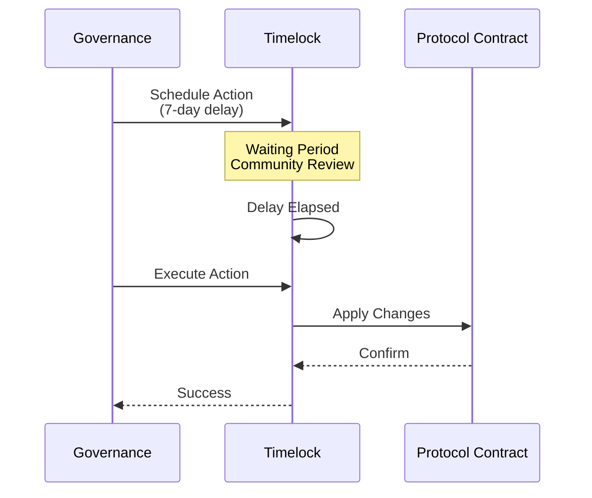

LayerCover's governance system balances decentralization with operational responsiveness. The protocol uses a multi-tier governance structure that separates routine parameter adjustments from critical upgrades, ensuring both security and adaptability as the protocol evolves.

## Governance Overview

### [Governance Architecture](/concepts/governance/architecture)
Understand the governance contracts, voting mechanisms, timelock protections, and guardian roles that secure protocol upgrades.

### [Risk Parameters](/concepts/governance/risk-parameters)
Learn how key protocol parameters are configured: capital requirements, coverage limits, fee structures, and trigger thresholds.

### [Delegate Staking](/concepts/governance/delegate-staking)
See how COVR holders stake, delegate, and manage withdrawal locks while feeding voting power into proposals.

### [Governors](/concepts/governance/governors)
Understand what professional delegates do with the authority you give them and how they stay accountable.

---

## Governance Structure

LayerCover implements a **tiered governance model** that assigns different levels of authority based on action urgency and risk:

### Governance Roles

**Committee (Multisig)**
- Fast parameter adjustments during normal operations
- Fee recipient configuration
- Non-critical operational decisions
- 3-5 day timelock for most actions

**Guardian (Emergency Response)**
- Emergency system pauses
- Adapter failure responses
- Capital pool mode switches (Normal → Guarded → Emergency)
- No timelock for emergency actions

**Owner (Core Governance)**
- Protocol upgrades and contract migrations
- Critical parameter changes (e.g., max coverage limits)
- Governance structure modifications
- 7+ day timelock for high-risk actions

### Timelock Protection

All governance actions except emergency responses flow through a timelock system:

This delay allows the community to:
- Review proposed changes
- Assess impact on their positions
- Exit if they disagree with changes
- Coordinate alternative proposals

## Governable Parameters

### Capital Pool Parameters
- **Underwriter notice period**: Withdrawal delay (typically 7 days)
- **System mode**: Normal, Guarded, or Emergency operations
- **Yield adapter configuration**: Add/remove/configure DeFi integrations
- **Adapter reward pools**: Map adapters to reward distribution pools

### Risk Management Parameters
- **CAT Pool triggers**: Tier 1 and Tier 2 capital ratio thresholds
- **CAT share percentages**: How much CAT Pool covers per tier
- **Reference capital**: Target healthy capital level per pool
- **Coverage caps**: Maximum coverage per pool or protocol
- **Claim fee basis points**: Protocol fee on claim payouts

### Premium Parameters
- **Base rate curves**: Utilization-to-premium rate mappings
- **Rate adjustment factors**: Pool-specific multipliers
- **Intent pricing bounds**: Min/max acceptable intent rates
- **Premium escrow periods**: Locked premium duration for intent deals

### Backstop Parameters
- **Backstop queue processing**: Max iterations per transaction
- **Withdrawal notice periods**: CAT Pool liquidity unlock timing
- **Tranche configuration**: Junior/mezzanine/senior ratios and yields
- **Loss waterfall rules**: Order of capital consumption during losses

## Emergency Procedures

### System Mode Transitions

**Normal Mode** → **Guarded Mode**
- Triggered by guardian or governance when risks elevate
- Restricts new high-risk operations
- Maintains existing positions
- Accelerates exit paths for capital providers

**Guarded Mode** → **Emergency Mode**
- Activated during critical failures (adapter exploits, oracle failures)
- Disables new deposits and adapter interactions
- Enables emergency withdrawals using only idle liquidity
- Queues all backstop draws for delayed processing

**Emergency Mode** → **Normal Mode**
- Requires 6-hour cooldown after emergency declaration
- Validates all adapter health checks pass
- Confirms no pending critical issues
- Executed via governance approval (not guardian)

### Adapter Failure Response

When a yield adapter fails (frozen withdrawals, exploit, valuation errors):

1. **Guardian marks adapter as failed**
   - Prevents new deposits to affected adapter
   - Blocks new withdrawal requests from affected adapter
   - Maintains principal accounting to prevent vault mispricing

2. **Emergency transfer fallback**
   - PayoutManager attempts direct aToken transfers to claimants
   - Bypasses normal withdrawal if adapter unresponsive
   - Syncs principal reduction to maintain accurate vault NAV

3. **Recovery or deactivation**
   - If recoverable: governance marks adapter healthy, resumes operations
   - If permanently failed: governance deactivates adapter after draining capital

## Governance Best Practices

### For Protocol Governors

**Parameter Changes**
- Model impact before proposing changes
- Provide clear rationale in proposals
- Allow sufficient timelock for community review
- Monitor effect after execution and adjust if needed

**Risk Management**
- Regular stress testing of trigger thresholds
- Monitor capital concentration across pools
- Track utilization trends and adjust caps proactively
- Coordinate with community on major changes

**Communication**
- Announce planned governance actions in advance
- Publish impact analyses for major changes
- Maintain transparent voting records
- Document reasoning for emergency actions

### For Capital Providers

**Active Monitoring**
- Track pending governance proposals
- Review timelock queue for scheduled changes
- Assess impact on your positions
- Participate in governance discussions

**Risk Management**
- Understand your withdrawal notice periods before committing capital
- Monitor system mode status (Normal/Guarded/Emergency)
- Diversify across multiple tranches/pools
- Have exit strategies for adverse governance outcomes

**Participation**
- Delegate voting power if not actively participating
- Provide feedback on proposals before execution
- Report issues or concerns via governance channels
- Engage constructively in parameter debates

## Key Governance Metrics

**Proposal Activity**: Number and frequency of governance proposals indicates protocol evolution velocity.

**Timelock Queue Depth**: Pending actions awaiting execution shows upcoming protocol changes.

**Emergency Action Frequency**: How often guardians invoke emergency powers signals system stress.

**Parameter Stability**: How frequently risk parameters change affects predictability for capital providers.

**Governance Participation**: Voting turnout and delegate engagement indicates community health.

**Execution Success Rate**: Ratio of executed vs. failed proposals shows governance effectiveness.

## Frequently Asked Questions

**Q: Can governance change the rules after I deposit capital?**
A: Yes, but with constraints. Most changes have 3-7 day timelocks allowing you to exit. Emergency actions (adapter failures, system pauses) can be immediate but are limited to protecting capital, not seizing it.

**Q: What happens if I disagree with a governance decision?**
A: You can exit during the timelock period before execution. For capital locked in notice periods, you may need to wait for your withdrawal to mature before fully exiting.

**Q: Who can propose governance actions?**
A: Currently the Owner (core governance multisig) and Guardian can propose actions within their scope. Future decentralization may introduce token-based proposal rights.

**Q: How do I participate in governance?**
A: Monitor the governance forum and timelock contract for pending proposals. Engage in discussions, provide feedback, and vote if you have delegation rights.

**Q: Can governance steal my capital?**
A: No. Governance cannot directly transfer user funds. All withdrawals flow through user-controlled transactions. Emergency mode may delay exits but cannot confiscate capital.

**Q: What happens during an adapter exploit?**
A: Guardian marks the adapter failed, blocking new activity. For payouts, the system attempts aToken transfers directly to claimants, bypassing the exploited adapter's withdraw function.

**Q: How are governance decisions enforced on-chain?**
A: Actions are encoded as contract calls, scheduled through the timelock, then executed after the delay. On-chain enforcement is automatic once the timelock releases the action.

---

Ready to explore more? See:
- [Buying Cover](/concepts/buying-cover) for the core user-facing mechanics these parameters control
- [Reinsurance](/concepts/reinsurance) for CAT Pool governance and trigger management
- [Technical Reference](/technical-reference) for low-level contract details
