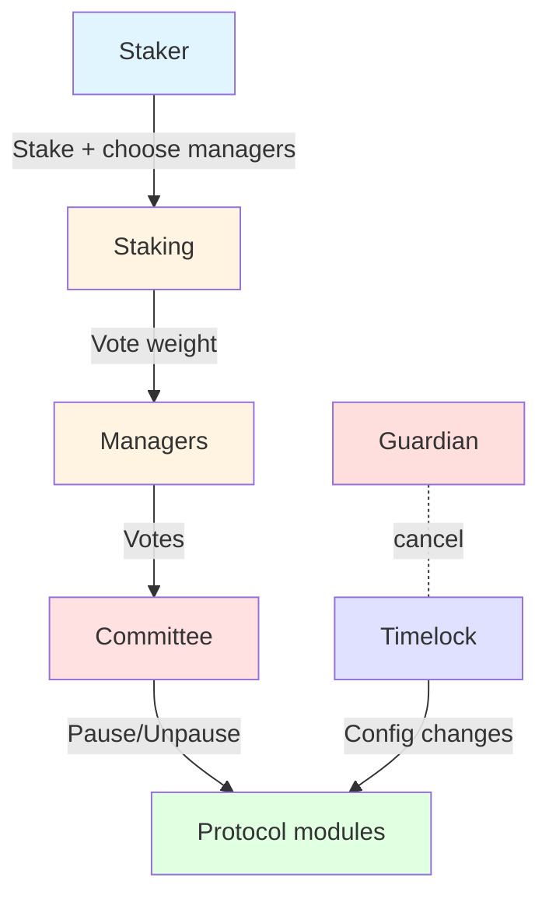

LayerCover’s governance is designed for people who stake COVR and the managers they delegate to. A timelocked executor (minimum two-day delay) holds ownership of the core contracts so that planned changes are always announced before they take effect. Guardians can cancel a queued change if something looks wrong, but they cannot speed it up. A coordinator contract sends approved updates to the pool registry, underwriting, policy, payouts, and yield modules so managers do not have to interact with each piece individually.

## Quick map

At a high level, stakers supply voting power, managers aggregate it, the Committee handles incidents, and the timelock controls planned changes. Guardians sit beside the timelock with the ability to cancel anything suspicious.

## For stakers

When you lock COVR, you create voting power that can be split across up to ten managers at once, letting you back multiple strategies without withdrawing and restaking. Rewards arrive in two streams: manager-specific ERC20 fees earned through claim fees on succesful proposals, and protocol-wide ERC20 incentives that everyone shares. If you or your manager vote on a proposal, that portion of your stake observes a seven-day unlock timer to prevent “vote then exit” moves and keep the vote baseline stable. Each pool can have only one active incident proposal, so your delegation choices do not get tangled across overlapping votes.

## For managers

Managers register once, set a fee within the cap, and start accepting delegation. All delegated stake rolls up automatically into their vote weight for Committee proposals. Voting triggers the same seven-day lock on their delegators’ positions, so good managers communicate before filing proposals. A helper contract batches reward claims and delegation moves to keep balances tidy without bespoke scripts. Managers earn alongside their delegators: the fee on governance rewards is skimmed automatically, and any manager-specific rewards they provide are shared pro‑rata with the people who backed them.

## Incident flow (Committee)

Incident handling runs through a dedicated Committee. To pause a pool, a proposer posts a bond between 1,000 and 2,500 COVR. The system snapshots total stake at creation to set quorum, and only one proposal per pool can run at a time. If a pause passes, the pool is frozen, claim fees on any payouts are redirected to the Committee, and a challenge period begins. An unpause proposal requires no bond and simply restores normal fee routing after a successful vote.

## Rewards, resolution, and slashing

After the challenge period, anyone can finalize. If enough fees arrived during the pause, the bond returns to the proposer with a bonus; if not, the bond is slashed as the cost of calling an unnecessary pause. “For” voters receive the collected fees pro‑rata, while failed proposals take an immediate partial slash so another proposer can step in. The seven-day post-vote lock remains in place through resolution, so voters cannot claim and exit in the same block.

## Timelocked execution

All planned configuration changes sit in the timelock queue for at least two days. The parameters that were scheduled must match the parameters used at execution, which blocks parameter swaps or front-running. Anyone can watch the queue, guardians can cancel if needed, and authorized executors apply changes only after the delay. For stakers and managers, upgrades and routing tweaks stay predictable and auditable.

## Putting it together

Staking supplies voting power with clear rewards and locks, managers run delegation programs with transparent fees and responsibilities, the Committee provides a bonded path for emergencies, and the timelock keeps long-range changes visible. The aim is to make governance understandable for newcomers while giving active participants the tools to keep the protocol safe.
