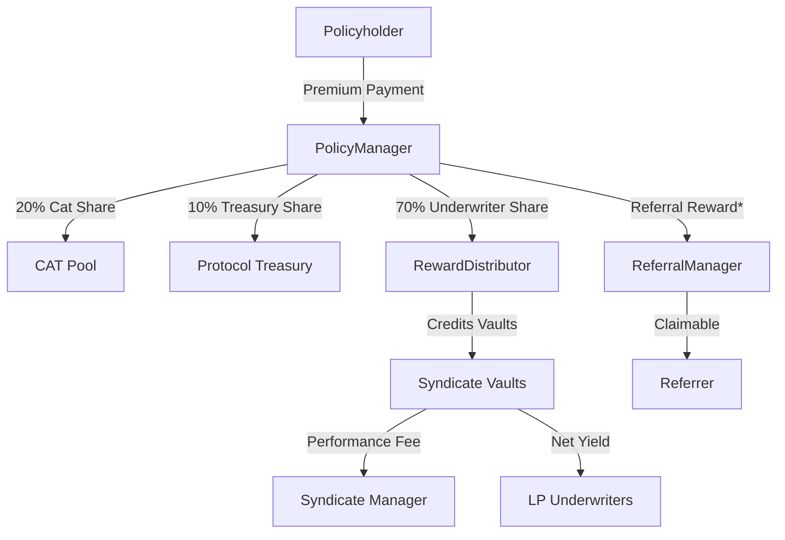

import { ThemedImage } from '@/components/ThemedImage'

LayerCover enables capital providers (underwriters) to earn premiums by backing specific risks. LayerCover gives underwriters granular control over their capital allocation, risk exposure, and liquidity. This section outlines the fundamental mechanics of underwriting on the LayerCover protocol.

## 1. Single-Sided Liquidity

Underwriters participate by depositing a single asset (e.g., USDC, ETH) into the **CapitalPool**. This capital acts as the principal that backs coverage.

* **Asset Choice:** You are not required to hold the protocol’s governance token or a basket of volatile assets.
* **Diversification:** While deposits are single-sided, you can allocate this principal across multiple independent risk pools to diversify your exposure.
* **Yield:** Idle capital (funds not currently paying out claims) is deployed into whitelisted yield adapters (e.g., Aave, Compound) to earn external DeFi yields on top of insurance premiums.

  <ThemedImage
    lightSrc="/doc-assets/illustrations/yield-light.png"
    darkSrc="/doc-assets/illustrations/yield-dark.png"
    alt="External Yield Generation"
    className="w-full rounded-lg border border-border"
  />

---

## 2. Allocation and Risk Points

Depositing into the CapitalPool does not automatically expose you to insurance risk; you must actively **allocate** your capital to specific risk pools via the Underwriter Manager (UM).

### The Allocation Process

1.  **Virtual Allocation:** Allocation is a record-keeping action; your assets do not physically move between wallets. The protocol simply tags a portion of your principal as pledged to a specific pool.
2.  **Risk Points Budget:** Every underwriter has a maximum "Risk Points" budget. Each pool is assigned a risk cost based on its rating, which consumes a portion of this budget. This limits the amount of leverage you can take and prevents over-concentration in high-risk assets. See the [Risk Framework](/concepts/underwriting/risk-assessment) for detailed point schedules.
3.  **Mutex Groups:** To prevent correlated failures, the protocol enforces "Mutex Groups" (Mutually Exclusive Groups). You cannot allocate capital to two pools within the same Mutex Group (e.g., two highly correlated stablecoins) simultaneously; the [correlation controls](/concepts/underwriting/risk-assessment#correlation-controls-mutex-groups) section explains how these clusters are defined.

---

## 3. Rewards and Premiums

Buying a policy loads the smart contracts with a premium balance. The protocol immediately and continuously routes that balance toward the actors that keep the system solvent including reinsurance backstops, the protocol treasury, the reward distributor that credits syndicate vaults, and any referral programs that were applied at purchase.

Every premium payment is split on-chain before it reaches underwriters or syndicate LPs:

| Destination | Share | Purpose |
|-------------|-------|---------|
| Reinsurance Pool (CAT Pool) | 20% | Protocol-wide emergency reserve that grows with underwriting volume |
| Protocol Treasury | 10% | Funds audits, operations, and growth; deducted alongside the CAT allocation |
| Underwriter Vault | 70% | Credited to the vault that backed the policy before any vault-level fees |
| Performance Fee (optional) | 10–20% of vault profits | Configurable per syndicate |
| Referral Discount (optional) | 2–5% buyer savings | Applied before collection; buyers pay less USDC, so every downstream share scales down proportionally |
| Referral Reward (optional) | 2–5% of original premium (capped by CAT share) | Paid to code owners from the CAT allocation via ReferralManager |

*Referral rewards are carved out of the CAT allocation before it settles in the pool so marketing spend never touches LP returns. Within each vault the manager can take a performance fee, and LP share price accrues the remainder.*

<Callout type="info">
  Rewards accrue continuously and can be claimed at any time without affecting your principal allocation.
</Callout>

---

## 4. Losses and Liability

If a valid claim is triggered, losses are realized instantly and mechanically.

* **Pro-Rata Loss:** When a payout occurs, the loss is prorated across all underwriters actively pledged to that pool at the exact block of the event.
* **Share Burning:** Losses are settled by "burning" a portion of your share in the CapitalPool. This reduces your principal balance but maintains price neutrality (the Price Per Share remains constant).
* **No "Race to Exit":** You cannot avoid a loss by withdrawing immediately after an event. The protocol snapshots the "Total Pledged" capital at the moment of the claim to ensure liability is fixed to those who backed the risk at that time.

### Combining Premiums and Yield

$$
\text{Total APY} = \text{Premium APY} + \text{External Yield APY} - \text{Expected Loss Rate}
$$

---

## 5. Salvage Rights

In the event of a payout, underwriters effectively "buy" the distressed asset from the policyholder, a process known as **Salvage**.

* **Asset Recovery:** When a claim is paid, the policyholder transfers the insured asset to the protocol. See [Paying Claims](/concepts/underwriting/paying-claims) for the block-by-block mechanics.
* **Entitlement:** Underwriters receive a pro-rata entitlement to these salvage assets based on their liability at the time of the claim.
* **Residual Value:** If the distressed asset recovers value (e.g., a de-pegged stablecoin returns to peg), underwriters can claim and sell these assets to offset their realized losses.

---

## 6. Managing Liquidity (Withdrawals)

LayerCover employs specific guardrails to ensure pool solvency while allowing underwriters to manage their positions.

* **Deallocation:** To reduce exposure to a specific pool, you must submit a deallocation request. This enters a governance-defined **Notice Period** during which the capital is locked and cannot be moved.
* **Withdrawal:** Withdrawing funds from the protocol also requires a notice period. Once the period expires, you can burn your shares and retrieve the underlying asset.
* **Solvency Floors:** The system enforces a coverage floor. You cannot withdraw capital if doing so would leave a pool with insufficient funds to cover its active policies and pending losses.

---

## 7. Syndicates

For users who prefer a passive "set-and-forget" experience, LayerCover supports **Syndicates**.

* **Delegated Management:** Syndicates are specialized vaults managed by professional risk assessors or DAOs. Explore the [Syndicates guide](/concepts/underwriting/syndicates) for manager roles, fees, and LP expectations.
* **Passive Exposure:** Instead of managing individual allocations and risk points, you deposit into a Syndicate. The Syndicate Manager handles all allocations, diversifications, and leverage management on your behalf.
* **Performance Fees:** Managers earn performance and management fees, aligning their incentives with the growth and preservation of your capital.
