<Callout type="info">
  **TL;DR:** Full Solidity interface reference for every deployed LayerCover contract. All interfaces follow the `I*` naming convention and use bundled config patterns for gas efficiency.
</Callout>

---

## Architecture Overview

```mermaid
flowchart LR
    SR["🔗 Registry"]

    subgraph Core["Core Contracts"]
        PM["📋 PolicyManager"]
        CP["🏦 CapitalPool"]
        RM["⚖️ RiskManager"]
        PR["📒 PoolRegistry"]
        IM["🔄 IntentMatcher"]
        PO["💸 PayoutManager"]
    end

    subgraph Policy["Policy Layer"]
        NFT["🎫 PolicyNFT"]
        OCR["🔮 ClaimResolver"]
    end

    subgraph Syndicate["Syndicate Layer"]
        SF["🏗️ Factory"]
        SYN["🏛️ Syndicate"]
        PA["📊 Allocations"]
        YSM["📈 YieldStrategy"]
        YA["🔌 YieldAdapter"]
    end

    subgraph Capital["Capital Layer"]
        SAC["🛡️ Backstop"]
    end

    SR --> Core
    PM --> Policy
    SF --> SYN
    SYN --> PA
    SYN --> YSM
    YSM --> YA
    CP --> Capital
    IM -.-> SYN

    style SR fill:#6366f120,stroke:#6366f1
    style PM fill:#22c55e20,stroke:#22c55e
    style CP fill:#3b82f620,stroke:#3b82f6
    style SYN fill:#f59e0b20,stroke:#f59e0b
```

---

## Core Infrastructure

The foundational vaults and capital layer that hold and manage underwriting capital.

  <a href="/contracts/ISyndicate" className="group block p-6 rounded-xl border border-border bg-gradient-to-br from-background to-amber-50/50 dark:to-amber-900/20 hover:border-brand-500 hover:shadow-lg hover:shadow-brand-500/10 hover:-translate-y-1 transition-all duration-300 no-underline">
    
🏛️

    <h3 className="text-lg font-semibold text-foreground mb-2">ISyndicate</h3>
    
ERC4626 underwriting vault - merged Hub+Strategy architecture for LP deposits, pool allocation, and yield.

  </a>
  <a href="/contracts/ICapitalPool" className="group block p-6 rounded-xl border border-border bg-gradient-to-br from-background to-blue-50/50 dark:to-blue-900/20 hover:border-brand-500 hover:shadow-lg hover:shadow-brand-500/10 hover:-translate-y-1 transition-all duration-300 no-underline">
    
🏦

    <h3 className="text-lg font-semibold text-foreground mb-2">ICapitalPool</h3>
    
Central asset storage, liquidity management, and ERC4626 withdrawal gating for the protocol.

  </a>
  <a href="/contracts/ISharedAssetController" className="group block p-6 rounded-xl border border-border bg-gradient-to-br from-background to-indigo-50/50 dark:to-indigo-900/20 hover:border-brand-500 hover:shadow-lg hover:shadow-brand-500/10 hover:-translate-y-1 transition-all duration-300 no-underline">
    
🛡️

    <h3 className="text-lg font-semibold text-foreground mb-2">ISharedAssetController</h3>
    
The Backstop (reinsurance) system that provides catastrophic loss coverage across pools.

  </a>

---

## Policy Lifecycle

Contracts governing policy issuance, claim resolution, and payout execution.

  <a href="/contracts/IPolicyManager" className="group block p-6 rounded-xl border border-border bg-gradient-to-br from-background to-green-50/50 dark:to-green-900/20 hover:border-brand-500 hover:shadow-lg hover:shadow-brand-500/10 hover:-translate-y-1 transition-all duration-300 no-underline">
    
📋

    <h3 className="text-lg font-semibold text-foreground mb-2">IPolicyManager</h3>
    
Central entry point for policy issuance, cancellation, and lifecycle. Uses unified <code>purchaseCoverage</code> flow.

  </a>
  <a href="/contracts/IPolicyNFT" className="group block p-6 rounded-xl border border-border bg-gradient-to-br from-background to-emerald-50/50 dark:to-emerald-900/20 hover:border-brand-500 hover:shadow-lg hover:shadow-brand-500/10 hover:-translate-y-1 transition-all duration-300 no-underline">
    
🎫

    <h3 className="text-lg font-semibold text-foreground mb-2">IPolicyNFT</h3>
    
ERC-721 tokenized insurance policy - transferable coverage represented as an NFT.

  </a>
  <a href="/contracts/IPayoutManager" className="group block p-6 rounded-xl border border-border bg-gradient-to-br from-background to-red-50/50 dark:to-red-900/20 hover:border-brand-500 hover:shadow-lg hover:shadow-brand-500/10 hover:-translate-y-1 transition-all duration-300 no-underline">
    
💸

    <h3 className="text-lg font-semibold text-foreground mb-2">IPayoutManager</h3>
    
Claim payout execution, loss distribution waterfall, and deficit coverage logic.

  </a>
  <a href="/contracts/IOptimisticClaimResolver" className="group block p-6 rounded-xl border border-border bg-gradient-to-br from-background to-purple-50/50 dark:to-purple-900/20 hover:border-brand-500 hover:shadow-lg hover:shadow-brand-500/10 hover:-translate-y-1 transition-all duration-300 no-underline">
    
🔮

    <h3 className="text-lg font-semibold text-foreground mb-2">IOptimisticClaimResolver</h3>
    
Optimistic oracle claim resolution via UMA for parametric and ecosystem risk policies.

  </a>

---

## Risk & Registry

Pool management, risk assessment, and capital allocation tracking.

  <a href="/contracts/IRiskManager" className="group block p-6 rounded-xl border border-border bg-gradient-to-br from-background to-orange-50/50 dark:to-orange-900/20 hover:border-brand-500 hover:shadow-lg hover:shadow-brand-500/10 hover:-translate-y-1 transition-all duration-300 no-underline">
    
⚖️

    <h3 className="text-lg font-semibold text-foreground mb-2">IRiskManager</h3>
    
Risk assessment, incident reporting, and pool risk parameter configuration.

  </a>
  <a href="/contracts/IPoolRegistry" className="group block p-6 rounded-xl border border-border bg-gradient-to-br from-background to-cyan-50/50 dark:to-cyan-900/20 hover:border-brand-500 hover:shadow-lg hover:shadow-brand-500/10 hover:-translate-y-1 transition-all duration-300 no-underline">
    
📒

    <h3 className="text-lg font-semibold text-foreground mb-2">IPoolRegistry</h3>
    
Central registry of all underwriting pools - creation, metadata, and status management.

  </a>
  <a href="/contracts/IPoolAllocations" className="group block p-6 rounded-xl border border-border bg-gradient-to-br from-background to-teal-50/50 dark:to-teal-900/20 hover:border-brand-500 hover:shadow-lg hover:shadow-brand-500/10 hover:-translate-y-1 transition-all duration-300 no-underline">
    
📊

    <h3 className="text-lg font-semibold text-foreground mb-2">IPoolAllocations</h3>
    
Per-syndicate capital allocation tracking - pledges, utilization, and capacity limits.

  </a>

---

## Orderbook & Rewards

Intent-based coverage matching, referral tracking, and reward distribution.

  <a href="/contracts/IIntentMatcher" className="group block p-6 rounded-xl border border-border bg-gradient-to-br from-background to-violet-50/50 dark:to-violet-900/20 hover:border-brand-500 hover:shadow-lg hover:shadow-brand-500/10 hover:-translate-y-1 transition-all duration-300 no-underline">
    
🔄

    <h3 className="text-lg font-semibold text-foreground mb-2">IIntentMatcher</h3>
    
On-chain orderbook matching buyer intents with underwriter quotes via EIP-712 signatures.

  </a>
  <a href="/contracts/IReferralManager" className="group block p-6 rounded-xl border border-border bg-gradient-to-br from-background to-pink-50/50 dark:to-pink-900/20 hover:border-brand-500 hover:shadow-lg hover:shadow-brand-500/10 hover:-translate-y-1 transition-all duration-300 no-underline">
    
🤝

    <h3 className="text-lg font-semibold text-foreground mb-2">IReferralManager</h3>
    
Referral code registration, tracking, and reward attribution for distribution partners.

  </a>
  <a href="/contracts/IRewardDistributor" className="group block p-6 rounded-xl border border-border bg-gradient-to-br from-background to-rose-50/50 dark:to-rose-900/20 hover:border-brand-500 hover:shadow-lg hover:shadow-brand-500/10 hover:-translate-y-1 transition-all duration-300 no-underline">
    
🎁

    <h3 className="text-lg font-semibold text-foreground mb-2">IRewardDistributor</h3>
    
Protocol reward distribution engine for underwriters and liquidity providers.

  </a>

---

## Yield & Deployment

Yield strategy management and syndicate factory deployment.

  <a href="/contracts/IYieldStrategyManager" className="group block p-6 rounded-xl border border-border bg-gradient-to-br from-background to-lime-50/50 dark:to-lime-900/20 hover:border-brand-500 hover:shadow-lg hover:shadow-brand-500/10 hover:-translate-y-1 transition-all duration-300 no-underline">
    
📈

    <h3 className="text-lg font-semibold text-foreground mb-2">IYieldStrategyManager</h3>
    
Manages whitelisted external yield strategies (Aave, Compound) for idle capital deployment.

  </a>
  <a href="/contracts/IYieldAdapter" className="group block p-6 rounded-xl border border-border bg-gradient-to-br from-background to-green-50/50 dark:to-green-900/20 hover:border-brand-500 hover:shadow-lg hover:shadow-brand-500/10 hover:-translate-y-1 transition-all duration-300 no-underline">
    
🔌

    <h3 className="text-lg font-semibold text-foreground mb-2">IYieldAdapter</h3>
    
Adapter interface for integrating individual yield sources into the strategy manager.

  </a>
  <a href="/contracts/ISyndicateFactory" className="group block p-6 rounded-xl border border-border bg-gradient-to-br from-background to-sky-50/50 dark:to-sky-900/20 hover:border-brand-500 hover:shadow-lg hover:shadow-brand-500/10 hover:-translate-y-1 transition-all duration-300 no-underline">
    
🏗️

    <h3 className="text-lg font-semibold text-foreground mb-2">ISyndicateFactory</h3>
    
Deployment factory for creating new Syndicate vaults with deterministic proxy addresses.

  </a>

---

## Conventions

  

    <h4 className="text-sm font-semibold text-foreground m-0 mb-1">🏷️ Naming</h4>
    
All interfaces use the I* prefix (e.g., ISyndicate, IPolicyManager)

  

  

    <h4 className="text-sm font-semibold text-foreground m-0 mb-1">⚙️ Config Pattern</h4>
    
Bundled struct configs (configureVault, configureGovernanceSettings) for gas efficiency

  

  

    <h4 className="text-sm font-semibold text-foreground m-0 mb-1">📝 NatSpec</h4>
    
Full @notice / @param / @return documentation on all public functions

  

  

    <h4 className="text-sm font-semibold text-foreground m-0 mb-1">🔐 Access Control</h4>
    
Role-based via OpenZeppelin AccessControl + TimelockController

  

  

    <h4 className="text-sm font-semibold text-foreground m-0 mb-1">🔄 Upgradability</h4>
    
UUPS proxy pattern with upgradeToAndCall on core contracts

  

  

    <h4 className="text-sm font-semibold text-foreground m-0 mb-1">📄 License</h4>
    
BUSL-1.1 for core contracts, MIT for interfaces

  

---

## Related Documentation

  <a href="/protocol/architecture" className="block p-4 rounded-lg border border-border hover:border-brand-500 hover:shadow-lg hover:shadow-brand-500/10 hover:-translate-y-1 transition-all duration-300 no-underline">
    <h4 className="text-base font-semibold text-foreground m-0">🏗️ Protocol Architecture →</h4>
    
How these contracts fit together in the protocol

  </a>
  <a href="/resources/contract-addresses" className="block p-4 rounded-lg border border-border hover:border-brand-500 hover:shadow-lg hover:shadow-brand-500/10 hover:-translate-y-1 transition-all duration-300 no-underline">
    <h4 className="text-base font-semibold text-foreground m-0">📍 Contract Addresses →</h4>
    
Deployed addresses across all supported networks

  </a>

