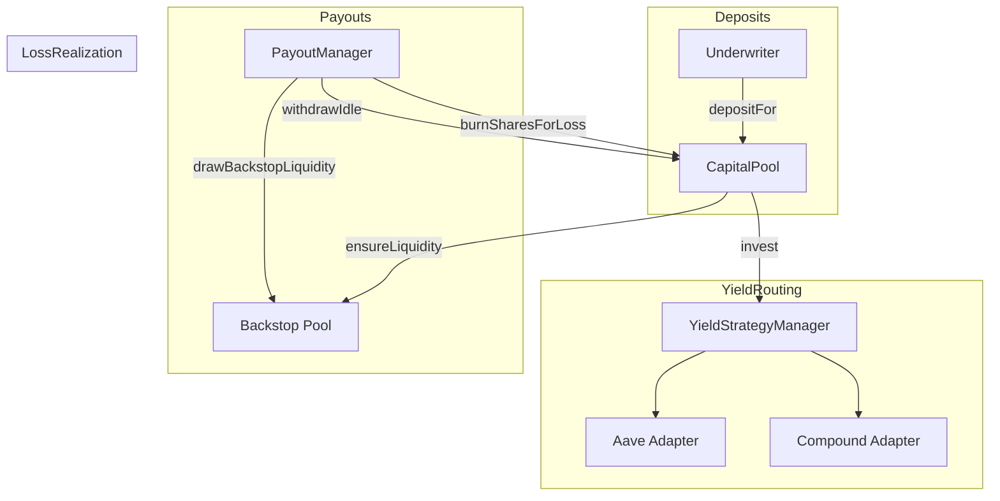

<Callout type="info">
  View deployed contract addresses in the [Contract Addresses](/resources/contract-addresses) section.
</Callout>

The **ICapitalPool** is the unified vault that manages underwriter capital, liquidity provisioning, and coordinates with the backstop system for claim payouts. It extends ERC4626 for standardized vault interactions.

## Interface

```solidity
// SPDX-License-Identifier: BUSL-1.1
pragma solidity ^0.8.20;

import {IERC4626} from "@openzeppelin/contracts/interfaces/IERC4626.sol";
import {IERC20} from "@openzeppelin/contracts/token/ERC20/IERC20.sol";
import {Types} from "../libraries/helpers/Types.sol";
import {IYieldStrategyManager} from "./IYieldStrategyManager.sol";
import {ISharedAssetController} from "./ISharedAssetController.sol";

/**
 * @title ICapitalPool
 * @notice Unified interface for CapitalPool - includes both public API and coordination functions
 */
interface ICapitalPool is IERC4626 {
    /* =========================
       ===== Admin / Config =====
       ========================= */

    /**
     * @notice Configures the capital pool with bundled settings
     * @param config The CapitalPoolConfig struct with all configuration parameters
     */
    function configure(Types.CapitalPoolConfig memory config) external;

    /**
     * @notice Returns the current system state
     * @return The CapitalSystemState struct containing current state
     */
    function state() external view returns (Types.CapitalSystemState memory);

    /**
     * @notice Alias for state() - returns current system state
     * @return The CapitalSystemState struct
     */
    function getSystemState() external view returns (Types.CapitalSystemState memory);

    /* ============================
       ===== Underwriter Flows =====
       ============================ */

    /**
     * @notice Deposits assets on behalf of a user with yield platform choice
     * @dev Called by allocation manager during capital deployment
     * @param user Address to credit the deposit to
     * @param amount Amount of underlying asset to deposit
     * @param yieldChoice The yield platform preference (AAVE, COMPOUND, etc.)
     */
    function depositFor(address user, uint256 amount, Types.YieldPlatform yieldChoice) external;

    /* ==========================
       ===== Risk Operations =====
       ========================== */

    /**
     * @notice Burns shares from an underwriter during loss charging
     * @dev Called by PayoutManager when distributing claim losses
     * @param underwriter The underwriter whose shares to burn
     * @param burnAmount Number of shares to burn
     */
    function burnSharesForLoss(address underwriter, uint256 burnAmount) external;

    /* =========================
       ===== View Helpers  =====
       ========================= */

    /**
     * @notice Returns per-underwriter account summary
     * @param underwriter Address to query
     * @return currentValue Current value of underwriter's position
     * @return yieldChoice Their selected yield platform
     * @return masterShares Number of vault shares held
     */
    function getUnderwriterAccount(address underwriter)
        external
        view
        returns (
            uint256 currentValue,
            Types.YieldPlatform yieldChoice,
            uint256 masterShares
        );

    /**
     * @notice Issues vault shares to a recipient for payout coverage
     * @dev Called during claim execution to mint shares for payout
     * @param recipient Address to receive the shares
     * @param shares Number of shares to issue
     * @return issued Actual shares issued
     */
    function issueSharesForPayout(address recipient, uint256 shares) external returns (uint256 issued);

    /* =====================================
       ===== Coordination (PayoutManager) =====
       ===================================== */

    /**
     * @notice Gets the idle balance available for immediate payout
     * @return balance Available idle liquidity
     */
    function getAvailableLiquidity() external view returns (uint256 balance);

    /**
     * @notice Withdraws idle capital from the CapitalPool (soft-fail)
     * @param amount Amount to withdraw
     * @return withdrawn Actual amount withdrawn
     */
    function withdrawIdle(uint256 amount) external returns (uint256 withdrawn);

    /**
     * @notice Records payout execution and updates unsettled shares
     * @param payoutShares Number of shares used for payout
     */
    function recordPayoutExecution(uint256 payoutShares) external;

    /**
     * @notice Ensures enough idle liquidity exists by optionally drawing from backstop
     * @param requiredAmount Amount of liquidity needed
     * @return drawn Amount drawn from backstop (if any)
     */
    function ensureLiquidity(uint256 requiredAmount) external returns (uint256 drawn);

    /**
     * @notice Draws backstop liquidity directly to the caller (PayoutManager)
     * @param amount Amount to draw
     * @return drawn Actual amount drawn
     */
    function drawBackstopLiquidity(uint256 amount) external returns (uint256 drawn);

    /**
     * @notice Checks if adapter routing is enabled (not in emergency mode)
     * @return enabled True if yield adapter routing is active
     */
    function adapterRoutingEnabled() external view returns (bool enabled);

    /**
     * @notice Swaps adapter debt for backstop liquidity during deficit scenarios
     * @param adapter The adapter with the deficit
     * @param deficit Amount of deficit to cover
     * @return swapped Amount swapped from backstop
     */
    function swapAdapterDebtForBackstopLiquidity(address adapter, uint256 deficit) external returns (uint256 swapped);
}
```

## Capital Flow



## Configuration

The CapitalPool uses a bundled configuration pattern via `Types.CapitalPoolConfig`:

| Field | Type | Description |
|-------|------|-------------|
| `yieldStrategyManager` | `address` | YieldStrategyManager contract |
| `backstopController` | `address` | SharedAssetController for reinsurance |
| `payoutManager` | `address` | PayoutManager for claim coordination |
| `backstopBufferBps` | `uint256` | Buffer percentage for backstop draws |
| `maxBackstopDrawPerCall` | `uint256` | Maximum backstop draw per transaction |

## Related Documentation

- [Syndicates](/underwriters/syndicates) - How syndicates use the capital pool
- [Paying Claims](/underwriters/paying-claims) - Payout flow through capital pool
- [IYieldStrategyManager](/contracts/IYieldStrategyManager) - Yield strategy management