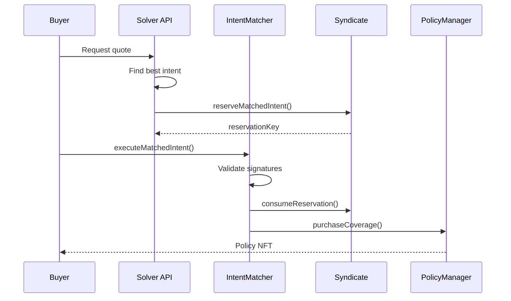

<Callout type="info">
  View deployed contract addresses in the [Contract Addresses](/resources/contract-addresses) section.
</Callout>

The **IIntentMatcher** facilitates the "Intent-Based" pricing model. It acts as an order book where buyers post coverage requests and underwriters sign off-chain offers ("Intents"). The matcher validates and executes these trades, settling them on-chain via the PolicyManager.

## Interface

```solidity
// SPDX-License-Identifier: BUSL-1.1
pragma solidity ^0.8.20;

/**
 * @title IIntentMatcher
 * @notice Interface for intent-based coverage pricing system
 */
interface IIntentMatcher {

    // ==================== Structs ====================

    struct CoverageIntent {
        address maker;              // Underwriter offering coverage
        uint256 poolId;             // Pool to allocate capital from
        uint256 coverageAmount;     // Amount of coverage offered
        uint256 premiumRateBps;     // Annual premium rate in basis points
        uint256 minDuration;        // Minimum coverage duration in seconds
        uint256 maxDuration;        // Maximum coverage duration in seconds
        uint256 nonce;              // Nonce for replay protection
        uint256 expiry;             // Intent expiration timestamp
        uint256 salt;               // Unique salt to avoid hash collisions
        bool requiresUpfront;       // If true, full premium must be paid upfront
    }

    struct CoverageBuyOrder {
        address taker;              // Coverage buyer
        uint256 poolId;             // Pool to buy coverage from
        uint256 coverageAmount;     // Coverage desired
        uint256 maxPremiumRateBps;  // Maximum annual rate willing to pay
        uint256 duration;           // Desired coverage duration in seconds
        uint256 premiumDeposit;     // Upfront premium payment
        uint256 nonce;              // Nonce for replay protection
        uint256 expiry;             // Order expiration timestamp
        uint256 salt;               // Unique salt for the buy order
    }

    struct ReserveIntent {
        address solver;               // Solver/matcher address
        address underwriter;          // Syndicate underwriting the coverage
        uint256 poolId;               // Target pool ID
        uint32 minCoverageDuration;   // Minimum duration (seconds)
        uint32 maxCoverageDuration;   // Maximum duration (seconds)
        uint256 coverageAmount;       // Total coverage reserved
        uint256 minFillAmount;        // Minimum fill amount for partial fills
        bool allowPartialFill;        // Whether partial fills are permitted
        uint64 reservationExpiry;     // Reservation expiration timestamp
        uint96 nonce;                 // Unique nonce for this reservation
        address whitelistedBuyer;     // Optional buyer allowlist (address(0) for open)
        uint16 minPremiumBps;         // Minimum premium rate (seller's floor)
        uint16 cancellationPenaltyBps; // Cancellation penalty in basis points
    }

    // ==================== Events ====================

    event IntentMatched(
        address indexed underwriter,
        address indexed buyer,
        uint256 indexed poolId,
        uint256 coverageAmount,
        uint256 premiumRateBps,
        uint256 duration,
        uint256 policyId
    );

    event NonceIncremented(address indexed user, uint256 newNonce);

    // ==================== Functions ====================

    /**
     * @notice Execute one or more matched intents to create coverage policies
     * @dev Unified function for both single and batch execution
     * @param intents Array of coverage intents (length 1 for single)
     * @param intentSignatures Corresponding signatures
     * @param order The buyer's coverage order
     * @param orderSignature Buyer's signature
     * @param fillAmounts Amount to fill from each intent
     * @param reserveIntents Reserve intents from syndicates
     * @param reserveSignatures Syndicate signatures
     * @param vault For vault cover: the ERC4626 vault address (address(0) for non-vault)
     * @param sharesToCover For vault cover: number of shares to protect
     * @return policyIds Array of created policy IDs
     */
    function executeMatchedIntent(
        CoverageIntent[] calldata intents,
        bytes[] calldata intentSignatures,
        CoverageBuyOrder calldata order,
        bytes calldata orderSignature,
        uint256[] calldata fillAmounts,
        ReserveIntent[] calldata reserveIntents,
        bytes[] calldata reserveSignatures,
        address vault,
        uint256 sharesToCover
    ) external returns (uint256[] memory policyIds);

    /**
     * @notice Generates EIP-712 hash for intent
     * @param intent The coverage intent to hash
     * @return hash The EIP-712 typed data hash
     */
    function getIntentHash(CoverageIntent calldata intent) external view returns (bytes32);

    /**
     * @notice Generates EIP-712 hash for buy order
     * @param order The buy order to hash
     * @return hash The EIP-712 typed data hash
     */
    function getOrderHash(CoverageBuyOrder calldata order) external view returns (bytes32);

    /**
     * @notice Increments user's nonce to invalidate all prior intents
     */
    function incrementNonce() external;

    /**
     * @notice Gets user's current nonce
     * @param user Address to query
     * @return Current nonce value
     */
    function nonces(address user) external view returns (uint256);
}
```

## Intent Flow



## Key Changes from Previous Version

1. **Unified Execute Function**: The separate `executeMatchedIntent` and `executeMatchedIntentBatch` have been merged into a single function that handles both cases.

2. **Vault Cover Support**: The `vault` and `sharesToCover` parameters enable vault cover purchases through the same flow.

3. **Enhanced ReserveIntent**: Added `minPremiumBps` (seller's floor) and `cancellationPenaltyBps` for more sophisticated underwriting control.

4. **Removed On-Chain Orderbook**: The `postBuyOrder`, `fillBuyOrder`, `cancelBuyOrder`, and related orderbook functions have been removed in favor of the off-chain intent matching model.

## Related Documentation

- [Intent-Based Pricing](/protocol/pricing) - How the intent system works
- [ISyndicate](/contracts/ISyndicate) - Reservation management
- [IPolicyManager](/contracts/IPolicyManager) - Policy creation