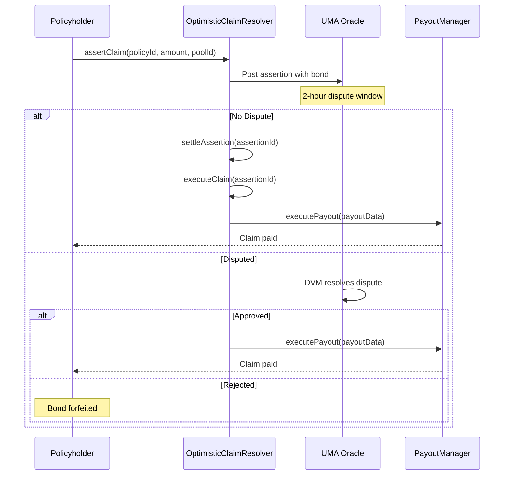

<Callout type="info">
  View deployed contract addresses in the [Contract Addresses](/resources/contract-addresses) section.
</Callout>

The **IOptimisticClaimResolver** handles claim resolution for pools that use the UMA Optimistic Oracle. It allows policyholders to file claims that are settled through UMA's dispute mechanism rather than a centralized committee.

## Interface

```solidity
// SPDX-License-Identifier: BUSL-1.1
pragma solidity ^0.8.20;

/**
 * @title IOptimisticClaimResolver
 * @notice Interface for the OptimisticClaimResolver contract
 */
interface IOptimisticClaimResolver {
    struct ClaimAssertion {
        uint256 policyId;      // Policy being claimed against
        uint256 claimAmount;   // Amount being claimed
        address claimant;      // Address filing the claim
        uint256 poolId;        // Pool the policy belongs to
        bytes32 assertionId;   // UMA assertion ID
        bool settled;          // Whether UMA has resolved
        bool approved;         // Whether claim was approved
    }

    /**
     * @notice Files a claim assertion with UMA's Optimistic Oracle
     * @dev Requires posting a bond that is forfeited if claim is disputed and rejected
     * @param policyId The policy to claim against
     * @param claimAmount Amount being claimed (up to coverage amount)
     * @param poolId Pool ID for validation
     * @return assertionId The UMA assertion ID
     */
    function assertClaim(
        uint256 policyId,
        uint256 claimAmount,
        uint256 poolId
    ) external returns (bytes32 assertionId);

    /**
     * @notice Settles a claim assertion after UMA's dispute period
     * @dev Called to finalize the UMA oracle result
     * @param assertionId The assertion to settle
     */
    function settleAssertion(bytes32 assertionId) external;
    
    /**
     * @notice Executes an approved claim payout
     * @dev Can only be called after assertion is settled and approved
     * @param assertionId The settled assertion to execute
     */
    function executeClaim(bytes32 assertionId) external;

    /**
     * @notice Returns details of a claim assertion
     * @param assertionId Assertion ID to query
     * @return ClaimAssertion struct with all details
     */
    function getClaimAssertion(bytes32 assertionId) external view returns (ClaimAssertion memory);
    
    /**
     * @notice Returns the active assertion for a policy (if any)
     * @param policyId Policy to check
     * @return assertionId Active assertion ID (bytes32(0) if none)
     */
    function getActivePolicyAssertion(uint256 policyId) external view returns (bytes32);
}
```

## Claim Flow



## IPFS Commitment Pattern

For tamper-proof claim rules, pools use IPFS CIDs stored in `PoolRegistry.oracleQuestionCID`. The CID points to immutable claim rules that cannot be modified after pool creation, ensuring fairness for policyholders.

## Related Documentation

- [Protocol Governance](/protocol/governance) - How optimistic claims work
- [IRiskManager](/contracts/IRiskManager) - Incident-based claims
- [IPayoutManager](/contracts/IPayoutManager) - Executes payouts
