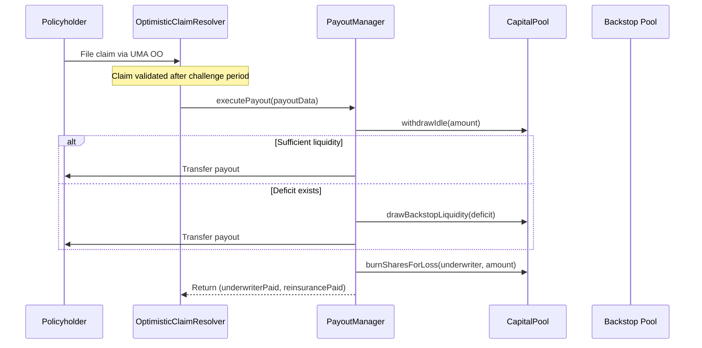

<Callout type="info">
  View deployed contract addresses in the [Contract Addresses](/resources/contract-addresses) section.
</Callout>

The **IPayoutManager** handles the execution of claim payouts. When a claim is validated by the Risk Manager or OptimisticClaimResolver, this contract coordinates the movement of funds from the CapitalPool, yield adapters, and backstop to the claimant.

## Interface

```solidity
// SPDX-License-Identifier: BUSL-1.1
pragma solidity ^0.8.20;

import {Types} from "../libraries/helpers/Types.sol";

/**
 * @title IPayoutManager
 * @notice Interface for PayoutManager contract
 * @dev Allows RiskManager to execute claim payouts
 */
interface IPayoutManager {
    /**
     * @notice Executes claim payout by gathering assets from adapters and distributing to claimant
     * @dev Only callable by RiskManager/OptimisticClaimResolver after claim validation
     * 
     * Flow:
     * 1. Validates capital proportions sum to 100%
     * 2. Gathers assets from yield adapters (Aave, Compound, etc.)
     * 3. Pays claimant first (priority settlement)
     * 4. Covers any deficit with aTokens or reinsurance pool
     * 5. Distributes loss across underwriters proportionally
     * 
     * @param p PayoutData struct containing:
     *   - claimant: Address receiving the payout
     *   - policyId: The policy being claimed
     *   - coverageAmount: Maximum payout amount
     *   - adapters: Array of yield adapter addresses holding capital
     *   - capitalPerAdapter: Amount to pull from each adapter
     *   - totalCapital: Sum of all capital being used
     * @return underwriterPaid Amount paid from underwriter capital
     * @return reinsurancePaid Amount paid from backstop/reinsurance
     */
    function executePayout(Types.PayoutData calldata p) external returns (uint256 underwriterPaid, uint256 reinsurancePaid);

    /**
     * @notice Charges a loss directly to an intent underwriter by burning their shares
     * @dev Merged from ILossDistributor for simplification
     * @param underwriter The underwriter to charge
     * @param poolId The pool ID
     * @param lossValue The value to charge in underlying asset terms
     * @return coveredValue Actual value covered (may be less if undercapitalized)
     */
    function chargeIntentLoss(address underwriter, uint256 poolId, uint256 lossValue) external returns (uint256 coveredValue);
}
```

## PayoutData Struct

The `executePayout` function receives a `PayoutData` struct with all the information needed to execute a claim:

| Field | Type | Description |
|-------|------|-------------|
| `claimant` | `address` | The address receiving the payout |
| `policyId` | `uint256` | The policy NFT being claimed against |
| `coverageAmount` | `uint256` | Maximum payout amount for the claim |
| `adapters` | `address[]` | Yield adapters holding underwriter capital |
| `capitalPerAdapter` | `uint256[]` | Amount to withdraw from each adapter |
| `totalCapital` | `uint256` | Total capital being used for payout |

## Payout Flow



## Loss Distribution

The `chargeIntentLoss` function handles loss distribution for intent-based policies. It burns the underwriter's shares to cover the loss. If the underwriter's capital is insufficient, the deficit is escalated through the protocol's multi-layer payout waterfall.

See [**Claims & Salvage → Multi-Layer Payout Waterfall**](/underwriters/claims-and-salvage#multi-layer-payout-waterfall) for the full fallback sequence.

## Related Documentation

- [Filing a Claim](/policyholders/filing-claims) - End-to-end claim process
- [Claims & Salvage](/underwriters/claims-and-salvage) - How claims affect underwriter capital
- [IRiskManager](/contracts/IRiskManager) - Validates and initiates payouts
- [ICapitalPool](/contracts/ICapitalPool) - Source of payout funds