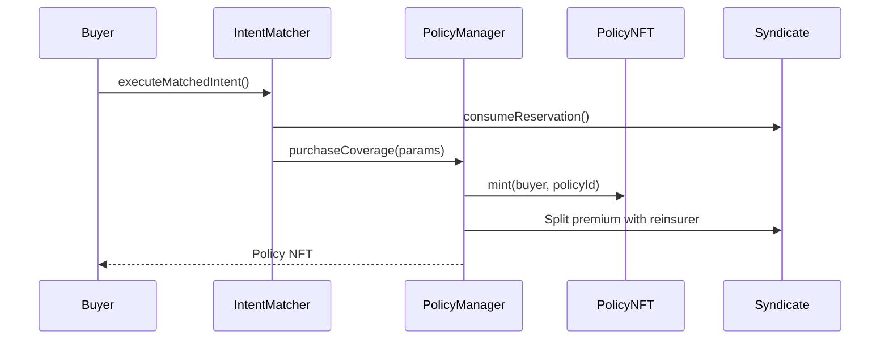

<Callout type="info">
  View deployed contract addresses in the [Contract Addresses](/resources/contract-addresses) section.
</Callout>

The **IPolicyManager** is the central entry point for the insurance policy system. It handles policy issuance, modifications, expiration, and claims. It uses a unified purchase flow via the `purchaseCoverage` function.

## Interface

```solidity
// SPDX-License-Identifier: BUSL-1.1
pragma solidity ^0.8.20;

import "./IPolicyNFT.sol";
import {Types} from "../libraries/helpers/Types.sol";

interface IPolicyManager {
    // ==================== View Functions ====================

    /**
     * @notice Returns the PolicyNFT contract address
     * @return The IPolicyNFT interface for the policy token contract
     */
    function policyNFT() external view returns (IPolicyNFT);

    /**
     * @notice Checks if a policy is currently active (not expired, not cancelled)
     * @param policyId The unique ID of the policy to check
     * @return True if the policy is active and providing coverage
     */
    function isPolicyActive(uint256 policyId) external view returns (bool);

    /**
     * @notice Returns the CAT pool premium share in basis points
     * @return The percentage (in bps) of premiums directed to the reinsurance pool
     */
    function catPremiumBps() external view returns (uint16);

    // ==================== Configuration ====================

    /**
     * @notice Configures governance-related settings
     * @dev Uses bundled config pattern for gas efficiency
     * @param config PolicyGovernanceConfig struct with governance parameters
     */
    function configureGovernanceSettings(Types.PolicyGovernanceConfig calldata config) external;

    /**
     * @notice Configures yield-related settings
     * @param config PolicyYieldConfig struct with yield parameters
     */
    function configureYieldSettings(Types.PolicyYieldConfig calldata config) external;

    // ==================== Policy Purchase ====================

    /**
     * @notice Purchase coverage via the unified purchase flow
     * @dev Called by IntentMatcher after matching a buyer with underwriter intent
     * @param params PurchaseParams struct containing all purchase parameters:
     *   - buyer: Address that will own the policy NFT
     *   - poolId: The underwriting pool providing coverage
     *   - coverageAmount: Maximum payout amount in case of claim
     *   - agreedRateBps: Annual premium rate in basis points
     *   - premiumDeposit: Upfront premium payment amount
     *   - backingUnderwriter: Syndicate providing the coverage capital
     *   - duration: Coverage period in seconds
     *   - requiresUpfront: Whether full premium must be paid upfront
     *   - reservationKey: Unique key for the capital reservation
     *   - referralCode: Optional referral code for reward attribution
     *   - vault: (for vault cover) The ERC4626 vault whose shares are being insured
     *   - sharesToCover: (for vault cover) Number of vault shares to protect
     * @return policyId The minted policy NFT ID
     */
    function purchaseCoverage(Types.PurchaseParams memory params) external returns (uint256 policyId);

    // ==================== Policy Lifecycle ====================

    /**
     * @notice Cancels an active policy and refunds unused premium
     * @dev Can only be called by the policy owner
     * @param policyId The policy to cancel
     */
    function cancelCover(uint256 policyId) external;

    /**
     * @notice Settles outstanding premium before processing a claim
     * @dev Called internally during claim flow
     * @param policyId The policy being claimed
     * @return True if settlement succeeded
     */
    function settlePremiumForClaim(uint256 policyId) external returns (bool);

    /**
     * @notice Force-voids a policy due to an incident (admin only)
     * @dev Used when a pool experiences an incident before policy expiry
     * @param policyId The policy to void
     * @param incidentBlock The block number when the incident was reported
     */
    function forceVoidPolicy(uint256 policyId, uint256 incidentBlock) external;

    // ==================== Admin Functions ====================

    /**
     * @notice Force initializes the contract (admin emergency function)
     */
    function forceInitialize() external;

    /**
     * @notice Upgrades the contract to a new implementation
     * @param newImplementation Address of new implementation
     * @param data Initialization data for the new implementation
     */
    function upgradeToAndCall(address newImplementation, bytes calldata data) external;
}
```

## PurchaseParams Struct

The unified `purchaseCoverage` function uses a `PurchaseParams` struct:

| Field | Type | Description |
|-------|------|-------------|
| `buyer` | `address` | Address that will own the policy NFT |
| `poolId` | `uint256` | The underwriting pool providing coverage |
| `coverageAmount` | `uint256` | Maximum payout amount in case of claim |
| `agreedRateBps` | `uint256` | Annual premium rate in basis points |
| `premiumDeposit` | `uint256` | Upfront premium payment amount |
| `backingUnderwriter` | `address` | Syndicate providing coverage capital |
| `duration` | `uint256` | Coverage period in seconds |
| `requiresUpfront` | `bool` | Whether full premium must be paid upfront |
| `reservationKey` | `bytes32` | Unique key for capital reservation |
| `referralCode` | `bytes32` | Optional referral code for rewards |
| `vault` | `address` | (Vault Cover) The ERC4626 vault being insured |
| `sharesToCover` | `uint256` | (Vault Cover) Number of vault shares to protect |

## Policy Flow



## Related Documentation

- [Intent-Based Pricing](/protocol/pricing) - How quotes and premiums work
- [Filing a Claim](/policyholders/filing-claims) - Claim filing and payout process
- [IIntentMatcher](/contracts/IIntentMatcher) - The orderbook that calls `purchaseCoverage`