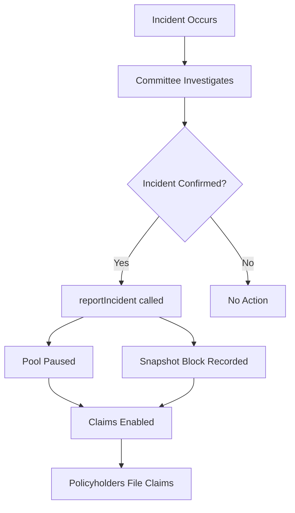

<Callout type="info">
  View deployed contract addresses in the [Contract Addresses](/resources/contract-addresses) section.
</Callout>

The **IRiskManager** is responsible for the "risk" side of the protocol. It handles incident reporting, configures the claims system, and coordinates with the OptimisticClaimResolver for claim processing.

## Interface

```solidity
// SPDX-License-Identifier: BUSL-1.1
pragma solidity ^0.8.20;

import "./IPoolRegistry.sol";
import "./IRMSalvageManager.sol";

interface IRiskManager {
    // ==================== Configuration ====================

    struct RiskManagerConfig {
        address committee;               // Governance committee address
        address optimisticClaimResolver; // OptimisticClaimResolver contract
        bool isTestnet;                  // Whether running on testnet
    }

    /**
     * @notice Configures the RiskManager with bundled settings
     * @param config RiskManagerConfig struct
     */
    function configure(RiskManagerConfig memory config) external;

    /**
     * @notice Returns the current configuration state
     * @return committee The governance committee address
     * @return optimisticClaimResolver The claim resolver contract
     * @return isTestnet Whether on testnet
     */
    function state() external view returns (address committee, address optimisticClaimResolver, bool isTestnet);

    // ==================== Incident Management ====================

    /**
     * @notice Reports an incident for a pool, triggering claim eligibility
     * @dev Only callable by Committee after governance vote
     * @param _poolId The affected underwriting pool
     * @param _pauseState Whether to pause the pool
     * @param incidentBlock Block number when incident occurred (for snapshots)
     */
    function reportIncident(uint256 _poolId, bool _pauseState, uint256 incidentBlock) external;

    // ==================== Admin Functions ====================

    /**
     * @notice Sets the fee recipient for a pool
     * @param _poolId The pool to configure
     * @param _recipient New fee recipient address
     */
    function setPoolFeeRecipient(uint256 _poolId, address _recipient) external;

    /**
     * @notice Blacklists or whitelists an address from claim submissions
     * @param sender Address to modify
     * @param blacklisted True to blacklist, false to whitelist
     */
    function setClaimSenderBlacklist(address sender, bool blacklisted) external;

    /**
     * @notice Checks if an address is blacklisted from sending claims
     * @param sender The address to check
     * @return True if blacklisted
     */
    function claimSenderBlacklist(address sender) external view returns (bool);

    /**
     * @notice Force processes an optimistic claim (admin emergency function)
     * @dev Bypasses the normal UMA dispute period
     * @param policyId The policy to process claim for
     * @param claimAmount The claim amount
     */
    function adminForceOptimisticClaim(uint256 policyId, uint256 claimAmount) external;
}
```

## Incident Flow

When a covered protocol experiences an incident (e.g., a hack or depeg event):



## Claim Blacklisting

The blacklist feature prevents certain addresses from filing claims:

| Function | Description |
|----------|-------------|
| `setClaimSenderBlacklist(addr, true)` | Blocks address from claims |
| `setClaimSenderBlacklist(addr, false)` | Allows address to claim |
| `claimSenderBlacklist(addr)` | Check if address is blocked |

## Related Documentation

- [Claims & Salvage](/underwriters/claims-and-salvage) - How claims affect capital
- [IPayoutManager](/contracts/IPayoutManager) - Executes claim payouts
- [IOptimisticClaimResolver](/contracts/IOptimisticClaimResolver) - UMA-based claims
- [Access Controls](/resources/access-controls) - Committee and admin roles