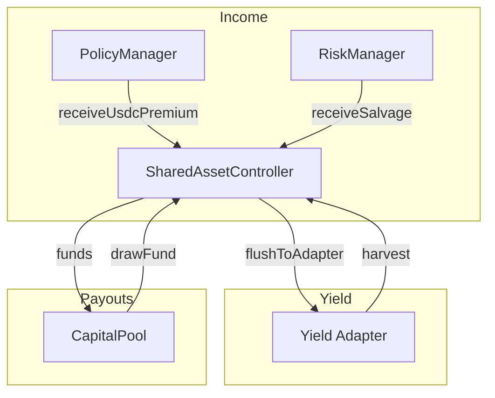

<Callout type="info">
  View deployed contract addresses in the [Contract Addresses](/resources/contract-addresses) section.
</Callout>

The **ISharedAssetController** manages the Reinsurance (Backstop) pool. This system provides a shared layer of protection for all Syndicates by absorbing losses that exceed a Syndicate's capacity and enabling liquidity during claim payouts.

## Interface

```solidity
// SPDX-License-Identifier: BUSL-1.1
pragma solidity ^0.8.20;

import { IERC20 } from "@openzeppelin/contracts/token/ERC20/IERC20.sol";

/**
 * @title ISharedAssetController
 * @notice Interface for the single-pool reinsurance controller
 * @dev Simplified ERC-4626 vault with backstop hook for future extensibility
 */
interface ISharedAssetController {
    // ==================== Events ====================

    event PremiumReceived(uint256 amount);
    event DrawExecuted(uint256 requestedAmount, uint256 sentToCapitalPool);
    event AdapterChanged(address indexed newAdapter);
    event DepositToAdapter(uint256 amount);
    event Harvest(uint256 gainRealized);
    event LossRealized(uint256 lossAmount);
    event SalvageReceived(uint256 amount);
    event SalvageDistributed(uint256 amount);
    event BackstopHookUpdated(address indexed previousHook, address indexed newHook);
    event WithdrawalRequested(address indexed user, uint256 shares, uint256 unlockTime);

    // ==================== View Functions ====================

    /**
     * @notice Returns the underlying asset address
     */
    function asset() external view returns (address);

    /**
     * @notice Returns the current yield adapter address
     */
    function adapter() external view returns (address);

    /**
     * @notice Returns the backstop hook address for future extensibility
     */
    function backstopHook() external view returns (address);

    /**
     * @notice Returns the CapitalPool contract address
     */
    function capitalPoolAddress() external view returns (address);

    /**
     * @notice Returns the PolicyManager contract address
     */
    function policyManagerAddress() external view returns (address);

    /**
     * @notice Returns the RiskManager contract address
     */
    function riskManagerAddress() external view returns (address);

    /**
     * @notice Returns total assets managed by the backstop
     */
    function totalAssets() external view returns (uint256);

    /**
     * @notice Returns minimum time between yield harvests
     */
    function harvestCooldown() external view returns (uint256);

    /**
     * @notice Returns timestamp of the last harvest
     */
    function lastHarvestTimestamp() external view returns (uint256);

    /**
     * @notice Returns total pending salvage awaiting distribution
     */
    function pendingSalvage() external view returns (uint256);

    /**
     * @notice Returns the notice period for withdrawals
     */
    function noticePeriod() external view returns (uint256);

    // ==================== Configuration ====================

    /**
     * @notice Sets the backstop hook for future extensibility
     * @param hook New hook address
     */
    function setBackstopHook(address hook) external;

    /**
     * @notice Sets the yield adapter contract
     * @param newAdapter Address of new adapter
     */
    function setAdapter(address newAdapter) external;

    /**
     * @notice Emergency adapter change (bypasses normal checks)
     * @param newAdapter Address of new adapter
     */
    function emergencySetAdapter(address newAdapter) external;

    /**
     * @notice Sets the minimum cooldown between harvests
     * @param newCooldown Cooldown in seconds
     */
    function setHarvestCooldown(uint256 newCooldown) external;

    // ==================== Yield Operations ====================

    /**
     * @notice Deploys idle funds to the yield adapter
     * @param amount Amount to deploy
     */
    function flushToAdapter(uint256 amount) external;

    /**
     * @notice Harvests yield from the adapter
     */
    function harvest() external;

    // ==================== Withdrawals ====================

    /**
     * @notice Requests a withdrawal with notice period
     * @param shares Number of shares to withdraw
     */
    function requestWithdrawal(uint256 shares) external;

    // ==================== Fund Flows ====================

    /**
     * @notice Receives premium income from policies
     * @param amount Premium amount in underlying asset
     */
    function receiveUsdcPremium(uint256 amount) external;

    /**
     * @notice Draws funds to cover claims (called by CapitalPool)
     * @param amountToDraw Amount to draw from backstop
     */
    function drawFund(uint256 amountToDraw) external;

    /**
     * @notice Receives salvage assets for distribution
     * @param amount Salvage amount
     */
    function receiveSalvage(uint256 amount) external;

    /**
     * @notice Claims salvage for a specific policy
     * @param policyId Policy to claim salvage for
     */
    function claimSalvage(uint256 policyId) external;

    // ==================== Emergency ====================

    /**
     * @notice Emergency extraction of funds from adapter
     * @param recipient Address to receive funds
     * @param amount Amount to transfer
     * @return Amount actually transferred
     */
    function emergencyTransferFromAdapter(address recipient, uint256 amount) external returns (uint256);

    /**
     * @notice Recovers accidentally sent ERC20 tokens
     * @param token Token to recover
     * @param amount Amount to recover
     * @param to Address to send tokens to
     */
    function recoverERC20(IERC20 token, uint256 amount, address to) external;
}
```

## Backstop Flow



## Related Documentation

- [Backstop Pool](/protocol/backstop-pool) - How the backstop system works
- [ICapitalPool](/contracts/ICapitalPool) - Interacts with backstop for liquidity
- [Claims & Salvage](/underwriters/claims-and-salvage) - Drawing from backstop