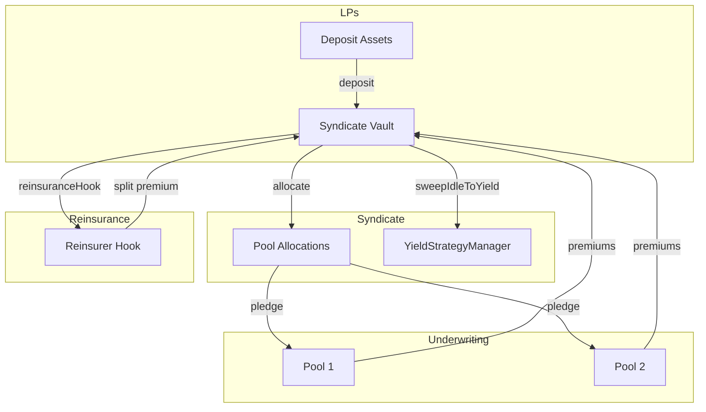

<Callout type="info">
  View deployed contract addresses in the [Contract Addresses](/resources/contract-addresses) section.
</Callout>

The **ISyndicate** interface defines the interactions for a Syndicate vault. Syndicates are ERC4626-compliant vaults that allow Liquidity Providers (LPs) to deposit capital, which is then allocated to underwriting pools to earn yield from premiums. The architecture uses a merged Hub+Strategy pattern for gas efficiency.

## Interface

```solidity
// SPDX-License-Identifier: MIT
pragma solidity ^0.8.20;

import {IERC4626} from "@openzeppelin/contracts/interfaces/IERC4626.sol";
import {Types} from "../libraries/helpers/Types.sol";
import {SyndicateTypes} from "../vaults/syndicates/libraries/SyndicateTypes.sol";

/**
 * @title ISyndicate
 * @notice Unified interface for Syndicate vaults (merged Hub+Strategy architecture)
 * @dev Includes vault operations, intent reservations, duration tracking, and snapshots
 */
interface ISyndicate is IERC4626 {
    
    /* =============================
       ===== Initialization =====
       ============================= */

    /**
     * @notice Initializes the Syndicate (called once by factory)
     * @param systemRegistry_ SystemRegistry for dependency resolution
     * @param asset_ The underlying asset (e.g., wstETH, USDC)
     * @param syndicateManager_ Address authorized to manage operations
     * @param feeRecipient_ Address receiving performance fees
     * @param name_ ERC20 token name for vault shares
     * @param symbol_ ERC20 token symbol for vault shares
     * @param initialOwner_ Initial owner address
     * @param salvageManager_ SalvageManager contract for salvage claims
     * @param performanceFeeBps_ Performance fee in basis points
     */
    function initialize(
        address systemRegistry_,
        address asset_,
        address syndicateManager_,
        address feeRecipient_,
        string calldata name_,
        string calldata symbol_,
        address initialOwner_,
        address salvageManager_,
        uint16 performanceFeeBps_
    ) external;

    /* =============================
       ===== Vault Operations =====
       ============================= */

    /**
     * @notice Returns idle assets not deployed to pools
     */
    function idleAssets() external view returns (uint256);

    /**
     * @notice Returns effective capacity available for underwriting
     */
    function effectiveCapacity() external view returns (uint256);

    /**
     * @notice Deallocates capital from a pool
     * @param poolId Pool to deallocate from
     */
    function deallocateFromPool(uint256 poolId) external;

    /**
     * @notice Allocates capital to a pool
     * @param poolId Target pool
     * @param amount Amount to allocate
     */
    function allocate(uint256 poolId, uint256 amount) external;

    /**
     * @notice Configures vault parameters
     * @param config VaultConfig struct with vault settings
     */
    function configureVault(SyndicateTypes.VaultConfig calldata config) external;

    /**
     * @notice Configures manager parameters
     * @param config ManagerConfig struct with manager settings
     */
    function configureManager(SyndicateTypes.ManagerConfig calldata config) external;

    /**
     * @notice Configures dependency addresses
     * @param config DependenciesConfig struct with dependency addresses
     */
    function configureDependencies(SyndicateTypes.DependenciesConfig calldata config) external;

    /**
     * @notice Sets the role manager contract
     * @param manager SyndicateRoleManager address
     */
    function setRoleManager(address manager) external;

    /* =============================
       ===== Intent Reservations =====
       ============================= */

    /**
     * @notice Reserves capital for a matched intent
     * @param params ReservationParams with reservation details
     * @return key Unique reservation key
     */
    function reserveMatchedIntent(
        SyndicateTypes.ReservationParams calldata params
    ) external returns (bytes32 key);

    /**
     * @notice Cancels an active reservation
     * @param key Reservation key to cancel
     */
    function cancelReservation(bytes32 key) external;

    /**
     * @notice Expires a reservation that has passed its expiry time
     * @param key Reservation key to expire
     */
    function expireReservation(bytes32 key) external;

    /**
     * @notice Consumes a reservation when policy is purchased
     * @param key Reservation key
     * @param poolId Pool to allocate to
     * @param coverageAmount Amount of coverage
     * @param coverageDuration Duration of coverage in seconds
     * @return reservedShares Shares consumed from reservation
     */
    function consumeReservation(bytes32 key, uint256 poolId, uint256 coverageAmount, uint32 coverageDuration) 
        external returns (uint256 reservedShares);

    /**
     * @notice Releases unused portion of a reservation
     * @param key Reservation key
     * @param coverageAmount Amount to release
     * @return releasedShares Shares released back to idle
     */
    function releaseReservation(bytes32 key, uint256 coverageAmount) external returns (uint256 releasedShares);

    /**
     * @notice Sets minimum nonce for a solver's intents
     * @param solver Solver address
     * @param newMin New minimum nonce value
     */
    function setSolverMinNonce(address solver, uint96 newMin) external;

    /* =============================
       ===== Duration Tracking =====
       ============================= */

    /**
     * @notice Sets deposit lock preference for the caller
     * @param duration Lock duration in seconds
     */
    function setDepositLockPreference(uint32 duration) external;

    /**
     * @notice Extends lock duration for existing deposits
     * @param newDuration New lock duration
     */
    function extendLockDuration(uint32 newDuration) external;

    /**
     * @notice Gets shares unlocking at a specific time
     * @param unlockTime Timestamp to query
     * @return Number of shares unlocking
     */
    function getSharesUnlockingAt(uint64 unlockTime) external view returns (uint256);

    /**
     * @notice Gets available shares for exact duration underwriting
     * @param duration Duration in seconds
     * @return Available shares
     */
    function availableSharesForExactDuration(uint32 duration) external view returns (uint256);

    /* =============================
       ===== Yield Management =====
       ============================= */

    /**
     * @notice Harvests yield from strategies
     * @param minAmount Minimum yield to harvest
     * @return appliedAmount Amount of yield applied
     */
    function harvestYield(uint256 minAmount) external returns (uint256 appliedAmount);

    /**
     * @notice Sweeps idle assets to yield strategies
     * @param minAmount Minimum amount to sweep
     * @return swept Amount swept to yield
     */
    function sweepIdleToYield(uint256 minAmount) external returns (uint256 swept);

    /**
     * @notice Performs routine upkeep operations
     */
    function upkeep() external;

    /**
     * @notice Returns performance fee in basis points
     */
    function performanceFeeBps() external view returns (uint16);

    /* =============================
       ===== Hooks =====
       ============================= */

    /**
     * @notice Returns the yield boost hook address
     */
    function yieldBoostHook() external view returns (address);

    /**
     * @notice Returns the reinsurance hook address
     */
    function reinsuranceHook() external view returns (address);

    /**
     * @notice Sets the yield boost hook
     * @param hook Hook contract address
     */
    function setYieldBoostHook(address hook) external;

    /**
     * @notice Sets the reinsurance hook
     * @param hook Hook contract address (must be approved reinsurer)
     */
    function setReinsuranceHook(address hook) external;

    /* =============================
       ===== Premium Handling =====
       ============================= */

    /**
     * @notice Receives premium and splits with reinsurer if applicable
     * @param premium Total premium amount being distributed
     * @param coverageAmount Total coverage amount that generated this premium  
     * @param reinsuredPortion Amount of coverage backed by reinsurance
     */
    function receivePremiumWithReinsuranceSplit(
        uint256 premium,
        uint256 coverageAmount,
        uint256 reinsuredPortion
    ) external;

    /* =============================
       ===== Bundled Views =====
       ============================= */

    /**
     * @notice Returns vault configuration
     */
    function getVaultConfig() external view returns (SyndicateTypes.VaultConfig memory);

    /**
     * @notice Returns manager configuration
     */
    function getManagerConfig() external view returns (SyndicateTypes.ManagerConfig memory);

    /**
     * @notice Returns account state for a user
     * @param account User address
     */
    function getAccountState(address account) external view returns (SyndicateTypes.AccountState memory);

    /**
     * @notice Returns reservation details
     * @param key Reservation key
     */
    function getReservation(bytes32 key) external view returns (SyndicateTypes.ReservationView memory);

    /**
     * @notice Gets nonce for a solver's intents
     */
    function reserveNonces(address solver) external view returns (uint96);

    /**
     * @notice Returns count of active reservations
     */
    function getActiveReservationsCount() external view returns (uint256);

    /**
     * @notice Allocates from strategy (internal use)
     */
    function allocateFromStrategy(uint256 poolId, uint256 amount) external;

    /**
     * @notice Returns the owner address
     */
    function owner() external view returns (address);

    /**
     * @notice Returns the syndicate manager address
     */
    function syndicateManager() external view returns (address);

    /**
     * @notice Returns the PoolAllocations contract address
     */
    function poolAllocations() external view returns (address);

    /* =============================
       ===== Salvage Claims =====
       ============================= */

    /**
     * @notice Distributes salvage tokens to LP holders
     * @param salvageToken Token to distribute
     * @param maxRounds Maximum distribution rounds
     */
    function distributeSalvage(address salvageToken, uint256 maxRounds) external;

    /**
     * @notice Initializes snapshot for salvage distribution
     * @param salvageToken Token to initialize distribution for
     */
    function initializeSalvageSnapshot(address salvageToken) external;

    /* =============================
       ===== Snapshot Support =====
       ============================= */

    /**
     * @notice Returns balance at a historical snapshot
     * @param account Account to query
     * @param snapshotId Snapshot ID
     */
    function balanceOfAt(address account, uint256 snapshotId) external view returns (uint256);

    /**
     * @notice Returns total supply at a historical snapshot
     * @param snapshotId Snapshot ID
     */
    function totalSupplyAt(uint256 snapshotId) external view returns (uint256);

    /* =============================
       ===== Misc & Admin =====
       ============================= */

    /**
     * @notice EIP-1271 signature validation for intents
     */
    function isValidSignature(bytes32 hash, bytes memory signature) external view returns (bytes4);

    /**
     * @notice Pauses the vault
     */
    function pause() external;

    /**
     * @notice Unpauses the vault
     */
    function unpause() external;
}
```

## Capital Flow



## Related Documentation

- [Syndicates](/underwriters/syndicates) - Conceptual overview
- [IPoolAllocations](/contracts/IPoolAllocations) - Allocation tracking