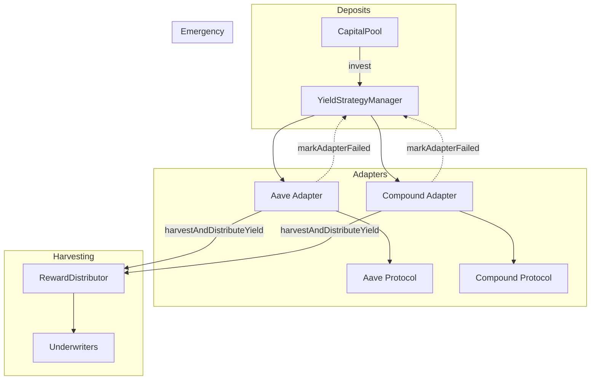

<Callout type="info">
  View deployed contract addresses in the [Contract Addresses](/resources/contract-addresses) section.
</Callout>

The **IYieldStrategyManager** is responsible for routing idle capital from the CapitalPool to external yield protocols (e.g., Aave, Compound). It manages the "Base Yield" component of the system and handles adapter lifecycle management.

## Interface

```solidity
// SPDX-License-Identifier: BUSL-1.1
pragma solidity ^0.8.20;

import {IERC20} from "@openzeppelin/contracts/token/ERC20/IERC20.sol";
import {IRewardDistributor} from "./IRewardDistributor.sol";
import {Types} from "../libraries/helpers/Types.sol";

interface IYieldStrategyManager {
    /* ========= Administration ========= */

    /**
     * @notice Registers a yield adapter for a specific platform
     * @param platform The yield platform (AAVE, COMPOUND, etc.)
     * @param adapterAddress Address of the adapter contract
     */
    function setBaseYieldAdapter(Types.YieldPlatform platform, address adapterAddress) external;

    /**
     * @notice Deactivates a yield adapter (prevents new deposits)
     * @param adapterAddress Address of the adapter to deactivate
     */
    function deactivateBaseYieldAdapter(address adapterAddress) external;

    /**
     * @notice Associates a reward pool with an adapter for distribution
     * @param adapterAddress The adapter address
     * @param rewardPoolId Pool ID for reward distribution
     */
    function setYieldAdapterRewardPool(address adapterAddress, uint256 rewardPoolId) external;

    /**
     * @notice Marks an adapter as failed (e.g., after a strategy exploit)
     * @param adapterAddress The failed adapter
     * @param reason Description of the failure
     */
    function markAdapterFailed(address adapterAddress, string calldata reason) external;

    /**
     * @notice Marks a previously failed adapter as recovered
     * @param adapterAddress The recovered adapter
     */
    function markAdapterRecovered(address adapterAddress) external;

    /* ========= Capital Flows ========= */

    /**
     * @notice Invests funds into a yield strategy for a user
     * @param user User whose funds are being invested
     * @param amount Amount of underlying asset to invest
     * @param choice Yield platform to invest in
     * @return invested Amount actually invested
     */
    function invest(address user, uint256 amount, Types.YieldPlatform choice) external returns (uint256 invested);

    /**
     * @notice Harvests yield from an adapter and distributes to stakers
     * @param adapterAddress The adapter to harvest from
     * @return distributed Amount of yield distributed
     */
    function harvestAndDistributeYield(address adapterAddress) external returns (uint256 distributed);

    /**
     * @notice Withdraws funds from a user's yield strategy
     * @param user User whose funds are being withdrawn
     * @param amount Amount to withdraw
     * @param recipient Address to receive withdrawn funds
     * @return withdrawn Amount actually withdrawn
     */
    function withdrawFor(address user, uint256 amount, address recipient) external returns (uint256 withdrawn);

    /**
     * @notice Withdraws funds directly from a specific adapter
     * @param strategy The adapter to withdraw from
     * @param recipient Address to receive funds
     * @param amount Amount to withdraw
     * @return received Amount actually received
     */
    function withdrawFromAdapter(address strategy, address recipient, uint256 amount) external returns (uint256 received);

    /**
     * @notice Withdraws liquidity for payout operations
     * @param amount Amount to withdraw
     * @param recipient Address to receive funds
     * @return withdrawn Amount actually withdrawn
     */
    function withdrawLiquidity(uint256 amount, address recipient) external returns (uint256 withdrawn);

    /**
     * @notice Syncs state after an emergency transfer from an adapter
     * @param adapter The adapter that lost funds
     * @param valueLost Amount of value lost
     * @param markFailed Whether to mark the adapter as failed
     */
    function syncAdapterEmergencyTransfer(address adapter, uint256 valueLost, bool markFailed) external;

    /**
     * @notice Records a loss for a user and adjusts their principal
     * @param user User who incurred the loss
     * @param burnShares Shares to burn for loss realization
     * @param userShareBalanceBefore User's share balance before loss
     * @return principalReduced Amount of principal reduced
     */
    function recordLoss(address user, uint256 burnShares, uint256 userShareBalanceBefore) external returns (uint256 principalReduced);

    /**
     * @notice Transfers principal to the backstop pool
     * @param adapter Adapter to transfer from
     * @param amount Amount to transfer
     */
    function transferPrincipalToBackstop(address adapter, uint256 amount) external;

    /**
     * @notice Claims outstanding reinsurance debt from an adapter
     * @param adapter The adapter with debt
     * @return recovered Amount recovered from backstop
     */
    function claimReinsuranceDebt(address adapter) external returns (uint256 recovered);

    /**
     * @notice Takes a snapshot of adapter value for accounting
     * @param adapter The adapter to snapshot
     * @return Current value of the adapter
     */
    function snapshotAdapterValue(address adapter) external returns (uint256);

    /* ========= View Functions ========= */

    /**
     * @notice Returns the underlying asset token
     * @return The underlying ERC20 asset
     */
    function asset() external view returns (IERC20);

    /**
     * @notice Returns the CapitalPool address
     * @return Address of the CapitalPool
     */
    function capitalPool() external view returns (address);

    /**
     * @notice Returns the RewardDistributor contract
     * @return The RewardDistributor interface
     */
    function rewardDistributor() external view returns (IRewardDistributor);

    /**
     * @notice Returns all active yield adapters
     * @return Array of active adapter addresses
     */
    function getActiveYieldAdapters() external view returns (address[] memory);

    /**
     * @notice Returns a user's complete yield state
     * @param user User to query
     * @return UnderwriterYieldState struct with yield details
     */
    function getUnderwriterYieldState(address user) external view returns (Types.UnderwriterYieldState memory);

    /**
     * @notice Returns total principal deposited in an adapter
     * @param adapter Adapter to query
     * @return Principal amount in adapter
     */
    function getPrincipalInAdapter(address adapter) external view returns (uint256);

    /**
     * @notice Checks if an adapter is active
     * @param adapter Adapter to check
     * @return True if adapter accepts deposits
     */
    function isAdapterActive(address adapter) external view returns (bool);

    /**
     * @notice Checks if an adapter is marked as failed
     * @param adapter Adapter to check
     * @return True if adapter has failed
     */
    function isAdapterFailed(address adapter) external view returns (bool);
}
```

## Yield Flow



## Adapter States

| State | Description | Can Deposit | Can Withdraw |
|-------|-------------|-------------|--------------|
| Active | Normal operation | ✅ | ✅ |
| Deactivated | Graceful shutdown | ❌ | ✅ |
| Failed | Emergency state | ❌ | ⚠️ Limited |
| Recovered | Back to normal | ✅ | ✅ |

## Related Documentation

- [IYieldAdapter](/contracts/IYieldAdapter) - Individual adapter interface
- [ICapitalPool](/contracts/ICapitalPool) - Capital source
- [IRewardDistributor](/contracts/IRewardDistributor) - Yield distribution