import { Callout } from '@/components/Callout'

## Welcome to LayerCover

LayerCover is a fully on-chain cover protocol inspired by the Lloyd's of London marketplace. It replaces traditional insurance carriers with smart contracts that coordinate risk, capital, and claims - all transparently and without intermediaries.

  

    🔒
    

      <h4 className="text-sm font-semibold text-foreground mb-1">Non-Custodial</h4>
      
You retain full control of your assets until a claim event

    

  

  

    ⚡
    

      <h4 className="text-sm font-semibold text-foreground mb-1">Transparent Claims</h4>
      
Standard pools settle instantly on-chain; parametric pools use UMA's Optimistic Oracle

    

  

  

    📈
    

      <h4 className="text-sm font-semibold text-foreground mb-1">Capital-Efficient</h4>
      
Single-sided liquidity across independent risk pools with built-in leverage controls

    

  

  

    🏷️
    

      <h4 className="text-sm font-semibold text-foreground mb-1">Fixed-Rate Pricing</h4>
      
Lock in exact costs upfront through an intent-based RFQ marketplace

    

  

---

## Choose Your Path

  <a href="/policyholders" className="group block p-6 rounded-xl border border-border bg-gradient-to-br from-background to-blue-50/50 dark:to-blue-900/20 hover:border-brand-500 hover:shadow-lg hover:shadow-brand-500/10 hover:-translate-y-1 transition-all duration-300 no-underline">
    🛡️
    <h3 className="text-lg font-semibold text-foreground mb-2">Policyholders</h3>
    
Purchase coverage for your DeFi positions. Protect stablecoins, vault shares, and protocol exposure.

  </a>
  <a href="/underwriters" className="group block p-6 rounded-xl border border-border bg-gradient-to-br from-background to-green-50/50 dark:to-green-900/20 hover:border-brand-500 hover:shadow-lg hover:shadow-brand-500/10 hover:-translate-y-1 transition-all duration-300 no-underline">
    💰
    <h3 className="text-lg font-semibold text-foreground mb-2">Underwriters</h3>
    
Provide capital to earn dual yields from premiums and DeFi strategies, managed via Syndicates.

  </a>
  <a href="/developers" className="group block p-6 rounded-xl border border-border bg-gradient-to-br from-background to-purple-50/50 dark:to-purple-900/20 hover:border-brand-500 hover:shadow-lg hover:shadow-brand-500/10 hover:-translate-y-1 transition-all duration-300 no-underline">
    💻
    <h3 className="text-lg font-semibold text-foreground mb-2">Developers</h3>
    
Integrate LayerCover into your dApp with our SDK - as simple as 3 lines of code.

  </a>

---

```mermaid
flowchart LR
    Buyer["🛡️ Policyholders"]
    Protocol["⚙️ LayerCover Protocol"]
    UW["💰 Underwriters"]
    Yield["📈 DeFi Yield"]

    Buyer -->|"Pay premium"| Protocol
    Protocol -->|"Policy NFT"| Buyer
    Protocol -->|"Claim payout"| Buyer

    Protocol -->|"Premium income"| UW
    UW -->|"Deposit capital"| Protocol
    Protocol -->|"Deploy idle capital"| Yield
    Yield -->|"Yield returns"| UW

    style Buyer fill:#3b82f620,stroke:#3b82f6,color:#3b82f6
    style UW fill:#22c55e20,stroke:#22c55e,color:#22c55e
    style Protocol fill:#8b5cf620,stroke:#8b5cf6,color:#8b5cf6
    style Yield fill:#f59e0b20,stroke:#f59e0b,color:#f59e0b
```

## The Lloyd's Model, On-Chain

The global insurance industry has for centuries operated through marketplace models like Lloyd's of London, where networks of syndicates provide capital to cover specific risks. DeFi needs an equivalent - protocol hacks, smart contract failures, and oracle exploits have caused billions in losses, yet the vast majority of on-chain capital remains uninsured.

LayerCover addresses this gap by combining modular risk assessment, flexible capital reuse, and on-chain salvage rights into a capital-efficient alternative to mutualised risk pool designs.

<Callout type="success">
  Ready to dive in? Start with **[Policyholders](/policyholders)**, **[Underwriters](/underwriters)**, or the **[Protocol Deep Dive](/protocol)**.
</Callout>
