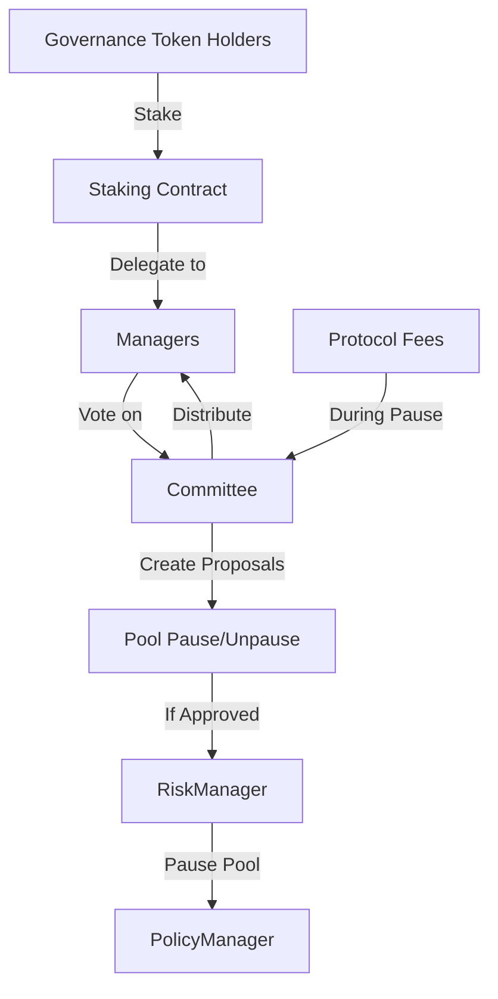
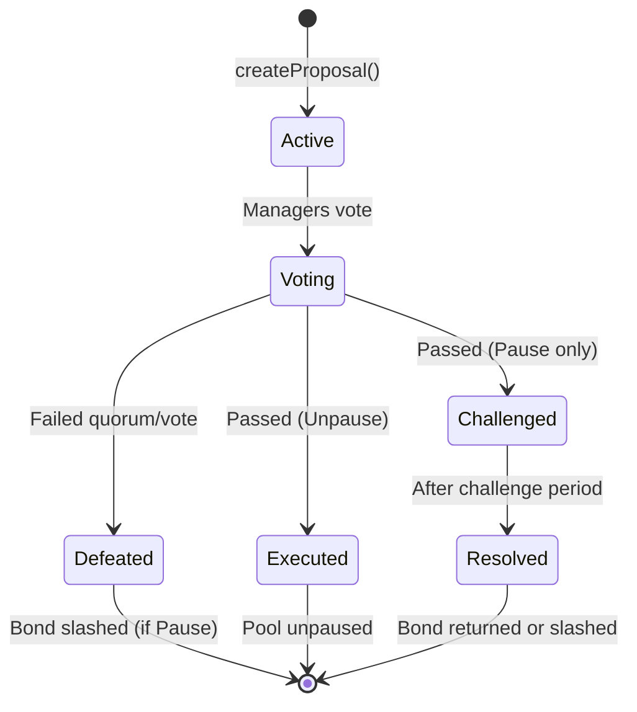
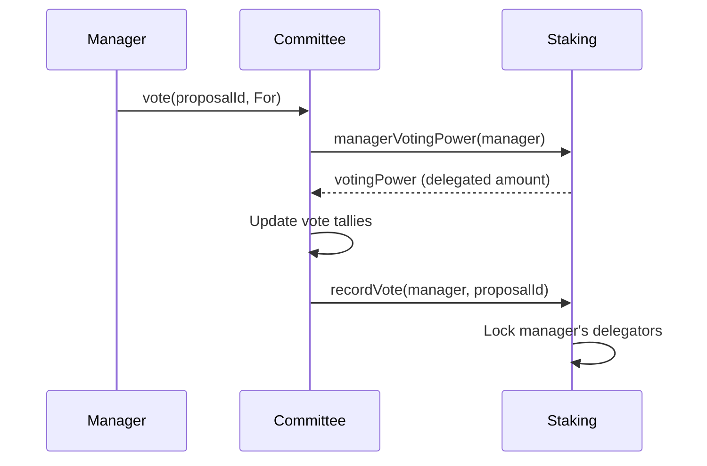

## Overview

Protocol governance centers on one critical function: pausing risky pools when incidents occur. Unlike traditional DAOs that govern every parameter, this protocol focuses governance on what matters most—protecting policyholders by quickly responding to hacks, exploits, or protocol failures. The Committee system allows stakers to propose pausing pools, vote with delegated power, and earn rewards when they correctly identify real incidents.

The bonding mechanism aligns incentives. Proposers must bond 1000-2500 governance tokens to create a pause proposal, with higher bonds earning higher fee shares (10-25%) if the proposal succeeds. If the proposal passes but no claims occur during the challenge period (indicating a false alarm), the entire bond is slashed. This discourages frivolous proposals while rewarding vigilant governance participants who identify real threats.

The challenge period (7 days) is crucial for validation. After a pause proposal passes, the pool is paused and fees are redirected to the Committee. If claims occur during this period, it confirms the incident was real—the proposer gets their bond back plus a reward, and all "For" voters share the collected fees pro-rata. If no claims occur, the proposer is slashed for wasting governance time. This creates a self-balancing system where governance earns rewards for protecting the protocol, but pays a price for false alarms.

The governance system enables decentralized protocol management:
- **Committee** for proposal creation and voting
- **Pause/Unpause proposals** for pool risk management
- **Bonded proposals** with slashing for bad actors
- **Challenge periods** for community validation
- **Fee rewards** distributed to voters

This document explains governance mechanics and participation.

---

## Governance Architecture

### System Overview



**Key Components:**
1. **Governance Token**: Voting power source
2. **Staking Contract**: Delegation and rewards
3. **Committee**: Proposal and voting system
4. **Managers**: Vote delegates for stakers
5. **RiskManager**: Executes governance decisions

---

## Committee Contract

### Core Parameters

```solidity
uint256 public immutable votingPeriod;      // e.g., 3 days
uint256 public immutable challengePeriod;   // e.g., 7 days
uint256 public immutable quorumBps;         // e.g., 1000 (10%)
uint256 public immutable slashPercentageBps; // e.g., 5000 (50%)

uint256 public constant minBondAmount = 1000 ether;
uint256 public constant maxBondAmount = 2500 ether;
uint256 public constant minProposerFeeBps = 1000; // 10%
uint256 public constant maxProposerFeeBps = 2500; // 25%
```

### Proposal Types

```solidity
enum ProposalType {
    Pause,    // Pause pool due to incident
    Unpause   // Resume pool operations
}
```

### Proposal States



---

## Creating Proposals

### Pause Proposal

```solidity
function createProposal(
    uint256 poolId,
    Types.ProposalType pType,
    uint256 bondAmount
) external nonReentrant returns (uint256)
```

**Requirements:**
- Caller must be registered manager
- Manager must have voting power > 0
- No active proposal for this pool
- Bond amount: 1000-2500 tokens (Pause only)
- No bond required for Unpause

**Process:**
1. Validate caller is manager with voting power
2. Check no active proposal for pool
3. Validate bond amount (Pause only)
4. Create proposal
5. Pull bond tokens from proposer
6. Calculate proposer fee share
7. Start voting period

**Code:**
```javascript
// Manager creates pause proposal
const bondAmount = ethers.parseEther("2000"); // 2000 tokens

await governanceToken.approve(committeeAddress, bondAmount);

const tx = await committee.connect(manager).createProposal(
    poolId,
    ProposalType.Pause,
    bondAmount
);

const receipt = await tx.wait();
const proposalId = receipt.events.find(e => e.event === 'ProposalCreated').args.proposalId;

console.log(`Proposal ${proposalId} created with bond ${bondAmount}`);
```

### Proposer Fee Share

```solidity
function _calculateFeeShare(uint256 _bondAmount) internal pure returns (uint256) {
    if (_bondAmount <= minBondAmount) {
        return minProposerFeeBps;  // 10%
    }
    if (_bondAmount >= maxBondAmount) {
        return maxProposerFeeBps;  // 25%
    }

    // Linear interpolation
    uint256 span = maxBondAmount - minBondAmount;
    uint256 bpsSpan = maxProposerFeeBps - minProposerFeeBps;
    return minProposerFeeBps + ((_bondAmount - minBondAmount) * bpsSpan) / span;
}
```

**Example:**
```
Bond 1000 tokens → 10% proposer fee
Bond 1750 tokens → 17.5% proposer fee
Bond 2500 tokens → 25% proposer fee
```

**Why Bond?**
- Prevents spam proposals
- Aligns incentives (skin in the game)
- Funds rewards for voters
- Slashed if bad proposal

---

## Voting Process

### Casting Votes

```solidity
function vote(uint256 proposalId, Types.VoteOption voteOption) external nonReentrant
```

**Vote Options:**
```solidity
enum VoteOption { None, For, Against }
```

**Requirements:**
- Proposal must be Active
- Before voting deadline
- Valid vote option (For/Against)
- Caller is registered manager

**Process:**


### Vote Weight

Manager's voting power = total staked tokens delegated to them:

```solidity
uint256 currentWeight = stakingContract.managerVotingPower(msg.sender);
```

**Dynamic Weight Updates:**
When delegators stake/unstake during voting:

```solidity
function updateVoteWeight(address voter, uint256 proposalId, uint256 newWeight) external nonReentrant {
    // Only staking contract can call
    if (msg.sender != address(stakingContract)) revert;

    Types.Proposal storage p = proposals[proposalId];
    if (p.status != Types.ProposalStatus.Active) return;

    Types.VoteOption voteChoice = p.votes[voter];
    uint256 prevWeight = p.voterWeight[voter];

    // Update vote tallies
    if (voteChoice == Types.VoteOption.For) {
        if (newWeight > prevWeight) {
            p.forVotes += newWeight - prevWeight;
        } else {
            p.forVotes -= prevWeight - newWeight;
        }
    } else if (voteChoice == Types.VoteOption.Against) {
        // Similar logic
    }

    p.voterWeight[voter] = newWeight;
}
```

### Changing Votes

Managers can change their vote before deadline:

```solidity
// Previous vote: For with 10,000 tokens
await committee.connect(manager).vote(proposalId, VoteOption.Against);

// Previous For vote removed, Against vote added with current weight
```

---

## Proposal Execution

### Execute After Voting

```solidity
function executeProposal(uint256 proposalId) external nonReentrant
```

**Requirements:**
- Proposal status: Active
- After voting deadline
- Anyone can execute (permissionless)

### Quorum Check

```solidity
uint256 totalStaked = governanceToken.balanceOf(address(stakingContract));
uint256 requiredQuorum = (totalStaked * quorumBps) / 10000;

bool reachedQuorum = (p.forVotes + p.againstVotes) >= requiredQuorum;
bool passed = p.forVotes > p.againstVotes;
```

**Example:**
```
Total staked: 1,000,000 tokens
Quorum: 10%
Required quorum: 100,000 tokens

Proposal votes:
- For: 80,000 tokens
- Against: 30,000 tokens
Total: 110,000 tokens

Reached quorum: Yes (110,000 >= 100,000)
Passed: Yes (80,000 > 30,000)
Result: PASSED
```

### Successful Proposal (Pause)

If quorum reached and For > Against:

```solidity
p.status = Types.ProposalStatus.Challenged;
p.challengeDeadline = block.timestamp + challengePeriod;

// Report incident (pauses pool)
riskManager.reportIncident(p.poolId, true);

// Redirect pool fees to committee
riskManager.setPoolFeeRecipient(p.poolId, address(this));
```

**Pool Effects:**
- New policy purchases blocked
- Existing policies remain active
- Coverage increases blocked
- Premium collection continues
- Fees redirected to committee (for rewards)

### Successful Proposal (Unpause)

```solidity
p.status = Types.ProposalStatus.Executed;
activeProposalForPool[p.poolId] = false;

// Unpause pool
riskManager.reportIncident(p.poolId, false);
```

### Defeated Proposal

If quorum failed or Against >= For:

```solidity
p.status = Types.ProposalStatus.Defeated;
activeProposalForPool[p.poolId] = false;

if (p.pType == Types.ProposalType.Pause) {
    // Slash proposer's bond
    uint256 slashAmount = (p.bondAmount * slashPercentageBps) / 10000;
    uint256 refund = p.bondAmount - slashAmount;

    if (refund > 0) {
        governanceToken.safeTransfer(p.proposer, refund);
    }
    // Slashed amount stays in committee
}
```

**Example:**
```
Bond: 2000 tokens
Slash percentage: 50%

Slashed: 1000 tokens (kept by committee)
Refunded: 1000 tokens (returned to proposer)
```

---

## Challenge Period

### Purpose

**7-day window** after successful pause proposal for:
- Community to validate incident
- Pool fees to accumulate
- Rewards to build up
- Final confirmation before resolution

### During Challenge Period

**Pool Status:**
- Paused (no new policies)
- Fees collected → Committee
- Existing policies continue
- Underwriters can deallocate (with notice period)

**Proposal Status:**
- Status: Challenged
- Voting closed
- Awaiting resolution

### Resolving Bond

After challenge period:

```solidity
function resolvePauseBond(uint256 proposalId) external nonReentrant
```

**Requirements:**
- Proposal type: Pause
- Status: Challenged
- After challenge deadline
- Anyone can call (permissionless)

**Two Outcomes:**

**1. Fees Collected (Incident Validated):**
```solidity
if (p.totalRewardFees > 0) {
    // Return bond to proposer
    governanceToken.safeTransfer(p.proposer, p.bondAmount);
    emit BondResolved(proposalId, false);  // Not slashed
}
```

**2. No Fees (False Alarm):**
```solidity
else {
    // Slash entire bond
    // Bond stays in committee
    emit BondResolved(proposalId, true);  // Slashed
}
```

**Rationale:**
- Fees collected = real incident = proposer was correct
- No fees = false alarm = proposer wasted governance time

---

## Fee Rewards

### Fee Collection

During challenge period:

```solidity
function receiveFees(uint256 proposalId) external payable onlyRiskManager {
    proposals[proposalId].totalRewardFees += msg.value;
}
```

**Fee Sources:**
- Policy purchase fees from paused pool
- Premium collection fees
- Other protocol fees related to pool

### Reward Distribution

After proposal resolved:

```solidity
function claimReward(uint256 proposalId) external nonReentrant
```

**Eligibility:**
- Voted "For" on the proposal
- Proposal is Resolved or Executed
- Has not claimed yet

**Calculation:**
```solidity
uint256 totalFees = p.totalRewardFees;
uint256 proposerBonus = (totalFees * p.proposerFeeShareBps) / 10000;
uint256 remainingFees = totalFees - proposerBonus;
uint256 userWeight = p.voterWeight[claimant];

uint256 reward = (remainingFees * userWeight) / p.forVotes;

if (claimant == p.proposer) {
    reward += proposerBonus;
}
```

**Example:**
```
Total fees collected: 10,000 USDC
Proposer bonus (15%): 1,500 USDC
Remaining for voters: 8,500 USDC

Voter A: 20,000 tokens voted For (25% of For votes)
Voter A reward: 8,500 * 25% = 2,125 USDC

Proposer (also voted For with 10,000 tokens):
- Voter share: 8,500 * 12.5% = 1,062.5 USDC
- Proposer bonus: 1,500 USDC
- Total: 2,562.5 USDC
```

---

## Best Practices

### For Managers

✅ **DO:**
- Research pool before proposing pause
- Provide evidence of incident
- Bond appropriate amount for fee share
- Vote based on analysis
- Claim rewards after resolution

❌ **DON'T:**
- Propose frivolous pauses (risk bond slash)
- Vote without investigation
- Ignore voting periods
- Spam proposals

### For Delegators

✅ **DO:**
- Delegate to active, diligent managers
- Monitor manager's voting record
- Switch managers if inactive
- Understand 7-day lock after manager votes

❌ **DON'T:**
- Delegate to inactive managers
- Ignore governance entirely
- Expect instant unstaking during votes

### For Protocol

✅ **DO:**
- Set reasonable quorum (10-20%)
- Balance slash percentage (30-70%)
- Ensure adequate voting periods
- Monitor proposal quality

❌ **DON'T:**
- Set quorum too high (deadlock)
- Slash too harshly (discourage participation)
- Rush voting periods
- Allow proposal spam

---

## View Functions

### Proposal Information

```solidity
function getProposalDetails(uint256 proposalId) external view returns (
    uint256 id,
    Types.ProposalType pType,
    address proposer,
    uint256 poolId,
    Types.ProposalStatus status,
    uint256 forVotes,
    uint256 againstVotes,
    uint256 bondAmount,
    uint256 totalRewardFees
)

function isProposalFinalized(uint256 proposalId) external view returns (bool)
function activeProposalForPool(uint256 poolId) public view returns (bool)
```

### Vote Information

```solidity
mapping(uint256 => mapping(address => Types.VoteOption)) public votes;
mapping(uint256 => mapping(address => uint256)) public voterWeight;
mapping(uint256 => mapping(address => bool)) public hasClaimedReward;
```

---

## Integration Examples

### Frontend: Display Proposals

```javascript
// Get proposal details
const proposal = await committee.getProposalDetails(proposalId);

console.log(`Proposal #${proposal.id}`);
console.log(`Type: ${proposal.pType === 0 ? 'Pause' : 'Unpause'}`);
console.log(`Pool: ${proposal.poolId}`);
console.log(`Proposer: ${proposal.proposer}`);
console.log(`Status: ${getStatusName(proposal.status)}`);
console.log(`For: ${ethers.formatEther(proposal.forVotes)} tokens`);
console.log(`Against: ${ethers.formatEther(proposal.againstVotes)} tokens`);
console.log(`Bond: ${ethers.formatEther(proposal.bondAmount)} tokens`);
console.log(`Rewards: ${ethers.formatUnits(proposal.totalRewardFees, 6)} USDC`);

// Check if user voted
const userVote = await committee.votes(proposalId, userAddress);
console.log(`Your vote: ${getVoteName(userVote)}`);
```

### Manager: Create Pause Proposal

```javascript
// Check if manager is registered
const isManager = await stakingContract.isManager(managerAddress);
const votingPower = await stakingContract.managerVotingPower(managerAddress);

if (!isManager || votingPower === 0n) {
    console.log("Not eligible to create proposals");
    return;
}

// Check if pool already has active proposal
const hasActiveProposal = await committee.activeProposalForPool(poolId);
if (hasActiveProposal) {
    console.log("Pool already has active proposal");
    return;
}

// Choose bond amount (higher = higher proposer fee share)
const bondAmount = ethers.parseEther("2000");

// Approve and create
await governanceToken.approve(committeeAddress, bondAmount);
const tx = await committee.createProposal(poolId, 0, bondAmount); // 0 = Pause
await tx.wait();
```

### Manager: Vote

```javascript
// Get proposal
const proposal = await committee.getProposalDetails(proposalId);

// Check voting period
const now = Math.floor(Date.now() / 1000);
if (now >= proposal.votingDeadline) {
    console.log("Voting period ended");
    return;
}

// Vote For or Against
const tx = await committee.connect(manager).vote(proposalId, VoteOption.For);
await tx.wait();

console.log("Voted For");
```

### User: Claim Rewards

```javascript
// Check if eligible
const proposal = await committee.getProposalDetails(proposalId);
const userVote = await committee.votes(proposalId, userAddress);
const hasClaimed = await committee.hasClaimedReward(proposalId, userAddress);

if (userVote !== VoteOption.For) {
    console.log("Only For voters can claim");
    return;
}

if (hasClaimed) {
    console.log("Already claimed");
    return;
}

// Claim
const tx = await committee.claimReward(proposalId);
const receipt = await tx.wait();

const rewardEvent = receipt.events.find(e => e.event === 'RewardClaimed');
console.log(`Claimed ${ethers.formatUnits(rewardEvent.args.amount, 6)} USDC`);
```

---

## Events

```solidity
event ProposalCreated(uint256 indexed proposalId, address indexed proposer, uint256 poolId, Types.ProposalType pType)
event Voted(uint256 indexed proposalId, address indexed voter, Types.VoteOption vote, uint256 weight)
event ProposalExecuted(uint256 indexed proposalId)
event BondResolved(uint256 indexed proposalId, bool wasSlashed)
event RewardClaimed(uint256 indexed proposalId, address indexed user, uint256 amount)
```

---

## Troubleshooting

### Common Issues

**Problem: "Manager has no voting power"**
- **Cause:** Manager has zero delegated tokens
- **Solution:** Get at least one delegator to stake tokens to your manager address

**Problem: "Vote lock active - cannot unstake"**
- **Cause:** Your manager voted within the last 7 days and proposal isn't finalized
- **Solution:** Wait until 7 days after the vote OR until the proposal is finalized

**Problem: "Pool already has active proposal"**
- **Cause:** Another proposal is already active for this pool
- **Solution:** Wait for current proposal to be executed/defeated/resolved

**Problem: "Insufficient bond amount"**
- **Cause:** Bond amount < 1000 tokens
- **Solution:** Increase bond to at least 1000 tokens (up to 2500 for max fee share)

**Problem: "Proposal execution failed"**
- **Cause:** Voting period hasn't ended yet
- **Solution:** Wait until after votingDeadline before calling executeProposal()

**Problem: "Cannot claim reward - not a For voter"**
- **Cause:** You voted Against or didn't vote
- **Solution:** Only For voters can claim rewards from successful proposals

### Gas Optimization Tips

1. **Batch operations when possible**: Vote on multiple proposals in separate transactions but plan timing
2. **Claim rewards periodically**: Don't claim after every proposal; wait until rewards accumulate
3. **Use multicall for read operations**: Query multiple proposal details in one call via frontend
4. **Execute proposals during low gas**: Anyone can execute, so wait for favorable gas prices

### Emergency Procedures

**What to do if you spot an incident:**

1. **Gather Evidence**
   - Transaction hash of exploit
   - Protocol announcement
   - On-chain data showing unusual activity
   - Community reports

2. **Create Proposal Quickly**
   - Don't wait - time is critical
   - Bond maximum amount (2500 tokens) for max fee share
   - Proposal creation takes ~2 minutes

3. **Rally Voters**
   - Share evidence in governance forums
   - Tag other managers on social media
   - Provide clear analysis in Discord/Telegram

4. **Monitor Challenge Period**
   - Watch for claims being filed
   - Track fee accumulation
   - Be ready to defend your proposal

---

## Security Considerations

### Attack Vectors & Mitigations

**1. Governance Attack (51% Attack)**
- **Risk:** Malicious actor accumulates 51% of voting power
- **Mitigation:**
  - Quorum requirements prevent low-turnout manipulation
  - Challenge period allows community validation
  - Slashing punishes false proposals
  - Wide token distribution reduces concentration

**2. Bribery Attacks**
- **Risk:** Attacker bribes managers to vote incorrectly
- **Mitigation:**
  - Delegators can switch managers at any time
  - Reputation matters for long-term manager income
  - 7-day lock prevents last-minute vote manipulation
  - Financial incentives align with correct voting

**3. Proposal Spam**
- **Risk:** Bad actors submit many frivolous proposals
- **Mitigation:**
  - 1000-2500 token bond requirement
  - 50% slash on defeated proposals
  - Only one active proposal per pool
  - Managers need voting power > 0

**4. Flash Loan Attacks**
- **Risk:** Attacker borrows tokens to gain temporary voting power
- **Mitigation:**
  - Voting period (3 days) exceeds flash loan duration
  - Staking required (can't vote with unstaked tokens)
  - 7-day lock after voting prevents quick exit

**5. Sybil Attacks (Multiple Managers)**
- **Risk:** One entity creates many manager identities
- **Mitigation:**
  - Each manager needs delegated stake to vote
  - Cost of acquiring stake is prohibitive
  - Reputation tracking identifies suspicious patterns
  - Pro-rata rewards don't benefit from multiple identities

### Audit Recommendations

Before mainnet deployment:
1. ✅ Professional smart contract audit
2. ✅ Economic model review
3. ✅ Game theory analysis
4. ✅ Stress testing with high-value scenarios
5. ✅ Community review period

### Best Practices for Security

**For Protocol:**
- Set reasonable quorum (10-20% of staked tokens)
- Monitor for unusual voting patterns
- Implement timelocks for critical changes
- Maintain emergency pause mechanism
- Regular security reviews

**For Managers:**
- Never share private keys
- Use hardware wallets for large bonds
- Verify proposal details carefully
- Don't vote without investigation
- Report suspicious proposals

**For Delegators:**
- Delegate to reputable managers
- Monitor manager voting history
- Diversify across multiple managers (future feature)
- Understand 7-day lock implications

---

## Quick Reference

### Key Parameters

| Parameter | Value | Purpose |
|-----------|-------|---------|
| Voting Period | 3 days | Time for managers to vote |
| Challenge Period | 7 days | Validation window after pause |
| Quorum | 10% | Min participation for valid vote |
| Min Bond | 1000 tokens | Minimum proposal bond |
| Max Bond | 2500 tokens | Maximum proposal bond |
| Min Proposer Fee | 10% | Fee share at min bond |
| Max Proposer Fee | 25% | Fee share at max bond |
| Slash Percentage | 50% | Penalty for defeated proposals |
| Unstake Lock | 7 days | Lock after manager votes |

### State Machine Summary

```
Proposal States:
Active → Voting → Defeated (slash bond)
              ↘ Challenged (7 days) → Resolved (return/slash bond)
              ↘ Executed (unpause)
```

### Function Quick Reference

| Action | Function | Who Can Call? |
|--------|----------|---------------|
| Create pause proposal | `createProposal(poolId, Pause, bondAmount)` | Any manager with voting power |
| Create unpause proposal | `createProposal(poolId, Unpause, 0)` | Any manager with voting power |
| Vote on proposal | `vote(proposalId, For/Against)` | Any manager |
| Execute after voting | `executeProposal(proposalId)` | Anyone (after voting deadline) |
| Resolve challenge | `resolvePauseBond(proposalId)` | Anyone (after challenge period) |
| Claim rewards | `claimReward(proposalId)` | For voters only |

### Economic Outcomes

| Scenario | Proposer | For Voters | Against Voters |
|----------|----------|------------|----------------|
| Proposal passes, fees collected | Bond returned + proposer bonus + voter share | Pro-rata fee share | Nothing |
| Proposal passes, no fees | Entire bond slashed | Nothing | Nothing |
| Proposal defeated | 50% bond slashed | Nothing | Nothing |

---

## Additional Resources

### Related Documentation
- [Tokenomics & Staking →](/governance/tokenomics) - How to stake and delegate
- [Referral System →](/governance/referral-system) - Protocol growth mechanics
- [Technical Architecture →](/technical-reference) - System design details

### Community Channels
- **Governance Forum:** [forum.layercover.com](https://forum.layercover.com) (example)
- **Discord:** Governance discussion channel
- **Telegram:** Real-time governance alerts

### Tools & Dashboards
- **Governance Dashboard:** View active proposals and stats
- **Manager Leaderboard:** Track top managers by voting activity
- **Proposal Analytics:** Historical voting data and outcomes

---

**Next:** Learn about [Tokenomics & Staking →](/governance/tokenomics)
