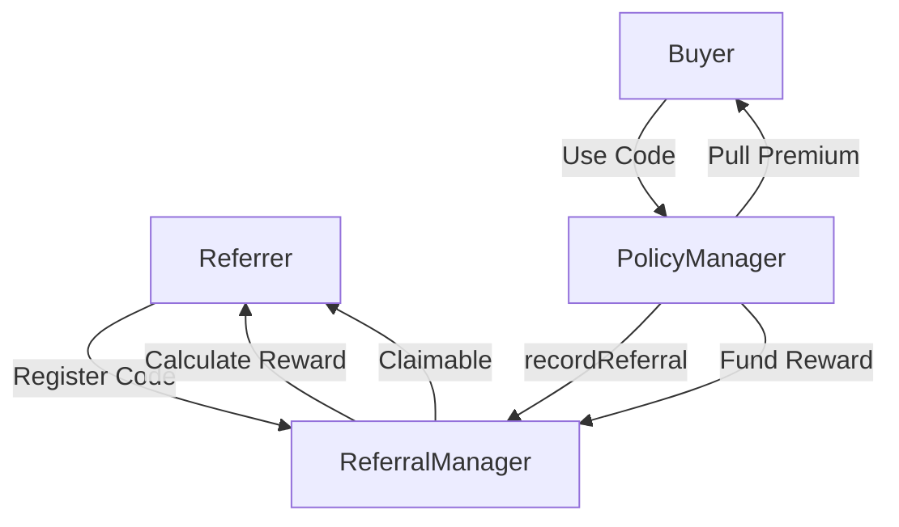
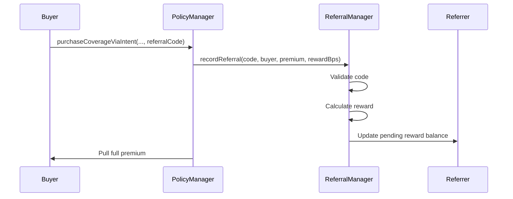

## Overview

The referral system turns users into advocates by offering immediate, tangible rewards for bringing new customers to the protocol. Referrers earn a commission (typically 5% of premiums) on every policy purchased using their code. Rewards are claimable at any time - no vesting, no waiting, no complexity.

The on-chain nature creates transparency and trust. Every referral is recorded permanently, total statistics are publicly queryable, and there's no central entity that can refuse to pay out rewards. Referrers can prove their performance to build reputation, and the protocol benefits from organic, grassroots growth.

The referral system incentivizes protocol growth through:
- **Referrer rewards** for successful referrals (typically 5% of premiums)
- **On-chain tracking** of all referrals
- **Instant rewards** (no vesting)
- **Flexible configuration** per deployment

---

## Referral Architecture

### System Overview



**Key Flow:**
1. Referrer registers a unique code
2. Buyer uses code when purchasing a policy
3. Buyer pays their full premium
4. Protocol records the referral and calculates the referrer's reward
5. Rewards accumulate and are claimable at any time

---

## ReferralManager Contract

### Configuration Parameters

```solidity
uint256 public referrerRewardBps;  // e.g., 500 = 5%
uint256 public constant BPS = 10_000;
```

**Example Setup:**
```
Referrer reward: 5% (500 bps)

Premium paid: 1000 USDC
Referrer earns: 50 USDC (5% of premium)
```

**Configuration Options:**
- Conservative: 3% reward
- Standard: 5% reward
- Aggressive: 10% reward

---

## Referral Code System

### Registering Codes

```solidity
function registerReferralCode(bytes32 code) external
```

**Requirements:**
- Code not already registered
- Code not zero
- One code per address

**Code:**
```javascript
// Create referral code
const code = ethers.encodeBytes32String("ALICE2024");

const tx = await referralManager.registerReferralCode(code);
await tx.wait();

console.log(`Registered code: ${ethers.decodeBytes32String(code)}`);
```

**Recommended Code Format:**
- Alphanumeric
- Easy to remember
- Unique identifier
- Max 31 bytes (bytes32 limit)

**Examples:**
```
Good:
- ALICE2024
- DEFI_DAVE
- INSURTECH
- BTC_MAXI

Bad:
- a (too short)
- thisistoolongforarefcode (might not fit)
- 123456789 (not memorable)
```

### Code Storage

```solidity
mapping(bytes32 => address) public codeToReferrer;     // code → referrer
mapping(address => bytes32) public referrerToCode;      // referrer → code
```

**One-to-one mapping:**
- Each code has one referrer
- Each referrer has one code
- Codes cannot be changed (permanent)

---

## Using Referral Codes

### Purchase with Referral

When a buyer purchases a policy with a referral code, the `PolicyManager` calls `recordReferral` on the `ReferralManager`. This records the referral and calculates the referrer's reward.

**Process:**


### Reward Calculation

```solidity
function recordReferral(
    bytes32 code,
    address buyer,
    uint256 policyId,
    uint256 premiumPaid,
    uint256 referrerRewardBpsUsed
) external returns (address referrer, uint256 rewardAmount)
```

**Math:**
```solidity
// Example:
// premiumPaid = 1000 USDC
// referrerRewardBpsUsed = 500 (5%)

// Calculate referrer reward
rewardAmount = (premiumPaid * referrerRewardBpsUsed) / BPS;
// = (1000 * 500) / 10000 = 50 USDC
```

The reward is tracked as a liability via `pendingRewards` and later funded as protocol fees are processed.

---

## Claiming Rewards

### Claim Process

```solidity
function claimRewards() external nonReentrant
```

**Process:**
1. Check unclaimed balance
2. Require balance > 0
3. Reset balance to zero
4. Transfer USDC to referrer
5. Emit event

**Code:**
```javascript
// Check unclaimed rewards
const unclaimed = await referralManager.unclaimedRewards(referrerAddress);

console.log(`Unclaimed: ${ethers.formatUnits(unclaimed, 6)} USDC`);

if (unclaimed > 0n) {
    // Claim
    const tx = await referralManager.connect(referrer).claimRewards();
    await tx.wait();

    console.log("Rewards claimed!");
}
```

**No Vesting:**
- Rewards instantly claimable
- No waiting period
- No unlock schedule
- Claim anytime

---

## Tracking & Statistics

### Per-Referrer Stats

```solidity
function getReferrerStats(address referrer) external view returns (
    bytes32 code,
    uint256 unclaimed,
    uint256 totalEarned
)
```

**Query:**
```javascript
const [code, unclaimed, totalEarned] = await referralManager.getReferrerStats(referrerAddress);

console.log(`Code: ${ethers.decodeBytes32String(code)}`);
console.log(`Unclaimed: ${ethers.formatUnits(unclaimed, 6)} USDC`);
console.log(`Total Earned: ${ethers.formatUnits(totalEarned, 6)} USDC`);
```

---

## Integration Examples

### Frontend: Register Referral Code

```javascript
// Check if user already has code
const [existingCode] = await referralManager.getReferrerStats(userAddress);

if (existingCode !== ethers.ZeroHash) {
    console.log(`Already registered: ${ethers.decodeBytes32String(existingCode)}`);
    return;
}

// Prompt user for code
const desiredCode = prompt("Enter your referral code (max 31 chars):");

// Validate length
if (desiredCode.length > 31) {
    console.log("Code too long");
    return;
}

// Encode and check availability
const codeBytes = ethers.encodeBytes32String(desiredCode);
const owner = await referralManager.getReferrer(codeBytes);

if (owner !== ethers.ZeroAddress) {
    console.log("Code already taken");
    return;
}

// Register
const tx = await referralManager.registerReferralCode(codeBytes);
await tx.wait();

console.log(`Registered: ${desiredCode}`);
```

### Referrer: Monitor Performance

```javascript
// Get referrer's stats
const [code, unclaimed, totalEarned] = await referralManager.getReferrerStats(referrerAddress);

if (code === ethers.ZeroHash) {
    console.log("Not registered as referrer");
    return;
}

console.log(`Your Code: ${ethers.decodeBytes32String(code)}`);
console.log(`Unclaimed Rewards: ${ethers.formatUnits(unclaimed, 6)} USDC`);
console.log(`Total Earned: ${ethers.formatUnits(totalEarned, 6)} USDC`);

// Claim if threshold reached
if (unclaimed >= ethers.parseUnits("100", 6)) {  // $100 threshold
    console.log("Claiming rewards...");
    const tx = await referralManager.connect(referrer).claimRewards();
    await tx.wait();
    console.log("Claimed!");
}
```

---

## Admin Functions

### Updating Configuration

```solidity
function setReferrerRewardBps(uint256 newBps) external onlyOwner
```

**Example:**
```javascript
// Owner updates reward to 8%
const newRewardBps = 800;
await referralManager.connect(owner).setReferrerRewardBps(newRewardBps);
```

**Considerations:**
- Higher rewards attract more referrers
- Balance protocol profitability
- Communicate changes clearly

---

## Best Practices

### For Referrers

✅ **DO:**
- Create memorable, short codes
- Share code across social media
- Target relevant audiences
- Track performance regularly
- Claim rewards periodically

❌ **DON'T:**
- Use offensive or inappropriate codes
- Spam referral codes
- Misrepresent protocol features
- Create multiple accounts (one code per address)

### For Protocol

✅ **DO:**
- Set attractive rewards (3-10%)
- Monitor program costs
- Adjust parameters based on adoption
- Display referral stats on frontend

❌ **DON'T:**
- Set reward too high (unsustainable)
- Change parameters too frequently
- Ignore fraud detection

---

## Economic Impact

### Cost to Protocol

```
Net cost per referral = Reward amount

Example:
Premium paid: 1000 USDC
Referrer gets: 50 USDC (5% reward)

Effective cost = 5% of premium
```

### ROI Analysis

**Assume:**
- Referral acquisition cost: 5% per policy
- Organic acquisition cost: 10% (marketing, ads)
- Referral retention: Higher (referred users more loyal)

**Break-even:**
```
If referral program reduces CAC from 10% to 5%,
and increases LTV by 20%,
then ROI is positive.
```

---

## View Functions

```solidity
function getReferrer(bytes32 code) public view returns (address referrer)
function isValidCode(bytes32 code) public view returns (bool)
function getReferrerStats(address referrer) public view returns (bytes32 code, uint256 unclaimed, uint256 totalEarned)
function referrerRewardBps() public view returns (uint256)
```

---

## Events

```solidity
event ReferralCodeRegistered(address indexed referrer, bytes32 indexed code)
event ReferralUsed(
    address indexed buyer,
    address indexed referrer,
    bytes32 indexed code,
    uint256 policyId,
    uint256 rewardAmount
)
event RewardsClaimed(address indexed referrer, uint256 amount)
event ReferrerRewardBpsSet(uint256 newBps)
```

---

## Security Considerations

### Sybil Resistance

**Current:**
- One code per address
- Self-referral prevention (transaction reverts)

**Mitigation:**
- Subgraph analytics for suspicious patterns
- Manual review of high-volume referrers
- Adjust rewards if abuse detected

### Code Squatting

**Issue:** Users may register popular codes early

**Mitigation:**
- First-come-first-served
- Reserved codes for partnerships (future)

### Wash Trading Prevention

**Cost Analysis (attacker perspective):**
```
Attack scenario: Self-referral with multiple addresses

Attacker actions:
- Address A registers code
- Address B buys policy with A's code
- A earns 50 USDC (5% reward)
- B paid 1000 USDC (full premium)

Net result:
- Attacker spent: 1000 USDC (full premium)
- Attacker earned: 50 USDC (referral reward)
- Net loss: 950 USDC

Conclusion: Economically irrational; they lose money
```

---

## Troubleshooting

### Common Issues

**Problem: "ReferralCodeAlreadyExists"**
- **Cause:** Someone already registered this code
- **Solution:** Choose a different, unique code

**Problem: "ReferrerAlreadyHasCode"**
- **Cause:** Your address already has a registered code
- **Solution:** Cannot register multiple codes per address; use existing code

**Problem: "CannotReferSelf"**
- **Cause:** Trying to use your own referral code
- **Solution:** Use someone else's code or don't use a referral code

**Problem: "ReferralCodeNotFound"**
- **Cause:** Code hasn't been registered yet
- **Solution:** Verify code spelling or ask referrer to register it first

**Problem: "No rewards to claim"**
- **Cause:** Zero unclaimed balance
- **Solution:** Wait for buyers to use your code before claiming

---

## Quick Reference

### Key Parameters

| Parameter | Default | Max | Purpose |
|-----------|---------|-----|---------|
| Referrer Reward | 5% (500 bps) | 10% (1000 bps) | Commission for referrers |
| Code Length | 1-31 chars | 31 chars | bytes32 limit |

### Math Formula

```
rewardAmount = (premiumPaid * referrerRewardBps) / 10000
```

### Function Quick Reference

| Action | Function | Who Can Call? |
|--------|----------|---------------|
| Register code | `registerReferralCode(bytes32)` | Anyone (once per address) |
| Claim rewards | `claimRewards()` | Referrers with balance > 0 |
| Update reward | `setReferrerRewardBps(uint256)` | Owner/Admin |
| Check code validity | `isValidCode(bytes32)` | Anyone (view) |
| Get stats | `getReferrerStats(address)` | Anyone (view) |

---

## Additional Resources

### Related Documentation
- [Governance System →](/governance/governance) - How protocol decisions are made
- [Smart Contract Reference →](/contracts) - System design

### Support
- **Documentation:** Full docs at docs.layercover.com
- **Discord:** #referrals channel for questions
- **GitHub:** Issues and feature requests

---

**Next:** Learn about [Smart Contract Reference →](/contracts)
