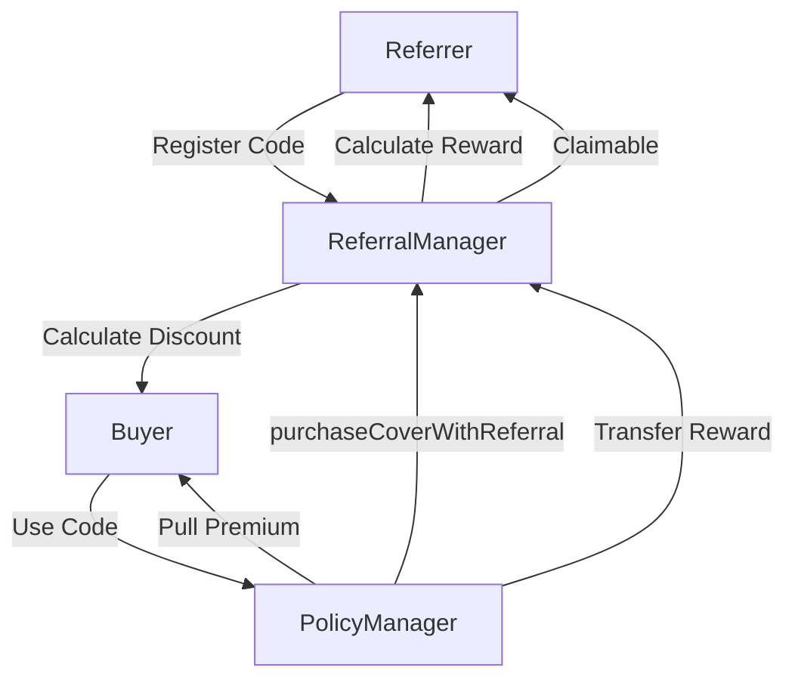
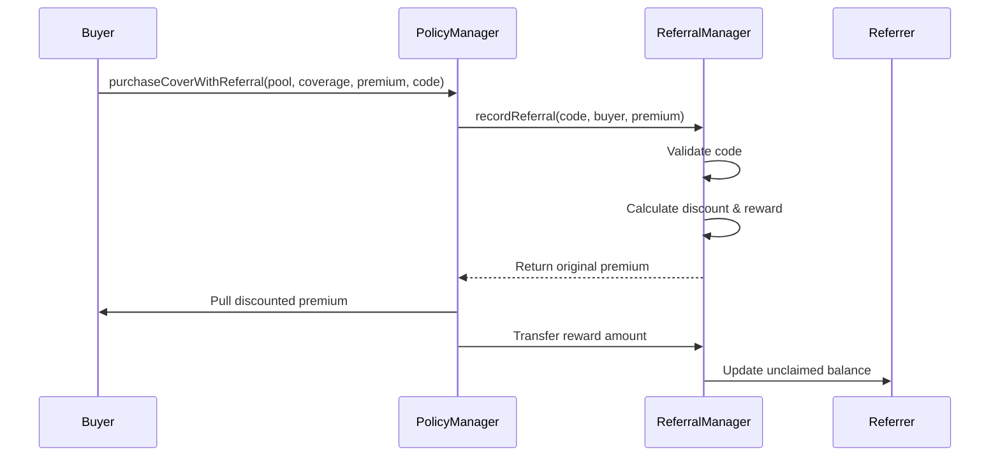

## Overview

The referral system turns users into marketers by offering immediate, tangible rewards for bringing new customers to the protocol. Unlike traditional referral programs with vesting schedules or complex claiming processes, this system provides instant gratification: buyers get an immediate discount (typically 3-5%) on their premium, and referrers earn rewards (typically 3-10% of the original premium) that are claimable at any time. There's no vesting, no waiting, no complexity—just pure economic incentive.

The math is precision-safe and gas-efficient. When a buyer uses a referral code, they pay the discounted premium upfront. The protocol reverse-engineers the original premium amount using the discount percentage, calculates the referrer's reward based on that original amount, and updates the referrer's unclaimed balance in a single storage write. This design prevents rounding exploits while minimizing gas costs. The economic cost to the protocol (discount + reward) is effectively a marketing expense—typically 5-10% of premium—often lower than traditional customer acquisition costs.

The on-chain nature creates transparency and trust. Every referral is recorded permanently, total statistics are publicly queryable, and there's no central entity that can refuse to pay out rewards. Referrers can prove their performance to build reputation, buyers can verify codes are legitimate before using them, and the protocol benefits from organic, grassroots growth. The result is a viral loop: satisfied users refer friends, earn rewards, and become advocates for the protocol.

The referral system incentivizes protocol growth through:
- **Buyer discounts** for using referral codes
- **Referrer rewards** for successful referrals
- **On-chain tracking** of all referrals
- **Instant rewards** (no vesting)
- **Flexible configuration** per deployment

This document explains referral mechanics and best practices.

---

## Referral Architecture

### System Overview



**Key Flow:**
1. Referrer registers unique code
2. Buyer uses code when purchasing policy
3. Buyer pays discounted premium
4. Protocol calculates original premium
5. Referrer earns reward based on original premium
6. Rewards instantly claimable

---

## ReferralManager Contract

### Configuration Parameters

```solidity
uint256 public buyerDiscountBps;   // e.g., 300 = 3%
uint256 public referrerRewardBps;  // e.g., 500 = 5%
uint256 public constant BPS = 10_000;
```

**Example Setup:**
```
Buyer discount: 3% (300 bps)
Referrer reward: 5% (500 bps)

Original premium: 1000 USDC
Buyer pays: 970 USDC (3% discount)
Referrer earns: 50 USDC (5% of original)
Protocol absorbs: 970 - 1000 + 50 = 20 USDC (net cost)
```

**Configuration Options:**
- Conservative: 2% discount, 3% reward
- Standard: 3% discount, 5% reward
- Aggressive: 5% discount, 10% reward

---

## Referral Code System

### Registering Codes

```solidity
function registerReferralCode(bytes32 code) external
```

**Requirements:**
- Code not already registered
- Code not zero
- One code per address

**Code:**
```javascript
// Create referral code
const code = ethers.encodeBytes32String("ALICE2024");

const tx = await referralManager.registerReferralCode(code);
await tx.wait();

console.log(`Registered code: ${ethers.decodeBytes32String(code)}`);
```

**Recommended Code Format:**
- Alphanumeric
- Easy to remember
- Unique identifier
- Max 32 bytes

**Examples:**
```
Good:
- ALICE2024
- DEFI_DAVE
- INSURTECH
- BTC_MAXI

Bad:
- a (too short)
- thisistoolongforarefcode (might not fit)
- 123456789 (not memorable)
```

### Code Storage

```solidity
mapping(bytes32 => address) public referralCodes;     // code → referrer
mapping(address => bytes32) public userReferralCode;  // referrer → code
```

**One-to-one mapping:**
- Each code has one referrer
- Each referrer has one code
- Codes cannot be changed (permanent)

---

## Using Referral Codes

### Purchase with Referral

```solidity
function purchaseCoverWithReferral(
    uint256 poolId,
    uint256 coverageAmount,
    uint256 initialPremiumDeposit,
    bytes32 referralCode
) external returns (uint256)
```

**Called by:** PolicyManager

**Process:**


### Discount & Reward Calculation

```solidity
function recordReferral(
    bytes32 referralCode,
    address buyer,
    uint256 premiumPaid  // Already discounted by buyer
) external returns (uint256 originalPremium)
```

**Math:**
```solidity
// Example:
// premiumPaid = 970 USDC (buyer paid this)
// buyerDiscountBps = 300 (3%)

// Calculate original premium
uint256 denominator = BPS - buyerDiscountBps;  // 10000 - 300 = 9700
originalPremium = (premiumPaid * BPS) / denominator;
// = (970 * 10000) / 9700 = 1000 USDC

// Calculate referrer reward (% of original)
uint256 rewardAmount = (premiumPaid * referrerRewardBps) / denominator;
// = (970 * 500) / 9700 = 50 USDC

// Calculate discount amount (for tracking)
uint256 discountAmount = (premiumPaid * buyerDiscountBps) / denominator;
// = (970 * 300) / 9700 = 30 USDC
```

**Why This Formula?**
```
originalPremium = premiumPaid / (1 - discount%)

Example:
premiumPaid = 970
discount = 3% = 0.03

originalPremium = 970 / (1 - 0.03) = 970 / 0.97 = 1000 ✓
```

### Recording Referral

```solidity
// Update referrer's unclaimed balance
unclaimedRewards[referrer] += rewardAmount;

// Track buyer's referral
buyerReferral[buyer] = referralCode;

// Update statistics
totalReferrals[referralCode]++;
totalDiscountsIssued += discountAmount;
totalRewardsPaid += rewardAmount;

emit ReferralRecorded(referralCode, buyer, originalPremium, discountAmount, rewardAmount);
```

---

## Claiming Rewards

### Claim Process

```solidity
function claimRewards() external nonReentrant
```

**Process:**
1. Check unclaimed balance
2. Require balance > 0
3. Reset balance to zero
4. Transfer USDC to referrer
5. Emit event

**Code:**
```javascript
// Check unclaimed rewards
const unclaimed = await referralManager.unclaimedRewards(referrerAddress);

console.log(`Unclaimed: ${ethers.formatUnits(unclaimed, 6)} USDC`);

if (unclaimed > 0n) {
    // Claim
    const tx = await referralManager.connect(referrer).claimRewards();
    await tx.wait();

    console.log("Rewards claimed!");
}
```

**No Vesting:**
- Rewards instantly claimable
- No waiting period
- No unlock schedule
- Claim anytime

---

## Tracking & Statistics

### Per-Referrer Stats

```solidity
mapping(address => uint256) public unclaimedRewards;
mapping(bytes32 => uint256) public totalReferrals;
```

**Query:**
```javascript
// Get referrer's stats
const code = await referralManager.userReferralCode(referrerAddress);
const unclaimed = await referralManager.unclaimedRewards(referrerAddress);
const totalReferrals = await referralManager.totalReferrals(code);

console.log(`Code: ${ethers.decodeBytes32String(code)}`);
console.log(`Unclaimed: ${ethers.formatUnits(unclaimed, 6)} USDC`);
console.log(`Total Referrals: ${totalReferrals}`);
```

### Global Stats

```solidity
uint256 public totalDiscountsIssued;
uint256 public totalRewardsPaid;
```

**Query:**
```javascript
const totalDiscounts = await referralManager.totalDiscountsIssued();
const totalRewards = await referralManager.totalRewardsPaid();

console.log(`Total Discounts: ${ethers.formatUnits(totalDiscounts, 6)} USDC`);
console.log(`Total Rewards: ${ethers.formatUnits(totalRewards, 6)} USDC`);
```

### Per-Buyer Tracking

```solidity
mapping(address => bytes32) public buyerReferral;
```

**Query:**
```javascript
// Check which code buyer used
const code = await referralManager.buyerReferral(buyerAddress);

if (code !== ethers.ZeroHash) {
    console.log(`Buyer used code: ${ethers.decodeBytes32String(code)}`);
    const referrer = await referralManager.referralCodes(code);
    console.log(`Referrer: ${referrer}`);
}
```

---

## Integration Examples

### Frontend: Register Referral Code

```javascript
// Check if user already has code
const existingCode = await referralManager.userReferralCode(userAddress);

if (existingCode !== ethers.ZeroHash) {
    console.log(`Already registered: ${ethers.decodeBytes32String(existingCode)}`);
    return;
}

// Prompt user for code
const desiredCode = prompt("Enter your referral code (max 31 chars):");

// Validate length
if (desiredCode.length > 31) {
    console.log("Code too long");
    return;
}

// Encode and check availability
const codeBytes = ethers.encodeBytes32String(desiredCode);
const owner = await referralManager.referralCodes(codeBytes);

if (owner !== ethers.ZeroAddress) {
    console.log("Code already taken");
    return;
}

// Register
const tx = await referralManager.registerReferralCode(codeBytes);
await tx.wait();

console.log(`Registered: ${desiredCode}`);
```

### Frontend: Purchase with Referral

```javascript
// Prompt buyer for referral code
const referralCodeInput = prompt("Have a referral code? (leave blank to skip)");

let referralCode = ethers.ZeroHash;

if (referralCodeInput) {
    referralCode = ethers.encodeBytes32String(referralCodeInput);

    // Validate code exists
    const referrer = await referralManager.referralCodes(referralCode);
    if (referrer === ethers.ZeroAddress) {
        console.log("Invalid referral code");
        referralCode = ethers.ZeroHash;
    } else {
        console.log(`Using code from: ${referrer}`);

        // Show discount
        const discountBps = await referralManager.buyerDiscountBps();
        console.log(`You'll save ${discountBps / 100}%!`);
    }
}

// Calculate premium (with discount if using code)
let premiumAmount = calculatePremium(poolId, coverageAmount);

if (referralCode !== ethers.ZeroHash) {
    const discountBps = await referralManager.buyerDiscountBps();
    premiumAmount = (premiumAmount * (10000n - discountBps)) / 10000n;
}

// Purchase
await usdc.approve(policyManagerAddress, premiumAmount);

const tx = await policyManager.purchaseCoverWithReferral(
    poolId,
    coverageAmount,
    premiumAmount,
    referralCode
);

await tx.wait();
```

### Referrer: Monitor Performance

```javascript
// Get referrer's code
const code = await referralManager.userReferralCode(referrerAddress);

if (code === ethers.ZeroHash) {
    console.log("Not registered as referrer");
    return;
}

console.log(`Your Code: ${ethers.decodeBytes32String(code)}`);

// Get stats
const unclaimed = await referralManager.unclaimedRewards(referrerAddress);
const totalRefs = await referralManager.totalReferrals(code);

console.log(`Unclaimed Rewards: ${ethers.formatUnits(unclaimed, 6)} USDC`);
console.log(`Total Referrals: ${totalRefs}`);

// Calculate average reward per referral
if (totalRefs > 0n) {
    const avgReward = unclaimed / totalRefs;
    console.log(`Avg Reward/Referral: ${ethers.formatUnits(avgReward, 6)} USDC`);
}

// Claim if threshold reached
if (unclaimed >= ethers.parseUnits("100", 6)) {  // $100 threshold
    console.log("Claiming rewards...");
    const tx = await referralManager.connect(referrer).claimRewards();
    await tx.wait();
    console.log("Claimed!");
}
```

---

## Admin Functions

### Updating Configuration

```solidity
function setBuyerDiscountBps(uint256 newBps) external onlyOwner
function setReferrerRewardBps(uint256 newBps) external onlyOwner
```

**Example:**
```javascript
// Owner updates discount to 5%
const newDiscountBps = 500;
await referralManager.connect(owner).setBuyerDiscountBps(newDiscountBps);

// Owner updates reward to 8%
const newRewardBps = 800;
await referralManager.connect(owner).setReferrerRewardBps(newRewardBps);
```

**Considerations:**
- Higher discounts = more buyers
- Higher rewards = more referrers
- Balance protocol profitability
- Communicate changes clearly

---

## Best Practices

### For Referrers

✅ **DO:**
- Create memorable, short codes
- Share code across social media
- Target relevant audiences
- Track performance regularly
- Claim rewards periodically

❌ **DON'T:**
- Use offensive or inappropriate codes
- Spam referral codes
- Misrepresent protocol features
- Create multiple accounts (one code per address)

### For Buyers

✅ **DO:**
- Use referral codes when available
- Verify code before purchase
- Understand discount percentage
- Share good codes with friends

❌ **DON'T:**
- Use invalid codes (transaction may fail)
- Expect discount without code
- Try to game system (one code per purchase)

### For Protocol

✅ **DO:**
- Set competitive discounts (2-5%)
- Set attractive rewards (3-10%)
- Monitor program costs
- Adjust parameters based on adoption
- Display referral stats on frontend

❌ **DON'T:**
- Set discount too low (no incentive)
- Set reward too high (unsustainable)
- Change parameters too frequently
- Ignore fraud detection

---

## Economic Impact

### Cost to Protocol

```
Net cost per referral = Discount + Reward - (Premium difference)

Example:
Original premium: 1000 USDC
Buyer pays: 970 USDC (3% discount)
Referrer gets: 50 USDC (5% reward)

Net cost = 30 (discount) + 50 (reward) - 30 (premium difference)
         = 50 USDC

Effective cost = 5% of original premium
```

### ROI Analysis

**Assume:**
- Referral acquisition cost: 5% per policy
- Organic acquisition cost: 10% (marketing, ads)
- Referral retention: Higher (referred users more loyal)

**Break-even:**
```
If referral program reduces CAC from 10% to 5%,
and increases LTV by 20%,
then ROI is positive.
```

### Growth Metrics

Track:
- New buyers via referrals (%)
- Referrer activation rate
- Average rewards per referrer
- Buyer retention (referral vs organic)
- Total program cost (% of premiums)

---

## View Functions

```solidity
function referralCodes(bytes32 code) public view returns (address referrer)
function userReferralCode(address user) public view returns (bytes32 code)
function unclaimedRewards(address referrer) public view returns (uint256)
function totalReferrals(bytes32 code) public view returns (uint256)
function buyerReferral(address buyer) public view returns (bytes32 code)
function buyerDiscountBps() public view returns (uint256)
function referrerRewardBps() public view returns (uint256)
function totalDiscountsIssued() public view returns (uint256)
function totalRewardsPaid() public view returns (uint256)
```

---

## Events

```solidity
event ReferralCodeRegistered(bytes32 indexed code, address indexed referrer)
event ReferralRecorded(
    bytes32 indexed code,
    address indexed buyer,
    uint256 originalPremium,
    uint256 discountAmount,
    uint256 rewardAmount
)
event RewardsClaimed(address indexed referrer, uint256 amount)
event BuyerDiscountUpdated(uint256 oldBps, uint256 newBps)
event ReferrerRewardUpdated(uint256 oldBps, uint256 newBps)
```

---

## Security Considerations

### Sybil Resistance

**Current:**
- One code per address
- No direct prevention of multiple addresses

**Mitigation:**
- Subgraph analytics for suspicious patterns
- Manual review of high-volume referrers
- Adjust rewards if abuse detected

### Code Squatting

**Issue:**
- Users may register popular codes early

**Mitigation:**
- First-come-first-served
- Consider auction mechanism (future)
- Reserved codes for partnerships

### Precision Loss

**Formula design prevents precision loss:**
```solidity
// Safe: multiply before divide
rewardAmount = (premiumPaid * referrerRewardBps) / denominator;

// Unsafe: divide before multiply (not used)
// wrong = (premiumPaid / denominator) * referrerRewardBps;
```

---

## Subgraph Integration

### Tracking Referrals

```graphql
type ReferralCode @entity {
  id: ID!                       # bytes32 code
  code: String!                 # Human-readable
  referrer: Bytes!              # Address
  totalReferrals: BigInt!
  totalRewards: BigDecimal!
  totalDiscounts: BigDecimal!
  createdAt: BigInt!
  buyers: [Referral!]! @derivedFrom(field: "code")
}

type Referral @entity {
  id: ID!                       # tx-log index
  code: ReferralCode!
  buyer: Bytes!
  originalPremium: BigDecimal!
  discountAmount: BigDecimal!
  rewardAmount: BigDecimal!
  timestamp: BigInt!
}
```

### Query Examples

```graphql
# Top referrers by total rewards
{
  referralCodes(
    orderBy: totalRewards
    orderDirection: desc
    first: 10
  ) {
    code
    referrer
    totalReferrals
    totalRewards
  }
}

# Recent referrals
{
  referrals(
    orderBy: timestamp
    orderDirection: desc
    first: 20
  ) {
    buyer
    code {
      code
      referrer
    }
    rewardAmount
    timestamp
  }
}
```

---

## Troubleshooting

### Common Issues

**Problem: "ReferralCodeAlreadyExists"**
- **Cause:** Someone already registered this code
- **Solution:** Choose a different, unique code

**Problem: "Code too long"**
- **Cause:** String exceeds 31 characters (bytes32 limit)
- **Solution:** Shorten your code to 31 characters or less

**Problem: "ReferrerAlreadyHasCode"**
- **Cause:** Your address already has a registered code
- **Solution:** Cannot register multiple codes per address; use existing code or new address

**Problem: "CannotReferSelf"**
- **Cause:** Trying to use your own referral code
- **Solution:** Use someone else's code or don't use a referral code

**Problem: "ReferralCodeNotFound"**
- **Cause:** Code hasn't been registered yet
- **Solution:** Verify code spelling or ask referrer to register it first

**Problem: "No rewards to claim"**
- **Cause:** Zero unclaimed balance
- **Solution:** Wait for buyers to use your code before claiming

### Premium Calculation Issues

**Problem: Discount amount doesn't match expected**
- **Cause:** Rounding in integer math
- **Solution:** Expected; precision loss is minimized by multiply-before-divide formula

**Example of correct calculation:**
```javascript
// Buyer pays 970 USDC (3% off 1000)
// Protocol calculates original:
const originalPremium = (970 * 10000) / (10000 - 300) // = 1000
const rewardAmount = (970 * 500) / (10000 - 300)      // = 50
const discountAmount = (970 * 300) / (10000 - 300)    // = 30

// Verification:
// Buyer paid: 970 ✓
// Original: 1000 ✓
// Discount: 30 (3% of 1000) ✓
// Reward: 50 (5% of 1000) ✓
```

### Integration Testing

**Test checklist before mainnet:**
- [ ] Register referral code successfully
- [ ] Purchase with valid code (buyer pays less)
- [ ] Purchase with invalid code (transaction fails gracefully)
- [ ] Self-referral prevention (transaction reverts)
- [ ] Reward accumulation (unclaimed balance increases)
- [ ] Claim rewards (USDC transferred correctly)
- [ ] Multiple purchases with same code (rewards accumulate)
- [ ] Gas costs reasonable (<100k gas for purchase)

---

## Advanced Strategies

### For Referrers

**Building a Referral Funnel:**

1. **Create Value First**
   - Educate about insurance need
   - Explain protocol benefits
   - Build trust before promoting code

2. **Multi-Channel Promotion**
   - Twitter: Pin code in bio
   - YouTube: Include in video descriptions
   - Blog: Add to insurance-related articles
   - Discord/Telegram: Share in community
   - Email: Include in newsletter signature

3. **Track and Optimize**
   - Monitor which channels drive most referrals
   - A/B test different messaging
   - Highlight discount benefit prominently
   - Share success stories

4. **Scale Up**
   - Partner with other protocols
   - Create referral landing pages
   - Build tools/calculators with code embedded
   - Offer additional value (guides, analysis)

**Referral Economics:**
```
Target: $10,000 monthly income from referrals

Required metrics:
- Average policy: 100 USDC premium
- Your reward: 5 USDC per policy (5%)
- Policies needed: 2,000/month (67/day)

Breakdown:
- Conversion rate: 2% (visitor → buyer)
- Required visitors: 100,000/month (3,333/day)
- Traffic sources: organic, paid, partnerships

Reality check:
- High volume needed for substantial income
- But: one-time setup, ongoing passive income
- Best for: influencers, educators, communities
```

### For Buyers

**Maximizing Savings:**

1. **Always Use Codes**
   - Even if small purchase, 3% adds up
   - No downside to using codes
   - Support creators you value

2. **Large Purchases = Larger Savings**
```
$1,000 coverage → 1 USDC premium → 0.03 USDC saved
$100,000 coverage → 100 USDC premium → 3 USDC saved
$1,000,000 coverage → 1,000 USDC premium → 30 USDC saved
```

3. **Track Your Total Savings**
   - Use frontend dashboard
   - Export transaction history
   - Share savings with community

### For Protocols/Partners

**Integration Opportunities:**

1. **Whitelabel Partnerships**
   - Partner protocol gets custom referral code
   - Their users get discounts
   - They earn rewards for driving volume
   - Win-win growth strategy

2. **Affiliate Programs**
   - Create tiered reward structure
   - Higher rewards for high-volume referrers
   - Custom codes for partners
   - Revenue sharing models

3. **Community Incentives**
   - Community DAO gets referral code
   - Rewards flow to treasury
   - Funds community initiatives
   - Aligns incentives

---

## Performance & Gas Optimization

### Gas Costs

**Typical gas usage:**
```
registerReferralCode(): ~50,000 gas
purchaseCoverWithReferral(): ~150,000 gas (incremental)
claimRewards(): ~45,000 gas

At 50 gwei and $3,000 ETH:
- Register: ~$7.50
- Purchase: ~$22.50 (once)
- Claim: ~$6.75 (per claim)
```

**Optimization tips:**
- Register code once, use forever
- Claim rewards in batches (wait for accumulation)
- Purchase during low gas times
- Use L2s for lower costs (if deployed)

### Storage Optimization

**Efficient design:**
- `bytes32` codes (single slot)
- Minimal mappings (2 for codes, 3 for stats)
- No arrays (no iteration needed)
- No structs (simple uint256 tracking)

**Why this matters:**
- Lower deployment costs
- Cheaper operations
- Simple, auditable code
- No complex state management

---

## Security Considerations

### Smart Contract Security

**Audit Focus Areas:**
1. **Math Precision**
   - Reverse-engineering original premium
   - Multiply-before-divide pattern
   - Rounding edge cases
   - Overflow protection (Solidity 0.8+)

2. **Access Control**
   - Only PolicyManager can record referrals
   - Only referrers can claim their own rewards
   - Owner can update percentages (within bounds)
   - No arbitrary code execution

3. **Reentrancy**
   - NonReentrant on claim functions
   - State updates before external calls
   - SafeERC20 for token transfers
   - No callback opportunities

4. **Economic Attacks**
   - Cannot game the system with self-referrals
   - Cannot steal other's rewards
   - Cannot manipulate original premium calculation
   - Bounded admin parameters prevent protocol drain

### Business Logic Security

**Potential Risks & Mitigations:**

1. **Code Squatting**
   - **Risk:** Bots register all good codes
   - **Mitigation:** First-come-first-served is fairest; reserved codes for partners

2. **Sybil Attacks**
   - **Risk:** One entity creates many codes
   - **Mitigation:** Doesn't benefit them; rewards are same regardless

3. **Referral Spam**
   - **Risk:** Aggressive/scammy promotion
   - **Mitigation:** Off-chain moderation; reputation system

4. **Wash Trading**
   - **Risk:** Buy/claim/repeat to drain protocol
   - **Mitigation:** Net negative for attacker (they pay 97%, get back 5%)

**Cost Analysis (attacker perspective):**
```
Attack scenario: Self-referral with multiple addresses

Attacker actions:
- Address A registers code
- Address B buys policy with A's code
- A earns 5 USDC
- B paid 97 USDC (3% discount)

Net result:
- Attacker spent: 97 USDC (premium paid)
- Attacker earned: 5 USDC (referral reward)
- Net loss: 92 USDC

Conclusion: Economically irrational; they lose money
```

### Frontend Security

**Best Practices:**

1. **Input Validation**
   - Sanitize referral code inputs
   - Check length before encoding
   - Verify code exists before purchase
   - Show clear error messages

2. **Contract Verification**
   - Display contract address
   - Link to block explorer
   - Show code is verified
   - Warn about phishing

3. **Transaction Simulation**
   - Show expected discount amount
   - Display referrer address
   - Preview reward impact
   - Confirm before signing

4. **Rate Limiting**
   - Prevent spam registration attempts
   - Throttle API calls
   - Implement CAPTCHAs if needed

---

## Testing & Monitoring

### Unit Test Coverage

**Core functionality:**
```solidity
// test/ReferralManager.t.sol (example structure)

test_registerReferralCode()
test_registerDuplicateCodeFails()
test_registerMultipleCodesFails()
test_purchaseWithValidCode()
test_purchaseWithInvalidCodeFails()
test_purchaseWithSelfReferralFails()
test_calculateDiscountedPremium()
test_rewardCalculation()
test_claimRewards()
test_claimWithZeroBalanceFails()
test_updateBuyerDiscount()
test_updateReferrerReward()
test_onlyPolicyManagerCanRecord()
```

### Integration Tests

**End-to-end scenarios:**
1. Complete buyer journey with referral
2. Multiple buyers using same code
3. Referrer claims after multiple referrals
4. Admin updates percentages mid-flight
5. Error handling for edge cases

### Monitoring & Analytics

**Key metrics to track:**

1. **Adoption Metrics**
   - Total codes registered
   - Active referrers (>0 referrals)
   - New codes per week
   - Code utilization rate

2. **Revenue Metrics**
   - Total discounts issued
   - Total rewards paid
   - Net cost to protocol
   - Cost per acquisition (CPA)

3. **User Metrics**
   - % buyers using codes
   - Average referrals per code
   - Top referrers by volume
   - Buyer retention (referral vs organic)

4. **Economic Metrics**
   - Average premium with referrals
   - Lifetime value (LTV) comparison
   - Return on referral investment (RORI)
   - Break-even time per buyer

**Alerting:**
- Unusual spike in referrals (potential abuse)
- High-value referrer milestones
- Protocol cost exceeding thresholds
- Error rate increases

---

## Quick Reference

### Key Parameters

| Parameter | Default | Max | Purpose |
|-----------|---------|-----|---------|
| Buyer Discount | 3% (300 bps) | 5% (500 bps) | Discount for code users |
| Referrer Reward | 5% (500 bps) | 10% (1000 bps) | Reward for referrers |
| Code Length | 1-31 chars | 31 chars | bytes32 limit |

### Math Formulas

```
Given: premiumPaid (what buyer paid), buyerDiscountBps, referrerRewardBps

denominator = 10000 - buyerDiscountBps
originalPremium = (premiumPaid * 10000) / denominator
rewardAmount = (premiumPaid * referrerRewardBps) / denominator
discountAmount = (premiumPaid * buyerDiscountBps) / denominator

Verification:
premiumPaid + discountAmount = originalPremium ✓
rewardAmount = originalPremium * (referrerRewardBps / 10000) ✓
```

### Function Quick Reference

| Action | Function | Who Can Call? |
|--------|----------|---------------|
| Register code | `registerReferralCode(bytes32)` | Anyone (once per address) |
| Purchase with code | `purchaseCoverWithReferral(...)` | Buyers via PolicyManager |
| Claim rewards | `claimRewards()` | Referrers with balance > 0 |
| Update discount | `setBuyerDiscountBps(uint256)` | Owner/Admin |
| Update reward | `setReferrerRewardBps(uint256)` | Owner/Admin |
| Check code validity | `referralCodes(bytes32)` | Anyone (view) |
| Get stats | `unclaimedRewards(address)` | Anyone (view) |

### Event Reference

```solidity
ReferralCodeRegistered(bytes32 indexed code, address indexed referrer)
  → User registered new referral code

ReferralRecorded(bytes32 indexed code, address indexed buyer, ...)
  → Buyer used code, rewards allocated

RewardsClaimed(address indexed referrer, uint256 amount)
  → Referrer claimed their rewards

BuyerDiscountUpdated(uint256 oldBps, uint256 newBps)
  → Admin changed discount percentage

ReferrerRewardUpdated(uint256 oldBps, uint256 newBps)
  → Admin changed reward percentage
```

---

## Future Enhancements

### Potential Features

1. **Tiered Rewards**
   - Higher rewards for high-volume referrers
   - Milestone bonuses (100th referral bonus)
   - Seasonal promotions

2. **Code NFTs**
   - Referral codes as tradeable NFTs
   - Marketplace for premium codes
   - Royalties on secondary sales

3. **Sub-Referrals**
   - Multi-level marketing (with care)
   - Referrer refers another referrer
   - Shared rewards across levels

4. **Dynamic Pricing**
   - Adjust discounts based on pool utilization
   - Higher discounts for new/underutilized pools
   - Lower discounts for popular pools

5. **Gamification**
   - Leaderboards for top referrers
   - Badges for milestones
   - Special perks for high performers
   - Referral competitions

### Integration Ideas

**DeFi Protocols:**
- Partner codes for friendly protocols
- Cross-protocol referral sharing
- Yield aggregator integrations

**Communities:**
- DAO treasury referral codes
- Guild-specific codes
- Educational platform partnerships

**Marketing Automation:**
- Webhook notifications on new referrals
- Email campaigns with code tracking
- CRM integration for sales teams

---

## Additional Resources

### Related Documentation
- [Governance System →](/governance/governance) - How protocol decisions are made
- [Tokenomics & Staking →](/governance/tokenomics) - Staking and rewards
- [Referral Guide →](/concepts/referrals) - User-friendly referral guide
- [Technical Architecture →](/technical-reference) - System design

### External Resources
- **Etherscan:** Verify contracts and track referrals
- **Dune Analytics:** Referral program dashboards
- **The Graph:** Subgraph for referral queries

### Support
- **Documentation:** Full docs at docs.layercover.com
- **Discord:** #referrals channel for questions
- **GitHub:** Issues and feature requests

---

**Next:** Learn about [Technical Architecture →](/technical-reference)
