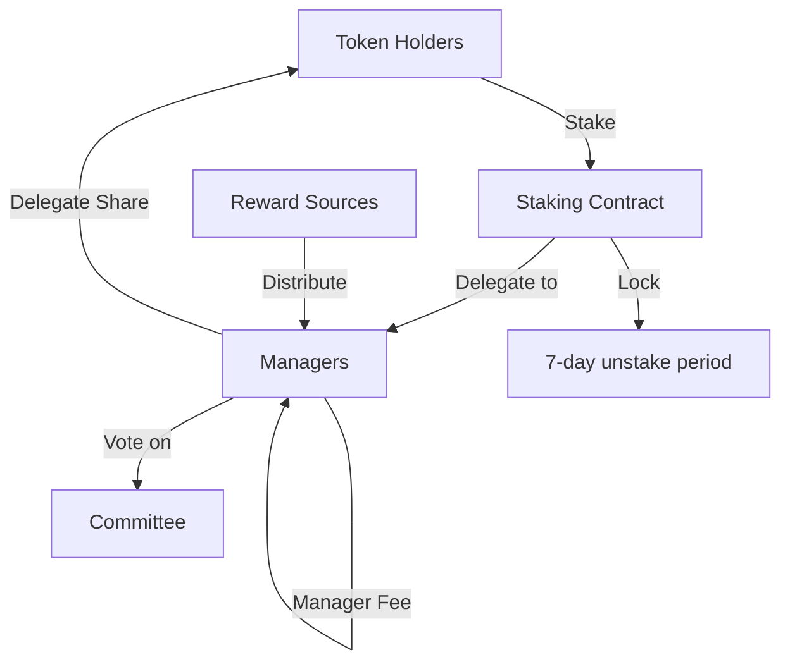
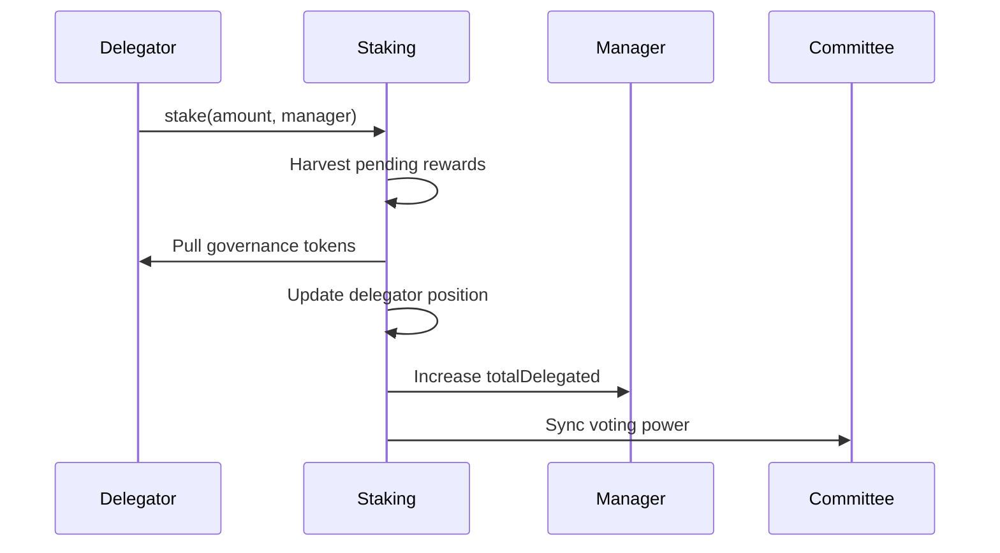
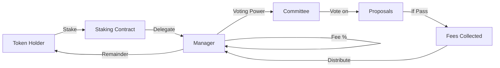

## Overview

The governance token is the voting power source for protocol decisions, but participation happens through delegated staking to elected managers. Token holders don't vote directly - they stake tokens to professional managers who vote on their behalf. This delegation model solves the participation problem plaguing many DAOs: most token holders lack time or expertise to evaluate every proposal, leading to low turnout and governance capture by whales.

Managers compete for delegated stake by offering competitive fee structures (0-20%) and building track records of quality voting. Delegators can switch managers freely (subject to a 7-day lock if their manager recently voted), creating a market for governance services. Good managers attract more stake, earn more fees, and gain more voting power. Bad managers lose delegators and relevance. This creates emergent specialization - some managers focus on technical analysis, others on economic policy, some on community representation.

The economic model is simple but powerful: protocol fees flow to managers, who take their fee cut (10-20%) and distribute the remainder pro-rata to delegators. Managers are incentivized to vote on all proposals to maximize their value proposition. Delegators are incentivized to choose active, competent managers. The 7-day unstake lock after votes prevents gaming by locking in positions during active proposals, ensuring voting power reflects real, committed stakeholders rather than mercenary capital.

The tokenomics system enables decentralized governance through:
- **Delegated staking** to elected managers
- **Voting power** based on staked amount
- **Manager fees** for active participation
- **Reward distribution** from protocol fees
- **7-day unstake lock** during active votes

This document explains staking mechanics and reward structures.

---

## Staking Architecture

### System Overview



**Key Concepts:**
- Token holders stake governance tokens
- Delegators choose a manager
- Managers vote on proposals
- Managers earn fee cut from rewards
- Delegators earn remaining rewards pro-rata

---

## Staking Contract

### Core Parameters

```solidity
uint256 public constant UNSTAKE_LOCK_PERIOD = 7 days;
uint256 public constant MAX_MANAGER_FEE_BPS = 2_000; // 20%
uint256 private constant BASIS_POINTS = 10_000;
uint256 private constant ACC_PRECISION = 1e18;

IERC20 public immutable governanceToken;
address public committeeAddress;
```

### Manager Structure

```solidity
struct ManagerInfo {
    bool registered;            // Is manager registered?
    uint16 feeBps;              // Fee percentage (0-2000 bps)
    uint256 totalDelegated;     // Total tokens delegated to manager
    uint256 accRewardPerShare;  // Accumulator for reward distribution
    uint256 managerRewards;     // Accumulated manager fees
}
```

### Delegator Structure

```solidity
struct DelegatorPosition {
    address manager;         // Delegated manager
    uint256 amount;          // Staked amount
    uint256 rewardDebt;      // Reward debt for accrual calculation
}
```

---

## Manager Lifecycle

### Registering as Manager

```solidity
function registerManager(uint16 feeBps) external
```

**Requirements:**
- Not already registered
- Fee ≤ 20% (2000 bps)

**Code:**
```javascript
// Register with 10% manager fee
const feeBps = 1000; // 10%

const tx = await stakingContract.registerManager(feeBps);
await tx.wait();

console.log(`Registered as manager with ${feeBps/100}% fee`);
```

**Manager Responsibilities:**
- Vote on governance proposals
- Attract delegators
- Maintain active participation
- Earn fee cut from rewards

### Updating Manager Fee

```solidity
function updateManagerFee(uint16 newFeeBps) external
```

**Example:**
```javascript
// Update fee from 10% to 15%
const newFeeBps = 1500;

const tx = await stakingContract.updateManagerFee(newFeeBps);
await tx.wait();
```

**Best Practice:**
- Start with competitive fee (5-15%)
- Increase based on performance
- Communicate changes to delegators
- Don't exceed 20%

---

## Delegator Actions

### Staking Tokens

```solidity
function stake(uint256 amount, address manager) external nonReentrant
```

**Process:**


**Code:**
```javascript
// Stake 1000 tokens to manager
const amount = ethers.parseEther("1000");
const managerAddress = "0x...";

// Approve tokens
await governanceToken.approve(stakingAddress, amount);

// Stake
const tx = await stakingContract.stake(amount, managerAddress);
await tx.wait();

console.log(`Staked ${ethers.formatEther(amount)} tokens to ${managerAddress}`);
```

**Effects:**
- Tokens locked in staking contract
- Voting power delegated to manager
- Start earning rewards (minus manager fee)
- Position recorded

### Adding More Stake

```javascript
// Already delegated to managerA, add more to same manager
const additionalAmount = ethers.parseEther("500");

await governanceToken.approve(stakingAddress, additionalAmount);

// Pass address(0) to use existing manager
const tx = await stakingContract.stake(additionalAmount, ethers.ZeroAddress);
await tx.wait();
```

**Alternative:**
```javascript
// Explicitly specify same manager
await stakingContract.stake(additionalAmount, managerAddress);
```

### Changing Manager

```solidity
function changeManager(address newManager) external nonReentrant
```

**Requirements:**
- Must have existing delegation
- New manager ≠ current manager
- Must have staked amount > 0
- Manager must not have active vote within 7 days

**Process:**
1. Harvest rewards from old manager
2. Reduce old manager's totalDelegated
3. Sync old manager's voting power
4. Switch to new manager
5. Update reward debt for new manager
6. Increase new manager's totalDelegated
7. Sync new manager's voting power

**Code:**
```javascript
// Switch from managerA to managerB
const newManager = "0x...";

const tx = await stakingContract.changeManager(newManager);
await tx.wait();

console.log(`Changed manager to ${newManager}`);
```

**7-Day Lock:**
```solidity
function _enforceManagerLock(address manager) internal view {
    uint256 proposalId = managerLastVotedProposal[manager];
    if (proposalId == 0) return;  // Manager hasn't voted

    if (ICommittee(committeeAddress).isProposalFinalized(proposalId)) return;

    if (block.timestamp < managerLastVoteTime[manager] + UNSTAKE_LOCK_PERIOD) {
        revert Errors.VoteLockActive(...);
    }
}
```

**Why Lock?**
- Prevents vote manipulation
- Ensures voting power stability
- Protects proposal integrity

### Unstaking

```solidity
function unstake(uint256 amount) external nonReentrant
```

**Requirements:**
- Must have sufficient staked amount
- Manager must not have active vote within 7 days
- Amount > 0

**Process:**
1. Check manager lock
2. Harvest pending rewards
3. Reduce position amount
4. Update manager's totalDelegated
5. Sync voting power
6. Transfer tokens back to delegator

**Code:**
```javascript
// Unstake 500 tokens
const amount = ethers.parseEther("500");

const tx = await stakingContract.unstake(amount);
await tx.wait();

console.log(`Unstaked ${ethers.formatEther(amount)} tokens`);
```

**Partial Unstake:**
```javascript
// Check current stake
const position = await stakingContract.getDelegatorPosition(userAddress);
const currentStake = position.amount;

// Unstake half
const halfStake = currentStake / 2n;
await stakingContract.unstake(halfStake);
```

**Full Unstake:**
```javascript
// Unstake everything
await stakingContract.unstake(position.amount);

// Position cleared:
// - manager = address(0)
// - amount = 0
// - rewardDebt = 0
```

---

## Reward Distribution

### Reward Accumulator Pattern

Similar to RewardDistributor for underwriters:

```solidity
// Per-manager accumulator
uint256 accRewardPerShare;

// User reward debt
uint256 rewardDebt;
```

### Depositing Rewards

```solidity
function depositManagerRewards(address manager, uint256 amount) external nonReentrant onlyRewardSource
```

**Called by:** Approved reward distributors (protocol treasury, fee collectors)

**Process:**
```solidity
uint256 managerCut = (amount * info.feeBps) / BASIS_POINTS;
uint256 delegatorShare = amount - managerCut;

// Manager fee
if (managerCut > 0) {
    info.managerRewards += managerCut;
}

// Delegator distribution
if (delegatorShare > 0) {
    if (info.totalDelegated == 0) {
        // No delegators → manager gets all
        info.managerRewards += delegatorShare;
    } else {
        // Update accumulator (pro-rata to delegators)
        info.accRewardPerShare += (delegatorShare * ACC_PRECISION) / info.totalDelegated;
    }
}
```

**Example:**
```
Reward deposit: 10,000 tokens
Manager fee: 10% (1000 bps)
Total delegated: 100,000 tokens

Manager cut: 10,000 * 10% = 1,000 tokens
Delegator share: 10,000 - 1,000 = 9,000 tokens

accRewardPerShare += (9,000 * 1e18) / 100,000
                   = 9e13 per token delegated

Delegator with 5,000 tokens:
Pending = (5,000 * 9e13) / 1e18 = 450 tokens
```

### Pending Rewards Calculation

```solidity
function _pendingRewards(DelegatorPosition storage position, ManagerInfo storage mInfo)
    internal view returns (uint256)
{
    if (position.amount == 0) return 0;

    uint256 accumulated = (position.amount * mInfo.accRewardPerShare) / ACC_PRECISION;

    if (accumulated < position.rewardDebt) return 0;

    return accumulated - position.rewardDebt;
}
```

### Harvesting (Internal)

```solidity
function _harvest(
    DelegatorPosition storage position,
    ManagerInfo storage mInfo,
    address delegator
) internal returns (uint256) {
    uint256 pending = _pendingRewards(position, mInfo);

    if (pending > 0) {
        governanceToken.safeTransfer(delegator, pending);
        emit DelegatorRewardPaid(delegator, position.manager, pending);
    }

    return pending;
}
```

**Triggered automatically on:**
- Staking more
- Changing manager
- Unstaking
- Claiming rewards

---

## Claiming Rewards

### Delegator Claims

```solidity
function claimDelegatorRewards() external nonReentrant returns (uint256)
```

**Process:**
1. Get delegator's position
2. Harvest pending rewards
3. Update reward debt
4. Transfer tokens

**Code:**
```javascript
// Claim accumulated rewards
const tx = await stakingContract.claimDelegatorRewards();
const receipt = await tx.wait();

const rewardEvent = receipt.events.find(e => e.event === 'DelegatorRewardPaid');
const amount = rewardEvent.args.amount;

console.log(`Claimed ${ethers.formatEther(amount)} tokens`);
```

### Manager Claims

```solidity
function claimManagerRewards() external nonReentrant returns (uint256)
```

**Process:**
1. Get manager's accumulated fees
2. Reset manager rewards
3. Transfer tokens

**Code:**
```javascript
// Manager claims their fee cut
const tx = await stakingContract.connect(manager).claimManagerRewards();
const receipt = await tx.wait();

const rewardEvent = receipt.events.find(e => e.event === 'ManagerRewardPaid');
const amount = rewardEvent.args.amount;

console.log(`Manager claimed ${ethers.formatEther(amount)} token fees`);
```

---

## Voting Power

### Manager Voting Power

```solidity
function managerVotingPower(address manager) external view returns (uint256) {
    return managerData[manager].totalDelegated;
}
```

**Used by:**
- Committee for proposal eligibility
- Committee for vote weight

### Dynamic Updates

When delegators stake/unstake:

```solidity
function _syncManagerVotingPower(address manager, uint256 newPower) internal {
    if (committeeAddress == address(0)) return;

    uint256 proposalId = managerLastVotedProposal[manager];
    if (proposalId == 0) return;  // Manager hasn't voted

    if (ICommittee(committeeAddress).isProposalFinalized(proposalId)) {
        // Clear vote tracking
        managerLastVotedProposal[manager] = 0;
        managerLastVoteTime[manager] = 0;
        return;
    }

    // Update vote weight in committee
    ICommittee(committeeAddress).updateVoteWeight(manager, proposalId, newPower);
}
```

**Example:**
```
Manager has 100,000 voting power (100k tokens delegated)
Manager votes For on Proposal #1

New delegator stakes 10,000 tokens to this manager

Manager's voting power: 110,000
Committee automatically updates For vote: +10,000

Manager now has 110,000 voting power on Proposal #1
```

---

## Slashing

### Slash Mechanism

```solidity
function slash(address user, uint256 amount) external onlyCommittee nonReentrant
```

**Called by:** Committee (for misbehavior, bond slashing)

**Process:**
1. Reduce delegator's staked amount
2. Reduce totalStaked
3. Reduce manager's totalDelegated
4. Update reward debt
5. Sync manager voting power
6. Transfer slashed tokens to committee

**Use Cases:**
- Proposer bond slashing (defeated proposal)
- Governance penalty (future use)
- Security measure

---

## View Functions

### Delegator Information

```solidity
function getDelegatorPosition(address delegator)
    external view returns (
        address manager,
        uint256 amount,
        uint256 pendingRewards
    )

function pendingDelegatorRewards(address delegator) external view returns (uint256)
```

### Manager Information

```solidity
function getManagerInfo(address manager)
    external view returns (
        bool registered,
        uint16 feeBps,
        uint256 totalDelegated,
        uint256 managerRewards,
        uint256 accRewardPerShare
    )

function isManager(address account) external view returns (bool)
function managerVotingPower(address manager) external view returns (uint256)
function pendingManagerRewards(address manager) external view returns (uint256)
```

### System Information

```solidity
uint256 public totalStaked;
mapping(address => uint256) public managerLastVotedProposal;
mapping(address => uint256) public managerLastVoteTime;
```

---

## Integration Examples

### Frontend: Display Staking Dashboard

```javascript
// Get user's position
const position = await stakingContract.getDelegatorPosition(userAddress);

console.log(`Manager: ${position.manager}`);
console.log(`Staked: ${ethers.formatEther(position.amount)} tokens`);
console.log(`Pending Rewards: ${ethers.formatEther(position.pendingRewards)} tokens`);

// Get manager info
if (position.manager !== ethers.ZeroAddress) {
    const managerInfo = await stakingContract.getManagerInfo(position.manager);

    console.log(`Manager Fee: ${managerInfo.feeBps / 100}%`);
    console.log(`Total Delegated to Manager: ${ethers.formatEther(managerInfo.totalDelegated)} tokens`);

    // Check if manager voted recently
    const lastVotedProposal = await stakingContract.managerLastVotedProposal(position.manager);
    if (lastVotedProposal > 0) {
        const lastVoteTime = await stakingContract.managerLastVoteTime(position.manager);
        const lockUntil = Number(lastVoteTime) + 7 * 24 * 60 * 60; // +7 days
        const now = Math.floor(Date.now() / 1000);

        if (now < lockUntil) {
            console.log(`⚠️ Locked until ${new Date(lockUntil * 1000).toLocaleString()}`);
        }
    }
}

// Get total staked in protocol
const totalStaked = await stakingContract.totalStaked();
console.log(`Total Protocol Stake: ${ethers.formatEther(totalStaked)} tokens`);
```

### Delegator: Stake to Manager

```javascript
// Find good manager
const managers = await findActiveManagers(); // Off-chain index

// Sort by total delegated (popularity)
managers.sort((a, b) => b.totalDelegated - a.totalDelegated);

// Pick top manager with reasonable fee
const selectedManager = managers.find(m => m.feeBps <= 1500); // ≤15%

// Stake
const stakeAmount = ethers.parseEther("1000");
await governanceToken.approve(stakingAddress, stakeAmount);
await stakingContract.stake(stakeAmount, selectedManager.address);
```

### Manager: Claim Fees

```javascript
// Check pending fees
const pending = await stakingContract.pendingManagerRewards(managerAddress);

if (pending > 0n) {
    console.log(`Claimable fees: ${ethers.formatEther(pending)} tokens`);

    const tx = await stakingContract.connect(manager).claimManagerRewards();
    await tx.wait();

    console.log("Fees claimed!");
}
```

---

## Best Practices

### For Delegators

✅ **DO:**
- Research manager's voting record
- Check manager fee (lower = more rewards)
- Monitor manager activity
- Claim rewards periodically
- Be aware of 7-day unstake lock

❌ **DON'T:**
- Delegate to inactive managers
- Ignore manager fee changes
- Try to unstake during vote lock
- Forget to claim rewards

### For Managers

✅ **DO:**
- Vote on all proposals
- Communicate with delegators
- Keep fee competitive
- Claim fees regularly
- Build reputation

❌ **DON'T:**
- Charge maximum 20% fee immediately
- Ignore proposals
- Vote carelessly
- Hide fee changes
- Be inactive

---

## Economic Model

### Reward Sources

Protocol revenue that flows to stakers comes from multiple sources, creating sustainable income for governance participants:

**1. Pool Pause Fees (Primary Source):**
When governance correctly identifies an incident and pauses a pool, all pool-related fees (policy purchase fees, premium processing fees, claim fees) are redirected to the Committee contract during the challenge period. These fees are then distributed pro-rata to "For" voters, with the proposer receiving a bonus (10-25% based on bond amount). This creates direct economic incentive for vigilant governance.

**2. Protocol Treasury Distributions:**
The protocol treasury accumulates fees over time from various sources (policy purchases, claim processing, referral program costs). Governance can vote to distribute portions of the treasury to stakers as rewards, typically on a quarterly or annual basis. These distributions provide baseline yield to stakers even during periods of low governance activity.

**3. Protocol Fees from Operations:**
A small percentage of premium income (e.g., 1-5%) can be allocated to governance rewards, creating ongoing yield for stakers. This ensures stakers earn passive income for maintaining their stake and voting rights, even when no pause proposals are active. This fee is configurable by governance and can be adjusted based on protocol economics.

**4. Slashed Bonds:**
When proposers submit frivolous pause proposals that pass but result in no claims (false alarms), their bonds are slashed and retained by the Committee. These slashed funds can be distributed to stakers or added to the treasury for future governance rewards, creating economic punishment for poor governance participation.

**5. Partnership and Integration Fees:**
As the protocol grows and integrates with other protocols, partnership fees (e.g., whitelabel insurance offerings, protocol integrations) can flow to governance stakers. This aligns governance incentives with protocol growth and business development efforts.

**Potential sources:**
- Protocol fees
- Treasury distributions
- Governance incentives
- Partner rewards

### Fee Distribution

**Delegator APR:**
```
APR = (Annual Rewards * (1 - managerFee) / Total Staked) * 100%
```

**Manager Income:**
```
Annual Income = Annual Rewards * managerFee * (totalDelegated / totalStaked)
```

**Example:**
```
Annual rewards: 100,000 tokens
Total staked: 1,000,000 tokens

Manager A:
- Fee: 10%
- Delegated: 100,000 tokens (10% of total)
- Manager income: 100,000 * 10% * 10% = 1,000 tokens/year

Delegator to Manager A:
- Staked: 10,000 tokens
- Gross rewards: 100,000 * 1% = 1,000 tokens
- Manager fee: 1,000 * 10% = 100 tokens
- Net rewards: 900 tokens
- APR: (900 / 10,000) * 100% = 9%
```

---

## Events

```solidity
event ManagerRegistered(address indexed manager, uint16 feeBps)
event ManagerFeeUpdated(address indexed manager, uint16 previousFeeBps, uint16 newFeeBps)
event Staked(address indexed delegator, address indexed manager, uint256 amount)
event Unstaked(address indexed delegator, address indexed manager, uint256 amount)
event ManagerChanged(address indexed delegator, address indexed previousManager, address indexed newManager)
event DelegatorRewardPaid(address indexed delegator, address indexed manager, uint256 amount)
event ManagerRewardDeposited(address indexed manager, address indexed caller, uint256 amount, uint256 managerCut)
event ManagerRewardPaid(address indexed manager, uint256 amount)
event DelegatorSlashed(address indexed delegator, address indexed manager, uint256 amount)
```

---

## Troubleshooting

### Common Issues

**Problem: "Cannot stake - insufficient allowance"**
- **Cause:** Haven't approved tokens for staking contract
- **Solution:** Call `governanceToken.approve(stakingAddress, amount)` first

**Problem: "Cannot change manager - vote lock active"**
- **Cause:** Current manager voted within 7 days and proposal not finalized
- **Solution:** Wait 7 days after last vote OR wait for proposal to finalize

**Problem: "Manager not registered"**
- **Cause:** Trying to delegate to an unregistered manager
- **Solution:** Verify manager is registered with `isManager(address)`

**Problem: "Manager fee too high"**
- **Cause:** Trying to set fee > 20% (2000 bps)
- **Solution:** Set fee between 0-2000 bps (0-20%)

**Problem: "No rewards to claim"**
- **Cause:** No pending rewards accumulated
- **Solution:** Wait for reward distributions or vote on proposals

**Problem: "Unstake amount exceeds staked"**
- **Cause:** Trying to unstake more than current position
- **Solution:** Check position with `getDelegatorPosition()` first

### Manager Selection Tips

**What to look for in a manager:**

1. **Voting Activity**
   - Consistent participation in proposals
   - Votes on time (before deadline)
   - Votes on most/all proposals

2. **Fee Structure**
   - Competitive fee (5-15% is typical)
   - Transparent about fee changes
   - Balanced between value and cost

3. **Track Record**
   - Votes align with proposal outcomes
   - Good judgment on pause/unpause decisions
   - Active in governance discussions

4. **Total Delegated**
   - Significant delegation indicates trust
   - But don't only choose largest (decentralization)
   - Balance between size and performance

5. **Communication**
   - Active in Discord/Telegram
   - Explains voting decisions
   - Responsive to delegators

**Red Flags:**
- ❌ Never votes or misses most proposals
- ❌ Charges maximum 20% fee with no track record
- ❌ Silent with no community presence
- ❌ Sudden unexplained fee increases
- ❌ Votes opposite to evidence/community consensus

---

## Advanced Strategies

### Delegator Strategies

**Conservative Strategy:**
- Stake to established manager with low fee (5-10%)
- Focus on stable, predictable returns
- Monitor manager monthly
- Claim rewards quarterly

**Active Strategy:**
- Split stake across 2-3 managers (requires multiple addresses)
- Monitor manager performance weekly
- Switch managers based on performance
- Claim rewards monthly

**Yield Maximization:**
- Stake maximum amount possible
- Choose manager with best performance/fee ratio
- Claim rewards frequently to compound
- Participate in governance discussions to influence managers

### Manager Strategies

**Building Reputation:**
1. **Start with competitive fee** (5-10% initially)
2. **Vote on every proposal** (establish participation record)
3. **Share voting rationale** (build trust)
4. **Engage with community** (visibility and credibility)
5. **Gradually increase fee** (after proven track record)

**Maintaining Delegation:**
- Communicate fee changes in advance
- Explain controversial votes clearly
- Be accessible to delegators
- Share governance insights
- Acknowledge mistakes and learn

**Income Optimization:**
```
Manager Annual Income = Sum of:
  1. Management fees (% of all rewards to delegators)
  2. Voter shares (for successful proposals you voted on)
  3. Proposer bonuses (if you create successful proposals)

Example:
- 100k tokens delegated (10% of 1M total staked)
- 10% manager fee
- Annual protocol rewards: 100k tokens
- Your delegators earn: 10k tokens (10% share)
- Your fee income: 1k tokens (10% of 10k)
- Additional from voting: 2k tokens (successful proposal rewards)
- Total annual income: 3k tokens
```

---

## Economics Deep Dive

### APR Calculation Examples

**Scenario 1: Conservative**
```
Total staked: 1,000,000 tokens
Annual rewards: 50,000 tokens (5% base APR)
Manager fee: 10%

Your stake: 10,000 tokens
Your share of rewards: 500 tokens (0.5% of pool)
Manager takes: 50 tokens (10% fee)
Your net rewards: 450 tokens
Your APR: (450/10,000) * 100 = 4.5%
```

**Scenario 2: Active Governance**
```
Same as above, plus:
- Manager votes on successful pause proposal
- Your share of proposal fees: 100 USDC
- Convert to tokens at $0.10: 1,000 tokens

Total rewards: 450 + 1,000 = 1,450 tokens
Your APR: (1,450/10,000) * 100 = 14.5%
```

**Scenario 3: High Fee Manager**
```
Total staked: 1,000,000 tokens
Annual rewards: 50,000 tokens
Manager fee: 20% (high but very active)

Your stake: 10,000 tokens
Your share of rewards: 500 tokens
Manager takes: 100 tokens (20% fee)
Your net rewards: 400 tokens
Base APR: 4%

But manager participates in 10 successful proposals:
Additional rewards: 2,000 tokens
After fee: 1,600 tokens

Total rewards: 400 + 1,600 = 2,000 tokens
Your APR: 20% (higher fee but more opportunities)
```

### Reward Distribution Timing

**When rewards arrive:**
- Continuous: As proposals resolve and fees are collected
- Periodic: Treasury distributions (quarterly/annually)
- Event-driven: Slashed bonds redistributed

**Optimal claiming strategy:**
```
Gas cost per claim: ~$2-5 (varies by network)
Reward amount threshold: $20-50 minimum to claim

If rewards < threshold:
  Wait for accumulation
Else:
  Claim and compound by staking more
```

---

## Security Considerations

### Delegator Security

**Smart Contract Risks:**
- Staking contract has been audited
- Use official contract addresses only
- Verify on block explorer before approving
- Never approve unlimited token allowances (set exact amounts)

**Manager Risks:**
- Manager cannot steal your staked tokens
- Worst case: Manager votes poorly, reducing rewards
- You can always switch managers (subject to 7-day lock)
- Your principal is safe even if manager is malicious

**7-Day Lock Implications:**
- Cannot unstake for 7 days after manager votes
- Cannot change manager for 7 days after vote
- Plan liquidity needs accordingly
- Don't delegate if you need immediate access

**Best Practices:**
- Use hardware wallet for large stakes
- Regularly monitor manager activity
- Keep some tokens liquid (unstaked) for emergencies
- Understand lock periods before staking

### Manager Security

**Private Key Management:**
- Use hardware wallet for manager operations
- Never expose private keys
- Consider multi-sig for large delegated amounts
- Use separate hot wallet for voting, cold wallet for fees

**Slashing Risks:**
- Only delegators get slashed (if proposer)
- Managers don't lose their own funds from votes
- But poor voting loses delegators (and your income)

**Reputation Risks:**
- One bad vote can damage reputation
- Delegators switch quickly after poor performance
- Recovery can take months
- Always vote with conviction and evidence

---

## Quick Reference

### Key Parameters

| Parameter | Value | Purpose |
|-----------|-------|---------|
| Unstake Lock | 7 days | Lock period after manager votes |
| Max Manager Fee | 20% (2000 bps) | Maximum fee managers can charge |
| Typical Manager Fee | 5-15% | Competitive range for most managers |
| Reward Precision | 1e18 | Prevents rounding errors |

### Action Checklist

**For New Delegators:**
- [ ] Buy/acquire governance tokens
- [ ] Research and select a manager
- [ ] Approve tokens for staking contract
- [ ] Call `stake(amount, managerAddress)`
- [ ] Monitor manager performance monthly
- [ ] Claim rewards periodically

**For New Managers:**
- [ ] Acquire initial reputation (vote as delegator first)
- [ ] Call `registerManager(feeBps)` with competitive fee
- [ ] Promote yourself in governance channels
- [ ] Vote on every proposal with clear rationale
- [ ] Build delegator base organically
- [ ] Claim manager fees regularly

### Function Quick Reference

| Action | Function | Who Can Call? |
|--------|----------|---------------|
| Register as manager | `registerManager(feeBps)` | Anyone |
| Update manager fee | `updateManagerFee(newFeeBps)` | Managers only |
| Stake tokens | `stake(amount, manager)` | Token holders |
| Add more stake | `stake(amount, address(0))` | Existing delegators |
| Change manager | `changeManager(newManager)` | Delegators |
| Unstake tokens | `unstake(amount)` | Delegators |
| Claim delegator rewards | `claimDelegatorRewards()` | Delegators |
| Claim manager fees | `claimManagerRewards()` | Managers |

### State Summary

```
Delegator States:
No position → Stake → Position created
Position → Add stake → Position increased
Position → Change manager (if no lock) → New manager
Position → Unstake (if no lock) → Position reduced/cleared

Manager States:
Unregistered → Register → Manager active
Manager → Vote → 7-day lock starts for delegators
Manager → Update fee → New fee applies to future rewards
```

---

## Governance Integration

### How Staking Powers Governance



**Flow:**
1. You stake governance tokens
2. Tokens delegated to manager of your choice
3. Manager uses delegated voting power in Committee
4. Manager votes on proposals to pause/unpause pools
5. Successful votes earn fee rewards
6. Manager takes their fee cut, you get the rest

### Your Role in Protocol Security

As a delegator, you're part of the protocol's immune system:
- **Your stake = voting power** for incident response
- **Your manager choice** influences governance quality
- **Your vigilance** (switching away from bad managers) maintains quality
- **Your rewards** come from protecting policyholders

This isn't just passive yield - you're contributing to protocol security.

---

## Additional Resources

### Related Documentation
- [Governance System →](/governance/governance) - How proposals and voting work
- [Referral System →](/governance/referral-system) - Protocol growth mechanics
- [Smart Contract Reference →](/contracts) - System design details

### Tools & Dashboards
- **Staking Dashboard:** View your position and rewards
- **Manager Leaderboard:** Compare manager performance and fees
- **APR Calculator:** Estimate potential returns
- **Lock Timer:** Track when you can unstake/change managers

### Community Resources
- **Manager Registry:** Off-chain database of manager profiles
- **Governance Forum:** Discuss manager performance
- **Discord/Telegram:** Real-time manager announcements

---

**Next:** Learn about [Referral System →](/governance/referral-system)
