import { Callout } from '@/components/Callout'
import { StepByStep } from '@/components/StepByStep'
import { PremiumCalculator } from '@/components/PremiumCalculator'

<Callout type="info">
  **TL;DR:** Connect wallet → Browse pools → Choose amount & duration → Pay premium → Receive Policy NFT.
</Callout>

## Before You Start

<Callout type="warning">
  **Prerequisites:**
  - A Web3 wallet (MetaMask, Rabby, WalletConnect-compatible)
  - Connected to **Base** network
  - USDC in your wallet for premium payment
  - The asset you want to cover (for vault cover only)
</Callout>

---

## Interactive Walkthrough

<StepByStep steps={[
  { title: "Connect Wallet", description: "Connect your Web3 wallet (MetaMask, Rabby, or any WalletConnect-compatible wallet) and switch to the Base network. Make sure you have USDC for the premium payment.", tip: "If you're new to Base, you can bridge assets from Ethereum using the official Base Bridge." },
  { title: "Browse Marketplace", description: "Navigate to the Marketplace tab. Browse available coverage pools filtered by category: Stablecoin Depeg, Vault Cover, or Ecosystem Risk. Each pool shows its risk rating (AAA to C), current premium rate, and available capacity.", tip: "Start with AAA-rated pools for the lowest premiums and highest-quality coverage." },
  { title: "Configure Policy", description: "Select a pool and configure your coverage: choose the coverage amount (how much protection you need), select the duration, and review the premium quote. The premium is calculated using the fixed-rate formula and locked at purchase.", tip: "The premium formula: P = (Coverage × Rate × Duration) / (365 × 10,000). Use the calculator below to estimate costs." },
  { title: "Approve & Purchase", description: "Two transactions: first approve USDC spending for the premium amount, then confirm the purchase. The IntentMatcher atomically matches your buy intent with an underwriter's sell intent, locks the backing capital, and mints your Policy NFT.", tip: "Both transactions must succeed - if either fails, nothing happens. Your funds are safe." },
  { title: "Coverage Active", description: "Your Policy NFT is minted directly to your wallet. Coverage begins immediately, though note the 7-day cooldown period before claims can be filed. View your active policies on the Dashboard.", tip: "Your Policy NFT is transferable - the current holder has the right to file claims." }
]} />

---

## Step-by-Step Guide

### 1️⃣ Browse Available Pools

Navigate to the **Marketplace** and browse available coverage pools. Each pool is categorised by risk type:

| Category | What It Covers | Example |
| :--- | :--- | :--- |
| **Stablecoin Depeg** | Loss of peg for stablecoins | USDC, DAI, FRAX |
| **Vault Cover** | Smart contract exploits on yield vaults | Aave aUSDC, Compound cUSDC |
| **Ecosystem Risk** | Broader protocol events (parametric) | Bridge failures, oracle manipulation |

Each pool shows a **risk rating** (AAA to C), current premium rates, and available capacity.

### 2️⃣ Configure Your Policy

Select a pool and configure:

- **Coverage Amount** - How much protection you need (in USDC)
- **Duration** - Fixed-term protection, with duration options defined by each pool
- **Premium** - Automatically calculated based on the pool's fixed rate

The premium formula is straightforward:

$$P = \frac{\text{Coverage} \times \text{Rate (bps)} \times \text{Duration (days)}}{365 \times 10{,}000}$$

### Estimate Your Premium

<PremiumCalculator defaultCoverage={10000} defaultRate={500} defaultDuration={90} />

### 3️⃣ Approve & Purchase

The purchase is an atomic, two-step on-chain transaction:

```mermaid
sequenceDiagram
    participant You
    participant OrderBook
    participant IntentMatcher
    participant PolicyManager

    You->>OrderBook: Select best quote
    OrderBook->>IntentMatcher: Match buyer + underwriter intent
    IntentMatcher->>PolicyManager: Lock capital + mint policy
    PolicyManager-->>You: 🎫 Policy NFT minted to your wallet
```

1. **Approve** USDC spending for the premium amount
2. **Confirm** the purchase transaction
3. Your **Policy NFT** is minted directly to your wallet

### 4️⃣ Coverage Active

Your coverage is active immediately upon purchase.

<Callout type="warning">
  **7-Day Cooldown:** Claims cannot be filed for the first 7 days after purchase. This governance-defined waiting period prevents opportunistic purchases after an exploit has already begun. If an incident is reported before your purchase during this window, your cover for that event is void.
</Callout>

---

## Vault Cover: Additional Steps

If you're purchasing cover for **ERC-4626 vault shares** (e.g., Aave aUSDC, Compound cUSDC):

1. The protocol **snapshots your position's USDC value** at purchase time
2. You **retain full custody** of your vault shares and continue earning yield
3. When claiming, you transfer the shares and receive a payout at the snapshotted value

How is the snapshot value calculated?

The protocol reads the vault's `convertToAssets()` function at the block of purchase to determine the USDC-equivalent value of your shares. This becomes the maximum payout amount. If the vault appreciates after purchase, the extra yield is yours to keep - but the payout is capped at the snapshot.

---

## After Purchase

Once you have your Policy NFT:

- **View** your active policies on the dashboard
- **Transfer** the NFT to another wallet - the new holder can file claims
- **Cancel** early for a pro-rata refund of unused premium
- **Wait** for expiry - the NFT remains in your wallet but coverage lapses

---

## Next Steps

  <a href="/policyholders/managing-policies" className="block p-4 rounded-lg border border-border hover:border-brand-500 hover:shadow-lg hover:shadow-brand-500/10 hover:-translate-y-1 transition-all duration-300 no-underline">
    <h4 className="text-base font-semibold text-foreground m-0">📋 Managing Policies →</h4>
    
Transfer, cancel, or renew your coverage

  </a>
  <a href="/policyholders/filing-claims" className="block p-4 rounded-lg border border-border hover:border-brand-500 hover:shadow-lg hover:shadow-brand-500/10 hover:-translate-y-1 transition-all duration-300 no-underline">
    <h4 className="text-base font-semibold text-foreground m-0">⚡ Filing Claims →</h4>
    
What to do when a covered event occurs

  </a>

