import { Callout } from '@/components/Callout'

<Callout type="info">
  **TL;DR:** LayerCover offers three types of coverage - stablecoin depeg, vault share protection, and parametric ecosystem cover - each with its own claim mechanism.
</Callout>

## At a Glance

| | 💵 Stablecoin Depeg | 🏦 Vault Cover | 🌐 Ecosystem Risk |
| :--- | :--- | :--- | :--- |
| **Protects** | Stablecoin peg loss | Yield vault shares | Protocol/ecosystem events |
| **Asset Examples** | USDC, DAI, FRAX | Aave aUSDC, Compound cUSDC | Bridge exploits, oracle failures |
| **Claim Trigger** | Incident reported by Risk Committee | Incident reported by Risk Committee | Policyholder files assertion |
| **Resolution** | Deterministic (1:1 swap) | Deterministic (snapshot value) | Optimistic (UMA Oracle) |
| **Payout Speed** | Instant | Instant | 2h (if undisputed) |
| **Custody** | Transfer depegged tokens | Transfer vault shares | No asset transfer required |

---

## 💵 Stablecoin Depeg Cover

Protects against loss of peg for stablecoins. If a covered stablecoin deviates significantly from $1, you can claim.

**How it works:**

- Your policy covers a specific **USDC amount** on a specific stablecoin pool
- When a depeg event is confirmed, you **transfer your depegged tokens** to the protocol
- You receive **full USDC value** based on your coverage amount
- The protocol holds the depegged tokens as **salvage** - they may recover value later

<Callout type="info">
  **Think of it as a put option.** You're buying the right to sell your stablecoin at $1, regardless of current market price.
</Callout>

---

## 🏦 Vault Cover (ERC-4626)

Protects yield-bearing vault shares against smart contract exploits, hacks, or other loss events.

**How it works:**

- At purchase, the protocol **snapshots your vault position's USDC value**
- You **retain full custody** of your vault shares and continue earning yield
- If the vault is exploited, you transfer shares and receive the **snapshot value in USDC**
- The protocol retains the (potentially worthless) shares as salvage

**Key distinctions from stablecoin cover:**

| | Stablecoin | Vault Cover |
| :--- | :--- | :--- |
| Snapshot | Not needed (1:1 peg) | Required at purchase |
| Asset custody | You hold until claim | You hold until claim |
| Yield during coverage | N/A | You keep earning |
| Payout basis | Coverage amount | Snapshot value (capped) |

---

## 🌐 Ecosystem Risk (Parametric)

Covers broader protocol events that don't involve holding a specific token - bridge failures, oracle manipulation, governance attacks, and other ecosystem-level risks.

**How it works:**

```mermaid
flowchart LR
    A["Event occurs"] -->|You file assertion| B["Optimistic<br/>ClaimResolver"]
    B -->|Post bond| C["2-hour challenge<br/>window"]
    C -->|No dispute| D["💰 USDC payout"]
    C -->|Disputed| E["UMA DVM vote"]
    E --> D
```

- Coverage is defined by **resolution rules** stored immutably on IPFS
- You **don't need to transfer any assets** - just prove the event occurred
- Claims use the **Optimistic Oracle** (UMA) - you post a bond and assert the event happened
- If no one disputes within 2 hours, you're paid automatically
- If disputed, UMA token holders vote on the outcome

What are the resolution rules?

Each parametric pool has specific rules stored on IPFS that define what constitutes a valid claim. For example: "The XYZ bridge must have lost >$1M in user funds due to an exploit, as confirmed by two independent security firms." These rules are immutable - the pool creator cannot change them after deployment to prevent manipulation.

---

## Choosing the Right Coverage

| You want to protect... | Choose... | Why |
| :--- | :--- | :--- |
| USDC or DAI holdings | **Stablecoin Depeg** | Direct 1:1 peg protection |
| Aave/Compound deposits | **Vault Cover** | Snapshot-based vault protection |
| Protocol you use (no token) | **Ecosystem Risk** | Parametric, oracle-based resolution |
| Multiple positions | **Multiple policies** | One policy per risk - diversify! |

---

## Next Steps

  <a href="/policyholders/buying-cover" className="block p-4 rounded-lg border border-border hover:border-brand-500 hover:shadow-lg hover:shadow-brand-500/10 hover:-translate-y-1 transition-all duration-300 no-underline">
    <h4 className="text-base font-semibold text-foreground m-0">📖 Buy Your First Policy →</h4>
    
Step-by-step walkthrough of purchasing cover

  </a>
  <a href="/resources/faq" className="block p-4 rounded-lg border border-border hover:border-brand-500 hover:shadow-lg hover:shadow-brand-500/10 hover:-translate-y-1 transition-all duration-300 no-underline">
    <h4 className="text-base font-semibold text-foreground m-0">❓ FAQ →</h4>
    
Common questions about coverage and claims

  </a>

