import { Callout } from '@/components/Callout'
import { FAQAccordion } from '@/components/FAQAccordion'

<Callout type="info">
  **TL;DR:** Transfer your distressed asset → Receive instant USDC payout. No votes, no committees, no waiting.
</Callout>

LayerCover uses **smart-contract-driven settlement**. Standard pools validate and pay claims automatically via on-chain rules. Parametric and ecosystem risk pools use **UMA's Optimistic Oracle** for dispute resolution - no governance votes or committees required.

---

## Two Claim Mechanisms

LayerCover supports two resolution methods depending on the pool type:

---

### Incident-Based Claims

Used by most pools. Claims are **fully permissionless** — you can file at any time by swapping your covered asset for the underwriter's asset, even before any committee has formally recognised the incident. In practice, claiming only makes economic sense once the covered event has actually occurred, since it requires surrendering your tokens as salvage and paying a claim fee.

**Step-by-step:**

1. **Incident occurs** - You notice the covered event has happened (e.g., a depeg or vault exploit)
2. **Go to Dashboard** - Navigate to your active policy and click **File Claim**
3. **Transfer your asset** - Send the distressed tokens (e.g., depegged USDC) to the protocol
4. **Receive payout** - USDC is sent instantly to your wallet in the same transaction

<Callout type="info">
  **How much do I get?** You receive the **coverage amount** minus the distressed asset's residual value. For a total de-peg (asset worth \$0), you receive the full coverage amount.
</Callout>

---

### Optimistic Claims (UMA Oracle)

Used by parametric and ecosystem risk pools. You can file a claim yourself without waiting for a committee.

**Step-by-step:**

1. **File assertion** - Submit your claim via the OptimisticClaimResolver, posting a small bond
2. **Challenge window** - A 2-hour window where anyone can dispute your claim
3. **Settlement** - If undisputed, your claim is approved automatically
4. **Payout** - USDC is paid via the PayoutManager

If someone disputes your claim, UMA's Decentralized Verification Mechanism (DVM) resolves it through a token-holder vote.

What if my optimistic claim is disputed?

If disputed, UMA token holders vote on whether the claim is valid based on the resolution rules stored on IPFS. This typically takes 48-72 hours. If your claim is valid, your bond is returned plus the disputer's bond. If invalid, you lose your bond.

---

## Vault Cover Claims

For **ERC-4626 vault share** coverage, the claim flow has a specific custody model:

```mermaid
sequenceDiagram
    participant You
    participant PolicyManager
    participant CapitalPool

    You->>PolicyManager: Transfer vault shares
    PolicyManager->>PolicyManager: Verify shares match snapshot
    PolicyManager->>CapitalPool: Request payout at snapshot value
    CapitalPool-->>You: 💰 USDC payout (snapshot value)
    PolicyManager->>PolicyManager: Hold shares as salvage
```

1. You **transfer your vault shares** to the PolicyManager
2. The protocol verifies the shares against the **snapshot taken at purchase**
3. You receive USDC at the **snapshotted value** - not the current (distressed) value
4. The protocol retains the shares as **salvage** (potential future recovery value)

---

## Eligibility Rules

Your claim will be validated if:

| Rule | Requirement |
| :--- | :--- |
| **Active policy** | Policy must not be expired or cancelled |
| **7-day cooldown** | At least 7 days since purchase |
| **Incident timing** | Incident must have occurred during your coverage period |
| **Pre-purchase check** | Incident must not have been reported before your purchase |
| **Correct pool** | Your policy must cover the affected pool |

---

## After a Claim

- Your **Policy NFT** is marked as claimed and can no longer be used
- The **payout** arrives in your wallet in the same transaction
- The underwriter's pledged capital is reduced by the payout amount
- Distressed assets are held as **salvage rights** - tokenized and tradeable

---

## FAQ

<FAQAccordion faqs={[
  {
    question: "What if the pool doesn't have enough capital to pay my claim?",
    answer: "LayerCover has a multi-layer safety net. Claims are paid first from the primary pool's pledged capital, then from the Backstop Pool (protocol-wide reinsurance). The Backstop is funded by a slice of every premium across all pools."
  },
  {
    question: "Can I file multiple claims on the same policy?",
    answer: "No. Each policy supports one claim. Once a claim is paid, the policy NFT is consumed."
  },
  {
    question: "What happens if I miss the claim window?",
    answer: "Claims must be filed while the policy is still active (not expired). Once your policy expires, you can no longer file claims against it, even for incidents that occurred during the coverage period."
  }
]} />

---

## Next Steps

  <a href="/policyholders/coverage-types" className="block p-4 rounded-lg border border-border hover:border-brand-500 hover:shadow-lg hover:shadow-brand-500/10 hover:-translate-y-1 transition-all duration-300 no-underline">
    <h4 className="text-base font-semibold text-foreground m-0">🛡️ Coverage Types →</h4>
    
Detailed comparison of stablecoin, vault, and parametric cover

  </a>
  <a href="/protocol/backstop-pool" className="block p-4 rounded-lg border border-border hover:border-brand-500 hover:shadow-lg hover:shadow-brand-500/10 hover:-translate-y-1 transition-all duration-300 no-underline">
    <h4 className="text-base font-semibold text-foreground m-0">🏦 Backstop Pool →</h4>
    
How the Backstop Pool ensures claims are always paid

  </a>

