import { Callout } from '@/components/Callout'

<Callout type="info">
  **TL;DR:** Buy a coverage NFT → Hold it in your wallet → If something goes wrong, transfer distressed assets and receive instant USDC payout.
</Callout>

LayerCover policies are **transferable NFTs** that entitle the holder to a payout when a covered event occurs. Standard pools settle claims instantly via on-chain rules; parametric pools use UMA's Optimistic Oracle for dispute resolution.

---

## Coverage Types

  <a href="/policyholders/coverage-types#stablecoin-depeg" className="group block p-6 rounded-xl border border-border bg-gradient-to-br from-background to-blue-50/50 dark:to-blue-900/20 hover:border-brand-500 hover:shadow-lg hover:shadow-brand-500/10 hover:-translate-y-1 transition-all duration-300 no-underline">
    💵
    <h3 className="text-lg font-semibold text-foreground mb-2">Stablecoin Cover</h3>
    
Protection against de-peg events for USDC, DAI, and other stablecoins.

  </a>
  <a href="/policyholders/coverage-types#vault-cover" className="group block p-6 rounded-xl border border-border bg-gradient-to-br from-background to-green-50/50 dark:to-green-900/20 hover:border-brand-500 hover:shadow-lg hover:shadow-brand-500/10 hover:-translate-y-1 transition-all duration-300 no-underline">
    🏦
    <h3 className="text-lg font-semibold text-foreground mb-2">Vault Cover</h3>
    
Protect ERC-4626 yield vault shares against smart contract exploits.

  </a>
  <a href="/policyholders/coverage-types#parametric" className="group block p-6 rounded-xl border border-border bg-gradient-to-br from-background to-purple-50/50 dark:to-purple-900/20 hover:border-brand-500 hover:shadow-lg hover:shadow-brand-500/10 hover:-translate-y-1 transition-all duration-300 no-underline">
    🌐
    <h3 className="text-lg font-semibold text-foreground mb-2">Ecosystem Risk</h3>
    
Parametric coverage for broader protocol and ecosystem events via UMA oracle.

  </a>

---

## How It Works

```mermaid
flowchart LR
    A["🛡️ You"] -->|Pay premium| B["📋 OrderBook"]
    B -->|Match with underwriter| C["⚡ IntentMatcher"]
    C -->|Mint| D["🎫 Policy NFT"]
    D -->|Incident occurs| E["📤 Transfer asset"]
    E -->|Instant| F["💰 USDC Payout"]
```

1. **Browse** - Find a coverage pool for the protocol or asset you want to protect
2. **Purchase** - Pay a fixed upfront premium and receive a Policy NFT in your wallet
3. **Hold** - Your coverage is active for the full policy term
4. **Claim** - If a covered event occurs, transfer your distressed asset and receive instant USDC

---

## Key Facts

| Feature | Detail |
| :--- | :--- |
| **Policy Format** | Transferable ERC-721 NFT |
| **Pricing** | Fixed rate, paid upfront - no streaming |
| **Claim Speed** | Instant, single-transaction settlement |
| **Cooldown** | 7-day window before first claim eligibility |
| **Cancellation** | Pro-rata refund of unused premium |
| **Coverage Terms** | Fixed-term durations, configurable per pool |

---

## Next Steps

  <a href="/policyholders/buying-cover" className="block p-4 rounded-lg border border-border hover:border-brand-500 hover:shadow-lg hover:shadow-brand-500/10 hover:-translate-y-1 transition-all duration-300 no-underline">
    <h4 className="text-base font-semibold text-foreground m-0">📖 Buying Cover Guide →</h4>
    
Step-by-step walkthrough of purchasing your first policy

  </a>
  <a href="/policyholders/filing-claims" className="block p-4 rounded-lg border border-border hover:border-brand-500 hover:shadow-lg hover:shadow-brand-500/10 hover:-translate-y-1 transition-all duration-300 no-underline">
    <h4 className="text-base font-semibold text-foreground m-0">⚡ Filing Claims →</h4>
    
How to file a claim and receive your instant payout

  </a>

