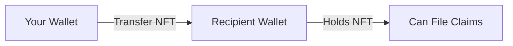

import { Callout } from '@/components/Callout'

<Callout type="info">
  **TL;DR:** Your policy is an NFT. View it on the dashboard, transfer it to any wallet, cancel it for a pro-rata refund, or let it expire naturally.
</Callout>

## Viewing Your Policies

Your active policies are visible on the **Dashboard** at [app.layercover.com](https://app.layercover.com). Each policy shows:

- **Pool** - Which protocol or asset is covered
- **Coverage Amount** - Maximum payout in USDC
- **Duration** - Start date, end date, days remaining
- **Status** - Active, Expired, Claimed, or Cancelled
- **Policy ID** - On-chain identifier (also the NFT token ID)

---

## Transferring Policies

Policies are standard **ERC-721 NFTs**, which means they are fully transferable.

- Transfer via the LayerCover dashboard, or any NFT marketplace / wallet
- The **current holder** of the Policy NFT has the right to file claims
- Transfers do not change the policy terms, coverage amount, or expiry date

<Callout type="warning">
  **Important:** Once you transfer a Policy NFT, you lose the ability to file claims or cancel the policy. Only the current holder has these rights.
</Callout>

---

## Cancelling a Policy

You can cancel any active policy before its expiry date and receive a **pro-rata refund** of unused premium.

**How the refund works:**

$$\text{Refund} = \text{Premium Paid} \times \frac{\text{Days Remaining}}{\text{Total Duration}}$$

<Callout type="info">
  **Example:** You paid \$123 for a 90-day policy and cancel after 30 days. You receive approximately **\$82 back** (60/90 of the premium).
</Callout>

**To cancel:**
1. Go to your **Dashboard**
2. Click on the active policy
3. Click **Cancel Policy**
4. Confirm the transaction - the refund is sent to your wallet immediately

What happens to the underwriter's capital?

When you cancel, the underwriter's locked capital is released immediately and becomes available for new policies. The portion of premium already earned (for the elapsed days) remains with the underwriter.

---

## Policy Expiry

When a policy reaches its end date:

- The policy **NFT remains in your wallet** but coverage lapses
- No further claims can be filed against expired policies
- The underwriter's capital lock is automatically released
- No action is required from you - expiry is passive

---

## Renewing a Policy

LayerCover does not currently offer automatic renewals. To maintain continuous coverage:

1. Purchase a new policy before your current one expires
2. The new policy has its own 7-day cooldown period
3. For uninterrupted coverage, purchase the new policy 7 days before the old one expires

<Callout type="info">
  **Tip:** Set a reminder 10 days before your policy expires to ensure you have time to purchase renewal coverage without a gap.
</Callout>

---

## Next Steps

  <a href="/policyholders/filing-claims" className="block p-4 rounded-lg border border-border hover:border-brand-500 hover:shadow-lg hover:shadow-brand-500/10 hover:-translate-y-1 transition-all duration-300 no-underline">
    <h4 className="text-base font-semibold text-foreground m-0">⚡ Filing Claims →</h4>
    
How to file a claim and receive your payout

  </a>
  <a href="/policyholders/coverage-types" className="block p-4 rounded-lg border border-border hover:border-brand-500 hover:shadow-lg hover:shadow-brand-500/10 hover:-translate-y-1 transition-all duration-300 no-underline">
    <h4 className="text-base font-semibold text-foreground m-0">🛡️ Coverage Types →</h4>
    
Understand the different types of protection available

  </a>

