import { Callout } from '@/components/Callout'

<Callout type="info">
  **TL;DR:** The Backstop Pool is a protocol-wide reserve funded by a percentage of all premiums. It steps in when a pool's primary capital is insufficient to pay claims.
</Callout>

## Why a Backstop?

Individual risk pools can be overwhelmed by catastrophic events. If a major protocol is exploited and claims exceed the pool's capital, policyholders need a fallback. The Backstop Pool provides that safety net - a shared reserve that backstops every pool in the protocol.

---

## Liquidity Waterfall

When a claim is filed, the PayoutManager follows a strict priority order:

```mermaid
flowchart TD
    C["🚨 Claim Filed"] --> L1{"Pool Capital<br/>sufficient?"}
    L1 -->|Yes| P1["✅ Paid from Pool"]
    L1 -->|No| L2{"3rd Party Reinsurance<br/>available?"}
    L2 -->|Yes| P2["✅ Paid from Reinsurer"]
    L2 -->|No| L3{"Backstop Pool<br/>sufficient?"}
    L3 -->|Yes| P3["✅ Paid from Backstop"]
    L3 -->|No| L4{"Protocol Treasury<br/>available?"}
    L4 -->|Yes| P4["✅ Paid from Treasury"]
    L4 -->|No| L5["⚠️ Partial Payout"]
    
    style P1 fill:#22c55e20,stroke:#22c55e
    style P2 fill:#8b5cf620,stroke:#8b5cf6
    style P3 fill:#3b82f620,stroke:#3b82f6
    style P4 fill:#f59e0b20,stroke:#f59e0b
    style L5 fill:#ef444420,stroke:#ef4444
```

| Layer | Source | Funded By |
| :--- | :--- | :--- |
| **Layer 1** | Pool Capital (Idle + Adapters) | Underwriter deposits |
| **Layer 2** | 3rd Party Reinsurance | External reinsurers (quota-share hooks) |
| **Layer 3** | Backstop Pool | Percentage of all protocol premiums |
| **Layer 4** | Protocol Treasury | Protocol revenue, pre-approved token reserves |

<Callout type="warning">
  If all four layers are exhausted, the claim is **partially paid** - the claimant receives whatever was available. Losses are never socialized across uninvolved syndicates or underwriters.
</Callout>

---

## How the Backstop Pool Works

### Funding
Every premium paid across the entire protocol is split:
- **80%** → Pool underwriters (Syndicates)
- **20%** → Backstop Pool
- Protocol fees are taken separately

This means the Backstop grows proportionally with protocol usage - more policies sold = larger safety net.

### Managed by SharedAssetController
The Backstop Pool is managed by the **SharedAssetController**, which:
- Aggregates contributions from all pools
- Deploys idle backstop capital to yield strategies (Aave, Compound)
- Processes payout requests from the PayoutManager
- Maintains minimum reserve ratios

### Usage
When the PayoutManager determines that a pool's capital is insufficient:

1. It calculates the **deficit** (claim amount − available pool capital)
2. It requests the deficit from the Backstop Pool
3. The Backstop covers the gap up to its available balance
4. If the Backstop is also exhausted, a `BackstopDepleted` event is emitted and the Protocol Treasury is drawn from (if registered and pre-approved)
5. If all layers are exhausted, the claimant receives a partial payout for whatever was available

---

## Backstop Pool Economics

The Backstop Pool benefits from **diversification** - it pools premium contributions from every coverage category (stablecoin, vault, parametric). A major event in one category is backstopped by premiums from all others.

---

## Next Steps

  <a href="/protocol/reinsurance" className="block p-4 rounded-lg border border-border hover:border-brand-500 hover:shadow-lg hover:shadow-brand-500/10 hover:-translate-y-1 transition-all duration-300 no-underline">
    <h4 className="text-base font-semibold text-foreground m-0">🏗️ 3rd Party Reinsurance →</h4>
    
External reinsurance via the hook-based capacity system

  </a>
  <a href="/protocol/capital-pool" className="block p-4 rounded-lg border border-border hover:border-brand-500 hover:shadow-lg hover:shadow-brand-500/10 hover:-translate-y-1 transition-all duration-300 no-underline">
    <h4 className="text-base font-semibold text-foreground m-0">🏦 Capital Pool →</h4>
    
Primary capital management and ERC-4626 vault

  </a>

