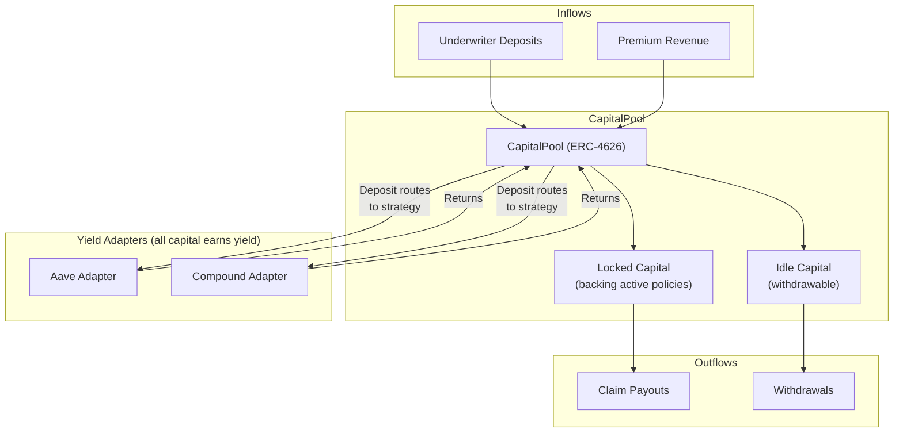

import { Callout } from '@/components/Callout'

<Callout type="info">
  **TL;DR:** The CapitalPool is an ERC-4626 vault that holds all underwriter capital. It manages solvency, routes claim payouts, and deploys idle funds to whitelisted yield strategies.
</Callout>

## Architecture

---

## How Capital Flows

### 1. Deposits
Underwriters deposit single-sided assets (USDC) into the CapitalPool and receive shares proportional to the vault's NAV.

### 2. Capital Locking
When a policy is sold, the IntentMatcher instructs the CapitalPool to **lock** the backing capital. Locked capital cannot be withdrawn, but **still earns yield**.

### 3. Yield Generation
**All capital** - both locked and idle - is deployed to whitelisted yield adapters on deposit. The locked/idle distinction only affects **withdrawability**, not yield generation:

| Adapter | Strategy | Risk |
| :--- | :--- | :--- |
| **Aave V3** | Supply USDC as lending deposits | Low |
| **Compound V3** | Supply USDC as lending deposits | Low |

<Callout type="warning">
  Yield adapters are whitelisted by protocol governance. Only battle-tested, blue-chip DeFi protocols are approved to minimize compounding smart contract risk.
</Callout>

### 4. Claim Payouts
When a claim is filed, the PayoutManager draws capital from the pool following the **liquidity waterfall**:

1. Idle capital in the pool
2. Capital recalled from yield adapters
3. Backstop Pool (protocol-wide reinsurance)
4. 3rd Party Reinsurance (external quota-share capacity)

### 5. Withdrawals
Underwriters can withdraw unlocked capital instantly. Capital actively backing policies remains locked until those policies expire or settle.

---

## ERC-4626 Vault

The CapitalPool implements the **ERC-4626 Tokenized Vault Standard**:

- `deposit(assets)` → Receive shares proportional to NAV
- `withdraw(shares)` → Redeem shares for underlying assets
- `totalAssets()` → Total capital (locked + idle + external yield)
- `convertToShares(assets)` → Preview share amount for deposit
- `convertToAssets(shares)` → Preview redemption amount

Share price increases as premiums and yield accumulate, and decreases when claims are paid.

---

## Solvency Controls

| Control | Mechanism |
| :--- | :--- |
| **Capital locking** | Backing capital stays locked until policies expire, preventing claim front-running |
| **Risk points budget** | Limits total exposure per underwriter |
| **Mutex groups** | Flags correlated pools to prevent concentrated risk |
| **Deposit caps** | Protocol-level TVL limits during guarded launch |

---

## Next Steps

  <a href="/protocol/backstop-pool" className="block p-4 rounded-lg border border-border hover:border-brand-500 hover:shadow-lg hover:shadow-brand-500/10 hover:-translate-y-1 transition-all duration-300 no-underline">
    <h4 className="text-base font-semibold text-foreground m-0">🛡️ Backstop Pool →</h4>
    
Backstop Pool and the liquidity waterfall

  </a>
  <a href="/underwriters/capital-and-leverage" className="block p-4 rounded-lg border border-border hover:border-brand-500 hover:shadow-lg hover:shadow-brand-500/10 hover:-translate-y-1 transition-all duration-300 no-underline">
    <h4 className="text-base font-semibold text-foreground m-0">📊 Capital & Leverage →</h4>
    
Risk points budgets and leverage controls

  </a>

