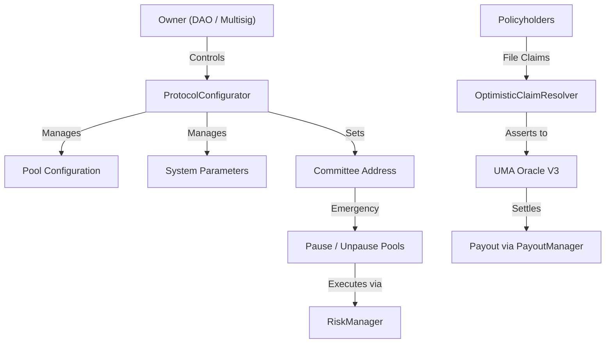
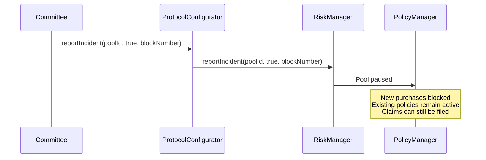
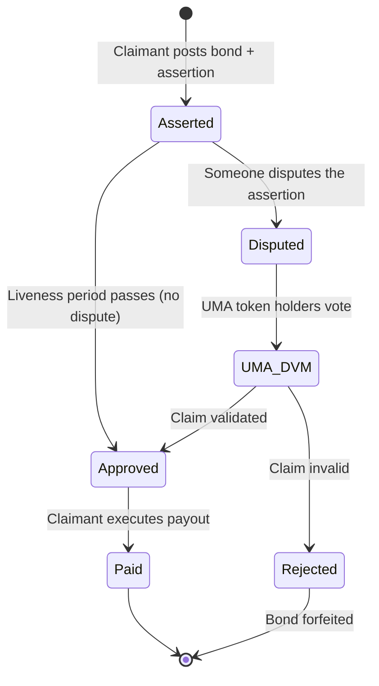

import { Callout } from '@/components/Callout'

<Callout type="info">
  **TL;DR:** Protocol parameters are managed by an owner-controlled admin contract (ProtocolConfigurator). Emergency pool pausing is handled by a privileged committee address. Claim disputes are resolved through **UMA Optimistic Oracle V3** - no governance votes required.
</Callout>

## Design Philosophy

LayerCover does not use a traditional DAO or token-voting governance model. Instead, the protocol uses a **minimalist admin architecture** designed for speed, security, and clarity:

- **Protocol configuration** is controlled by the `ProtocolConfigurator` owner (DAO multisig or timelock)
- **Emergency response** (pausing pools during incidents) is delegated to a privileged committee address
- **Claim disputes** are resolved through **UMA Optimistic Oracle V3** - a decentralized, permissionless dispute resolution system

This separation keeps day-to-day operations fast while ensuring claim resolution is trustless and decentralized.

---

## Architecture

| Component | Role |
| :--- | :--- |
| **ProtocolConfigurator** | Central admin hub - pool management, fees, system parameters |
| **Committee** | Privileged address for emergency pool pausing during incidents |
| **UMA Optimistic Oracle V3** | Decentralized dispute resolution for parametric/ecosystem claims |
| **VaultResolution** | Optimistic oracle for asserting vault state changes |
| **RiskManager** | Executes incident reports and processes approved claims |

---

## ProtocolConfigurator

The `ProtocolConfigurator` is the **administrative hub** of the protocol. It consolidates all configuration functions into a single owner-controlled contract.

### What Can the Owner Configure?

| Function | Description |
| :--- | :--- |
| Add risk pools | Register new coverable protocols/assets |
| Configure pool parameters | Risk ratings, vault cover, optimistic oracle settings |
| Set yield adapters | Register Aave/Compound adapters for capital deployment |
| Configure syndicates | Max allocations, leverage ratios, permissionless creation |
| Set system contracts | Update SystemRegistry with new contract addresses |
| Configure PolicyManager | Cooldown periods, reserve factors, claim lock periods |
| Configure CapitalPool | Backstop buffer, deposit caps, max draw per call |
| Upgrade contracts | UUPS proxy upgrades for PolicyManager and other contracts |

<Callout type="info">
  The owner is expected to be a **timelock contract** or **multisig**, ensuring all configuration changes have an execution delay for transparency.
</Callout>

---

## Emergency Committee

The committee is a **single privileged address** (typically a multisig) with limited emergency powers:

1. **Pause a pool** - Blocks new policy purchases when an incident is detected
2. **Redirect pool fees** - Routes fees to a designated recipient during an incident
3. **Unpause a pool** - Restores normal operation after resolution

The committee **cannot**:
- Change protocol parameters
- Upgrade contracts
- Access or move user funds
- Modify claim logic

---

## Claim Resolution via UMA

For **parametric and ecosystem risk pools**, claims are resolved through **UMA Optimistic Oracle V3** - a decentralized, permissionless dispute resolution mechanism.

### How It Works

| Step | What happens |
| :--- | :--- |
| **1. Assert claim** | Claimant posts a bond and submits claim via `OptimisticClaimResolver` |
| **2. Challenge window** | A configurable liveness period (default ~2 hours) where anyone can dispute |
| **3. If undisputed** | Claim is automatically approved - claimant can execute payout |
| **4. If disputed** | UMA's Decentralized Verification Mechanism (DVM) resolves via token-holder vote (48-72h) |

<Callout type="info">
  Resolution criteria for each pool are stored on **IPFS** via an immutable content hash (`oracleQuestionCID`). This prevents rule modification after policies are purchased.
</Callout>

### For Incident-Based Pools

Standard pools (stablecoin depeg, vault cover) use a simpler flow: the committee reports an incident, policyholders file claims, and the smart contract validates and pays automatically. No UMA involvement needed. See [Filing Claims](/policyholders/filing-claims) for details.

---

## COVR Token

The **COVR** token is the protocol's ERC-20 governance token:

- **Fixed supply cap**: 1,000,000,000 (1 billion) tokens
- **Burnable**: Holders can burn tokens
- **EIP-2612 Permit**: Supports gasless approvals

The token is deployed at genesis and is intended for future protocol governance evolution.

---

## Next Steps

  <a href="/contracts" className="block p-4 rounded-lg border border-border hover:border-brand-500 hover:shadow-lg hover:shadow-brand-500/10 hover:-translate-y-1 transition-all duration-300 no-underline">
    <h4 className="text-base font-semibold text-foreground m-0">📜 Smart Contracts →</h4>
    
Browse the full contract interface reference

  </a>
  <a href="/resources/access-controls" className="block p-4 rounded-lg border border-border hover:border-brand-500 hover:shadow-lg hover:shadow-brand-500/10 hover:-translate-y-1 transition-all duration-300 no-underline">
    <h4 className="text-base font-semibold text-foreground m-0">🔐 Access Controls →</h4>
    
Full role and permission reference for every contract

  </a>

