import { Callout } from '@/components/Callout'

<Callout type="info">
  **TL;DR:** LayerCover replaces insurance carriers with smart contracts. Capital providers pledge assets to back specific risks; policyholders buy coverage that pays out instantly if an event occurs. It's the Lloyd's of London model, on-chain.
</Callout>

## The Lloyd's of London Model

For over 300 years, Lloyd's of London has operated as a **marketplace** - not an insurance company. Individual syndicates bring capital, assess risks, and write policies. Lloyd's provides the infrastructure: standards, trust, settlement, and a central pool for catastrophic losses.

LayerCover brings this model on-chain:

| Lloyd's of London | LayerCover |
| :--- | :--- |
| Syndicates (capital providers) | Syndicate Vaults (ERC-4626) |
| Insurance brokers | RFQ OrderBook (automated matching) |
| Policy documents | Policy NFTs (ERC-721) |
| Lloyd's Central Fund | Backstop Pool (on-chain reinsurance) |
| Claims adjusters | Smart contract rules (deterministic) |
| Annual accounting | Real-time, on-chain NAV |

---

## The Policy NFT

Every LayerCover policy is represented as a **transferable ERC-721 NFT**. The NFT encodes:

- **Pool ID** - Which risk is covered
- **Coverage amount** - Maximum payout in USDC
- **Duration** - Start and end timestamps
- **Premium paid** - The fixed upfront cost
- **Claim status** - Whether a claim has been filed

```mermaid
flowchart LR
    Purchase["Premium Payment"] --> Mint["Mint Policy NFT"]
    Mint --> Active["Active Coverage"]
    Active --> Claim["File Claim → Payout"]
    Active --> Expire["Expiry → NFT remains"]
    Active --> Cancel["Cancel → Pro-rata refund"]
    Active --> Transfer["Transfer → New holder"]
```

The current **holder** of the NFT has the right to file claims. This makes insurance positions liquid and composable.

---

## Key Innovations

### 1. Deterministic Payouts

Claims are settled by smart contract rules, not human judgment:

- **No governance votes** - No DAO deciding if your claim is valid
- **No waiting periods** - Payout in the same transaction as the claim
- **Rules-based** (for standard claims) - On-chain state determines validity; parametric claims use UMA's Optimistic Oracle
- **Like a put option** - You transfer a distressed asset and receive an instant USDC payout at the covered value

### 2. Fixed-Rate Pricing

Premiums are quoted upfront through an **intent-based RFQ** (Request for Quote) marketplace:

- Underwriters post **sell-side intents** with committed rates
- Buyers select the best quote and purchase atomically
- No AMM curves, no price slippage, no variable fees
- Rates are locked for the full policy duration

### 3. Capital Efficiency

The protocol maximises capital utilisation:

- **Single-sided liquidity** - No LP pairs, no impermanent loss
- **Cross-pool leverage** - Back multiple uncorrelated risks with the same capital
- **External yield** - Idle capital earns DeFi yield (Aave, Compound)
- **Salvage recovery** - Distressed assets may recover value, reducing net losses

### 4. Multi-Layer Safety

A layered defense protects against catastrophic losses:

```mermaid
flowchart TD
    Claim["Claim Request"] --> L1["Layer 1:<br/>Pool Capital"]
    L1 --> L2["Layer 2:<br/>Backstop Pool"]
    L2 --> L3["Layer 3:<br/>3rd Party Reinsurance"]
    L3 --> L4["Layer 4:<br/>Protocol Treasury"]
    L4 --> Paid["✅ Claim Paid"]
```

---

## Protocol Loop

1. **Policyholder** pays a premium via the OrderBook
2. **IntentMatcher** matches buyer and seller intents atomically
3. **PolicyManager** mints the Policy NFT
4. **CapitalPool** locks the required capital backing
5. **Idle capital** earns external yield via whitelisted adapters
6. **Premiums** are split: 80% to underwriters, 20% to the Backstop Pool

---

## Next Steps

  <a href="/protocol/pricing" className="block p-4 rounded-lg border border-border hover:border-brand-500 hover:shadow-lg hover:shadow-brand-500/10 hover:-translate-y-1 transition-all duration-300 no-underline">
    <h4 className="text-base font-semibold text-foreground m-0">💲 Pricing Model →</h4>
    
How fixed-rate intents and the RFQ system work

  </a>
  <a href="/protocol/capital-pool" className="block p-4 rounded-lg border border-border hover:border-brand-500 hover:shadow-lg hover:shadow-brand-500/10 hover:-translate-y-1 transition-all duration-300 no-underline">
    <h4 className="text-base font-semibold text-foreground m-0">🏦 Capital Pool →</h4>
    
ERC-4626 vault mechanics and yield adapters

  </a>

