import { Callout } from '@/components/Callout'

<Callout type="info">
  **TL;DR:** LayerCover is an on-chain Lloyd's of London - autonomous smart contracts coordinate risk, capital, and claims without intermediaries.
</Callout>

This section explains the **how and why** behind LayerCover's design. For practical guides, see [Policyholders](/policyholders), [Underwriters](/underwriters), or [Developers](/developers).

---

## System Architecture

```mermaid
flowchart TD
    subgraph Policyholder Layer
        B["🛡️ Policyholders"]
        NFT["🎫 Policy NFTs"]
    end

    subgraph Matching Engine
        OB["📋 OrderBook"]
        IM["⚡ IntentMatcher"]
    end

    subgraph Capital Layer
        CP["🏦 CapitalPool"]
        SV["🏛️ Syndicate Vaults"]
        YA["📈 Yield Adapters"]
    end

    subgraph Risk Layer
        RM["🔍 RiskManager"]
        PR["📊 PoolRegistry"]
        BP["🛡️ Backstop Pool"]
    end

    subgraph Claims Layer
        PM["📤 PayoutManager"]
        OCR["⚖️ OptimisticClaimResolver"]
        SR["🔄 Salvage Rights"]
    end

    B -->|Pay premium| OB
    OB -->|Match| IM
    IM -->|Mint| NFT
    IM -->|Lock capital| CP
    SV -->|Pledge| CP
    CP -->|Deploy idle| YA
    RM -->|Rate pools| PR
    B -->|File claim| PM
    B -->|Optimistic claim| OCR
    PM -->|Pay from| CP
    PM -->|Fallback| BP
    PM -->|Issue| SR
```

---

## Core Contracts

| Contract | Purpose |
| :--- | :--- |
| [PolicyManager](/contracts/IPolicyManager) | Mints policies, manages lifecycle, validates claims |
| [CapitalPool](/contracts/ICapitalPool) | Holds underwriter capital, manages solvency |
| [IntentMatcher](/contracts/IIntentMatcher) | Matches buyer and seller intents atomically |
| [RiskManager](/contracts/IRiskManager) | Risk ratings, incident reporting, pool pausing |
| [PoolRegistry](/contracts/IPoolRegistry) | Registry of all risk pools and their parameters |
| [PayoutManager](/contracts/IPayoutManager) | Executes claim payouts via liquidity waterfall |
| [RewardDistributor](/contracts/IRewardDistributor) | Routes premiums to underwriters |
| [Syndicate](/contracts/ISyndicate) | Managed vault for passive LP underwriting |

---

## Deep Dives

  <a href="/protocol/how-cover-works" className="group block p-4 rounded-lg border border-border hover:border-brand-500 hover:shadow-lg hover:shadow-brand-500/10 hover:-translate-y-1 transition-all duration-300 no-underline">
    

      🏛️
      <h4 className="text-base font-semibold text-foreground m-0">How Cover Works →</h4>
    

    
The insurance model and Lloyd's analogy

  </a>
  <a href="/protocol/pricing" className="group block p-4 rounded-lg border border-border hover:border-brand-500 hover:shadow-lg hover:shadow-brand-500/10 hover:-translate-y-1 transition-all duration-300 no-underline">
    

      💲
      <h4 className="text-base font-semibold text-foreground m-0">Pricing →</h4>
    

    
Fixed-rate intents and the RFQ system

  </a>
  <a href="/protocol/capital-pool" className="group block p-4 rounded-lg border border-border hover:border-brand-500 hover:shadow-lg hover:shadow-brand-500/10 hover:-translate-y-1 transition-all duration-300 no-underline">
    

      🏦
      <h4 className="text-base font-semibold text-foreground m-0">Capital Pool →</h4>
    

    
ERC-4626 vault, yield adapters, solvency

  </a>
  <a href="/protocol/backstop-pool" className="group block p-4 rounded-lg border border-border hover:border-brand-500 hover:shadow-lg hover:shadow-brand-500/10 hover:-translate-y-1 transition-all duration-300 no-underline">
    

      🛡️
      <h4 className="text-base font-semibold text-foreground m-0">Backstop Pool →</h4>
    

    
Backstop Pool and the liquidity waterfall

  </a>
  <a href="/protocol/governance" className="group block p-4 rounded-lg border border-border hover:border-brand-500 hover:shadow-lg hover:shadow-brand-500/10 hover:-translate-y-1 transition-all duration-300 no-underline">
    

      ⚖️
      <h4 className="text-base font-semibold text-foreground m-0">Governance →</h4>
    

    
Committee system, staking, and delegation

  </a>
  <a href="/contracts" className="group block p-4 rounded-lg border border-border hover:border-brand-500 hover:shadow-lg hover:shadow-brand-500/10 hover:-translate-y-1 transition-all duration-300 no-underline">
    

      📝
      <h4 className="text-base font-semibold text-foreground m-0">Contract Interfaces →</h4>
    

    
Full interface reference for all contracts

  </a>

