import { Callout } from '@/components/Callout'
import { PremiumCalculator } from '@/components/PremiumCalculator'

<Callout type="info">
  **TL;DR:** LayerCover uses a fixed-rate, intent-based RFQ marketplace. Underwriters post committed quotes; policyholders select the best rate. No AMMs, no slippage.
</Callout>

## Why Fixed Rates?

Traditional DeFi insurance uses **bonding curves** or **AMM-style dynamic pricing** - rates change with every transaction, creating uncertainty for both buyers and sellers. LayerCover uses **fixed-rate pricing** instead:

| Dynamic Pricing (others) | Fixed Rate (LayerCover) |
| :--- | :--- |
| Rate changes with utilisation | Rate is locked at purchase |
| Price slippage on large orders | No slippage - exact quote |
| Uncertainty on total cost | Deterministic cost upfront |
| Continuous rate feeding | Committed quotes with capital |

---

## Intent-Based OrderBook

The pricing system works like a **Request for Quote (RFQ)** marketplace:

```mermaid
sequenceDiagram
    participant UW as Underwriter
    participant OB as OrderBook
    participant PH as Policyholder
    participant IM as IntentMatcher

    UW->>OB: Post sell intent (rate, amount, duration)
    UW->>OB: EIP-712 signature + locked capital
    PH->>OB: Browse available quotes
    PH->>IM: Select best quote
    IM->>IM: Validate + match intents
    IM-->>PH: 🎫 Policy NFT minted
    IM-->>UW: 💰 Premium collected
```



### Sell Intents

Underwriters post **sell-side intents** - committed offers to back a specific amount of coverage at a specific rate:

| Field | Description | Example |
| :--- | :--- | :--- |
| `rate` | Annualised premium rate (basis points) | 500 (5.00%) |
| `maxAmount` | Maximum coverage amount | $50,000 |
| `duration` | Policy term in days | 90 |
| `poolId` | Target risk pool | 1 |
| `signature` | EIP-712 signed commitment | `0x...` |

### Matching

When a policyholder accepts a quote:

1. The **IntentMatcher** verifies both intents (buyer + seller)
2. Capital is **locked immediately** from the underwriter's pledge
3. A **Policy NFT** is minted to the buyer
4. The **premium** is collected and distributed

This is an **atomic transaction** - everything succeeds or nothing does.

---

## Premium Formula

$$P = \frac{C \times R \times D}{365 \times 10{,}000}$$

| Variable | Description |
| :--- | :--- |
| $P$ | Premium (USDC) |
| $C$ | Coverage amount (USDC) |
| $R$ | Rate (basis points, e.g. 500 = 5%) |
| $D$ | Duration (days) |

### Worked Example

<Callout type="info">
**Coverage:** $10,000 · **Rate:** 500 bps (5%) · **Duration:** 90 days

$$P = \frac{10{,}000 \times 500 \times 90}{365 \times 10{,}000} = \frac{450{,}000{,}000}{3{,}650{,}000} = \$123.29$$

You pay **$123.29** for 90 days of $10,000 coverage.
</Callout>

### Try It Yourself

<PremiumCalculator defaultCoverage={10000} defaultRate={500} defaultDuration={90} />

---

## Partial Fills

Intents support **partial fills** - a buyer can consume part of an underwriter's committed capacity:

```
Underwriter posts: $50,000 at 500bps
Buyer purchases:   $10,000 at 500bps

Remaining intent:  $40,000 at 500bps (still live)
```

This allows large intents to serve multiple buyers without re-posting.

---

## Rate Competition

Multiple underwriters compete on the same pool. The OrderBook surfaces the **best available rates**, creating a competitive marketplace:

```
Pool #1 - Available Quotes:
├── Underwriter A: 450 bps ($25K capacity)  ← Best rate
├── Underwriter B: 500 bps ($50K capacity)
├── Underwriter C: 520 bps ($30K capacity)
└── Underwriter D: 600 bps ($100K capacity)
```

Buyers see all available quotes sorted by rate and can select the best option for their coverage needs.

---

## Next Steps

<div className="grid gap-4 sm:grid-cols-2 my-8">
  <a href="/protocol/capital-pool" className="block p-4 rounded-lg border border-border hover:border-brand-500 hover:shadow-lg hover:shadow-brand-500/10 hover:-translate-y-1 transition-all duration-300 no-underline">
    <h4 className="text-base font-semibold text-foreground m-0">🏦 Capital Pool →</h4>
    <p className="text-sm text-muted-foreground m-0 mt-1">How capital backing and yield adapters work</p>
  </a>
  <a href="/underwriters/managing-a-syndicate" className="block p-4 rounded-lg border border-border hover:border-brand-500 hover:shadow-lg hover:shadow-brand-500/10 hover:-translate-y-1 transition-all duration-300 no-underline">
    <h4 className="text-base font-semibold text-foreground m-0">⚙️ For Managers →</h4>
    <p className="text-sm text-muted-foreground m-0 mt-1">How to post intents and manage quotes</p>
  </a>
</div>
