import { Callout } from '@/components/Callout'

<Callout type="info">
  **TL;DR:** Syndicates can augment their underwriting capacity by integrating with external 3rd party reinsurers via a hook-based system. This allows syndicates to write more coverage than their LP capital alone supports, with premium and losses shared proportionally.
</Callout>

## Overview

While the [Backstop Pool](/protocol/backstop-pool) acts as a protocol-wide safety net, **3rd Party Reinsurance** is a syndicate-level feature. It allows individual syndicates to partner with external capital providers - similar to how traditional reinsurers back Lloyd's syndicates.

Key difference:

| | Backstop Pool | 3rd Party Reinsurance |
| :--- | :--- | :--- |
| **Scope** | Protocol-wide | Per-syndicate |
| **Funding** | Automatic (% of all premiums) | External capital commitment |
| **Control** | Managed by protocol | Managed by syndicate manager |
| **Purpose** | Catastrophic loss absorption | Capacity expansion |

---

## 2-Phase Capacity Model

When a policy quote is reserved against a syndicate, the protocol performs a **sequential capacity check**:

```mermaid
flowchart TD
    R["Reserve Intent Request"] --> P1{"Phase 1:<br/>LP Capital<br/>sufficient?"}
    P1 -->|Yes| S1["✅ Fully backed by LPs"]
    P1 -->|No| P2{"Phase 2:<br/>Reinsurance Hook<br/>configured?"}
    P2 -->|No| F["❌ Insufficient capacity"]
    P2 -->|Yes| P3{"Hook has<br/>available capacity?"}
    P3 -->|Yes| S2["✅ Split: LP + Reinsurer"]
    P3 -->|No| F

    style S1 fill:#22c55e20,stroke:#22c55e
    style S2 fill:#3b82f620,stroke:#3b82f6
    style F fill:#ef444420,stroke:#ef4444
```



1. **Phase 1 - LP Share Capacity:** The system first attempts to fulfil the requested coverage using the syndicate's available LP capital
2. **Phase 2 - Reinsurance Overflow:** If LP capacity is insufficient, and a `reinsuranceHook` is configured, the shortfall is passed to the external reinsurer

**Effective capacity formula:**

$$\text{effectiveCapacity} = \text{managedAssets} + \text{hook.availableCapacity()}$$

---

## The Reinsurance Hook

The integration is managed via the **`IReinsuranceHook`** interface. Syndicates connect to external reinsurers by setting a hook address:

```solidity
// Syndicate manager connects to a reinsurer
syndicate.setReinsuranceHook(hookAddress);
```

### Hook Interface

| Function | When Called | Purpose |
| :--- | :--- | :--- |
| `onCapacityReserved` | During `reserveIntent` | Lock reinsurer capacity for the reservation |
| `onCapacityReleased` | Reservation expires or matures | Release previously locked capacity |
| `calculateLossSplit` | During a claim | Determine proportional loss sharing (e.g. 50/50) |
| `payClaimPortion` | Claim payout | Transfer reinsurer's share of the loss to PayoutManager |
| `onPremiumEarned` | Premium drains | Notify reinsurer to claim their premium share |

---

## Premium Revenue Sharing

When premiums are earned on policies backed by 3rd party reinsurance, the revenue is shared proportionally between the syndicate LPs and the reinsurer:

```mermaid
sequenceDiagram
    participant PM as PolicyManager
    participant SV as Syndicate
    participant RH as ReinsuranceHook
    participant RP as Reinsurer

    PM->>SV: receivePremiumWithReinsuranceSplit(premium, coverage, reinsuredPortion)
    SV->>SV: Internalize LP share → increases NAV
    SV->>RH: onPremiumEarned(premium, reinsuredPortion)
    RH->>RP: Transfer reinsurer's share
```



The split is determined by the **proportion of coverage** backed by reinsurance. For example, if a $100K policy has $60K backed by LP capital and $40K backed by the reinsurer, the reinsurer receives 40% of the premium.

---

## Loss Splitting

When a claim is filed on a reinsured policy, losses are shared using the same proportional split:

```mermaid
flowchart LR
    C["Claim: $100K"] --> LS["calculateLossSplit()"]
    LS --> LP["Syndicate LPs: $60K<br/>(60% exposure)"]
    LS --> RE["Reinsurer: $40K<br/>(40% exposure)"]
    RE --> PO["payClaimPortion() → PayoutManager"]
    LP --> CP["CapitalPool → Policyholder"]
    PO --> CP

    style LP fill:#3b82f620,stroke:#3b82f6
    style RE fill:#8b5cf620,stroke:#8b5cf6
```



The `RiskManager` calls `calculateLossSplit()` during claim processing to determine the proportional share. The reinsurer's portion is then collected via `payClaimPortion()`.

---

## Risk Point Efficiency

A key benefit of 3rd party reinsurance is **reduced risk point consumption**. The protocol's risk budgeting system only counts LP-exposed capital against a syndicate's risk limits:

<Callout type="success">
  **Example:** If a syndicate has a 50/50 quota share with a reinsurer, a \$100K coverage position only consumes \$50K worth of risk points from the syndicate's portfolio budget. This effectively doubles the number of pools the syndicate can back.
</Callout>

---

## Types of Reinsurance Systems

The hook interface is **model-agnostic**. The protocol only validates that `syndicatePortion + reinsurancePortion ≤ totalClaim` - it imposes no constraints on *how* the hook splits losses. This means a single hook contract can implement any of the following traditional reinsurance structures:

### Quota Share (Proportional)

The simplest model. The reinsurer takes a fixed percentage of every policy - both premiums and losses are split at the same ratio.

| Parameter | Example |
| :--- | :--- |
| **Reinsurer share** | 40% |
| **\$100K claim** | Syndicate pays \$60K, Reinsurer pays \$40K |
| **Premium split** | 60/40 (same ratio) |

```solidity
// Hook logic
function calculateLossSplit(uint256 totalLoss, uint256)
    external view returns (uint256, uint256)
{
    uint256 reinsured = (totalLoss * quotaShareBps) / 10000;
    return (totalLoss - reinsured, reinsured);
}
```

**Best for:** Syndicates seeking predictable, proportional risk sharing across all policies.

### Excess of Loss (XoL)

The syndicate absorbs all losses up to a **retention threshold**. The reinsurer only pays for losses *above* that threshold, up to an optional cap.

| Parameter | Example |
| :--- | :--- |
| **Retention** | \$50K |
| **Limit** | \$200K |
| **\$30K claim** | Syndicate pays \$30K, Reinsurer pays \$0 |
| **\$120K claim** | Syndicate pays \$50K, Reinsurer pays \$70K |

```solidity
function calculateLossSplit(uint256 totalLoss, uint256)
    external view returns (uint256, uint256)
{
    if (totalLoss <= retention) return (totalLoss, 0);
    uint256 excess = totalLoss - retention;
    if (limit > 0 && excess > limit) excess = limit;
    return (totalLoss - excess, excess);
}
```

**Best for:** Syndicates comfortable absorbing routine claims but needing protection against large, catastrophic losses.

### Stop Loss (Aggregate XoL)

Similar to XoL but operates on **cumulative losses** over a period rather than individual claims. The hook tracks total losses and only triggers once the aggregate exceeds a threshold.

| Parameter | Example |
| :--- | :--- |
| **Aggregate retention** | \$500K per year |
| **Year-to-date losses** | \$480K |
| **Next \$50K claim** | Syndicate pays \$20K (to reach \$500K), Reinsurer pays \$30K |

```solidity
function calculateLossSplit(uint256 totalLoss, uint256)
    external view returns (uint256, uint256)
{
    if (aggregateLosses + totalLoss <= aggregateRetention) {
        aggregateLosses += totalLoss;
        return (totalLoss, 0);
    }
    uint256 syndicateShare = aggregateRetention > aggregateLosses
        ? aggregateRetention - aggregateLosses : 0;
    aggregateLosses += totalLoss;
    return (syndicateShare, totalLoss - syndicateShare);
}
```

**Best for:** Syndicates wanting unlimited individual-claim exposure but capping their total annual loss.

### Surplus Share

A proportional model where the reinsurer only participates on policies that exceed the syndicate's **line size** (retained capacity). Small policies are 100% retained by the syndicate.

| Parameter | Example |
| :--- | :--- |
| **Syndicate line** | \$100K |
| **\$80K policy claim** | Syndicate pays 100% (below line) |
| **\$250K policy claim** | Syndicate pays \$100K, Reinsurer pays \$150K |

```solidity
function calculateLossSplit(uint256 totalLoss, uint256 syndicateCapacity)
    external view returns (uint256, uint256)
{
    if (syndicateCapacity >= totalLoss) return (totalLoss, 0);
    return (syndicateCapacity, totalLoss - syndicateCapacity);
}
```

**Best for:** Syndicates wanting to fully retain small risks while ceding large exposures to a reinsurer.

### Facultative (Per-Risk)

A per-policy arrangement where the hook can accept or reject individual risks. The hook maintains an internal registry of which policies it covers and at what split.

```solidity
function calculateLossSplit(uint256 totalLoss, uint256)
    external view returns (uint256, uint256)
{
    uint256 cededPct = policyAgreements[currentPolicyId];
    if (cededPct == 0) return (totalLoss, 0); // Not covered
    uint256 reinsured = (totalLoss * cededPct) / 10000;
    return (totalLoss - reinsured, reinsured);
}
```

**Best for:** Reinsurers who want selective underwriting - choosing specific risks rather than blanket coverage.

---

<Callout type="info">
  **Composability:** These models can be combined. For example, a hook could implement a **Quota Share with XoL cap** - proportionally sharing all losses up to a ceiling, after which the syndicate absorbs the remainder. The protocol doesn't care about the internal logic; it only reads the returned split.
</Callout>

---

## Lifecycle

### Reservation
When capacity is reserved, the reinsurance hook locks the corresponding external capital:

| Phase | LP Capital | Reinsurer Capital |
| :--- | :--- | :--- |
| **Reserve** | Locked in syndicate | Locked via `onCapacityReserved` |
| **Policy Minted** | Becomes a liability | Pledged commitment |
| **Premium Earned** | Increases share price | Shared via `onPremiumEarned` |
| **Claim Filed** | Loss charged to LPs | Loss charged via `payClaimPortion` |
| **Expiry** | Capital freed | Released via `onCapacityReleased` |

### Tracking

Every reservation and policy tracks a `reinsuredAmount` / `reinsuredPortion` field, maintaining a clear record of how much liability sits with the reinsurer vs. the syndicate LPs.

---

## Next Steps

<div className="grid gap-4 sm:grid-cols-2 my-8">
  <a href="/protocol/backstop-pool" className="block p-4 rounded-lg border border-border hover:border-brand-500 hover:shadow-lg hover:shadow-brand-500/10 hover:-translate-y-1 transition-all duration-300 no-underline">
    <h4 className="text-base font-semibold text-foreground m-0">🛡️ Backstop Pool →</h4>
    <p className="text-sm text-muted-foreground m-0 mt-1">Protocol-wide catastrophic loss reserve</p>
  </a>
  <a href="/underwriters/managing-a-syndicate" className="block p-4 rounded-lg border border-border hover:border-brand-500 hover:shadow-lg hover:shadow-brand-500/10 hover:-translate-y-1 transition-all duration-300 no-underline">
    <h4 className="text-base font-semibold text-foreground m-0">📊 Managing a Syndicate →</h4>
    <p className="text-sm text-muted-foreground m-0 mt-1">Allocation, quotes, fees, and operations</p>
  </a>
</div>
