import { Callout } from '@/components/Callout'

<Callout type="info">
  **TL;DR:** No single key controls the protocol. LayerCover uses tiered roles (Owner, Guardian, Committee, Risk Admin) secured by timelocks, multisigs, and staking requirements.
</Callout>

LayerCover uses a role-based access control (RBAC) system built on least-privilege principles: every role has only the permissions it needs, critical actions require timelocks, and the Guardian can pause the protocol but never access funds.

---

## Role Hierarchy

```mermaid
flowchart TD
    O["🏛️ Owner/Admin\n(2-day Timelock)"] --> G["🛡️ Guardian\n(3-of-5 Multisig)"]
    O --> C["⚖️ Committee\n(Staked Token Holders)"]
    O --> RA["📊 Risk Admin\n(24h Timelock)"]
    O --> FR["💰 Fee Recipient\n(Treasury)"]

    G -.->|"Emergency Pause"| P["⏸️ Protocol Pause"]
    C -.->|"Risk Assessment"| RI["📋 Risk & Incidents"]
    RA -.->|"Risk Ratings"| RR["🔢 Pool Configuration"]

    style O fill:#3b82f620,stroke:#3b82f6
    style G fill:#ef444420,stroke:#ef4444
    style C fill:#8b5cf620,stroke:#8b5cf6
    style RA fill:#f59e0b20,stroke:#f59e0b
    style FR fill:#22c55e20,stroke:#22c55e
```

### Role Summary

| Role | Control Type | Primary Responsibilities | Key Restrictions |
| :--- | :--- | :--- | :--- |
| **Owner/Admin** | Timelock-governed | Protocol parameters, upgrades, governance | 2-day timelock, no fund access |
| **Guardian** | Multi-sig (3-of-5) | Emergency pause, incident response | No fund access, cannot upgrade contracts |
| **Committee** | Staked token holders | Risk assessment, governance proposals | Min 10k tokens staked, 51% quorum |
| **Risk Admin** | Appointed specialist | Risk ratings, coverage limits, mutex groups | 24-hour timelock, governance-approved |
| **Fee Recipient** | Protocol treasury | Passive fee collection | No special permissions |

---

## Contract-Specific Permissions

### PolicyManager

Primary contract that mints PolicyNFTs, tracks cover terms, and gates underwriting parameters.

| Function | Owner | Guardian | Governance | Public |
| :--- | :---: | :---: | :---: | :---: |
| **purchaseCoverage()** | · | · | · | ✅ (IntentMatcher only) |
| **cancelCover()** | · | · | · | ✅ (policy owner) |
| **lapsePolicy()** | · | · | · | ✅ (policy owner) |
| **forceExpireIntentPolicy()** | · | · | · | ✅ (underwriter / matcher) |
| **sweepPendingCatPremium()** | · | · | · | ✅ |
| **sweepPendingPoolPremium()** | · | · | · | ✅ |
| **setIssuancePaused()** | · | ✅ | · | · |
| **configureGovernanceSettings()** | · | · | ✅ | · |
| **configureYieldSettings()** | ✅ | · | · | · |

> **Note:** `configureGovernanceSettings()` is a batched setter that configures the backstop premium share, reserve factor, cover cooldown period, claim lock period, and wstETH price adapter in a single call.

### IntentMatcher

Off-chain intent matching engine that verifies EIP-712 signed coverage intents and buy orders, then creates policies through PolicyManager.

| Function | Owner | Guardian | Governance | Public |
| :--- | :---: | :---: | :---: | :---: |
| **executeMatchedIntents()** | · | · | · | ✅ (solver / matcher) |
| **incrementNonce()** | · | · | · | ✅ |
| **pause()** | · | ✅ | · | · |
| **unpause()** | · | ✅ | · | · |

### RiskManager

Claims pipeline: validates, processes, and settles incidents plus manages salvage recoveries.

| Function | Owner | Guardian | Committee | Governance |
| :--- | :---: | :---: | :---: | :---: |
| **processClaim()** | · | · | · | · (public, policy owner) |
| **reportIncident()** | · | · | ✅ | · |
| **setPoolFeeRecipient()** | · | · | ✅ | · |
| **configure()** | · | · | · | ✅ |
| **setClaimSenderBlacklist()** | · | · | · | ✅ |
| **sweepSalvageRemainder()** | · | · | · | ✅ |
| **adminForceOptimisticClaim()** | ✅ | · | · | · |

> **Note:** `configure()` is a batched setter that configures the committee address, optimistic claim resolver, and testnet mode in a single call.

### CapitalPool

ERC-4626 vault holding underwriting capital, routing deposits into yield strategies, and enforcing withdrawal rules.

| Function | Owner | Guardian | Governance | Public |
| :--- | :---: | :---: | :---: | :---: |
| **deposit()** | · | · | · | ✅ |
| **mint()** | · | · | · | ✅ |
| **setSystemMode()** | ✅ | · | · | · |
| **configure()** | ✅ | · | · | · |

> **Note:** Direct `withdraw()` and `redeem()` are disabled and will revert. All withdrawals go through the PoolAllocationManager. `configure()` is a batched setter for deposit cap, backstop buffer, and max draw per call.

### PoolAllocations

Capital allocation hub coordinating pool pledges, mutex groups, and leverage limits for syndicates and underwriters.

| Function | Owner | Guardian | Governance | Public |
| :--- | :---: | :---: | :---: | :---: |
| **configureAllocationLimits()** | ✅ | · | · | · |
| **setPoolMutexGroup()** | ✅ | · | · | · |
| **setSyndicatePoolCap()** | ✅ | · | · | · |

> **Note:** `configureAllocationLimits()` is a batched setter for max allocations per underwriter, max leverage ratio, cooldown period, and max exposure per pool.

### PoolRegistry

Registry that creates new coverage pools and manages pool configuration across the protocol.

| Function | Owner | Guardian | Committee | Public |
| :--- | :---: | :---: | :---: | :---: |
| **addProtocolRiskPool()** | ✅ | · | · | · |
| **addOptimisticOraclePool()** | ✅ | · | · | · |
| **setPoolRiskRating()** | ✅ | · | · | · |
| **setIsYieldRewardPool()** | ✅ | · | · | · |
| **setPoolCoverageCap()** | ✅ | · | · | · |
| **setReinsurerApproval()** | ✅ | · | · | · |
| **setPoolOracleQuestionCID()** | ✅ | · | · | · |
| **setPauseState()** | ✅ | · | · | · (or RiskManager) |
| **setFeeRecipient()** | · | · | · | · (RiskManager only) |

---

## Timelock Delays

| Action Type | Min Delay | Execution Window | Guardian Cancel? |
| :--- | :--- | :--- | :---: |
| **Parameter Changes** | 2 days | 7 days | ✅ |
| **Contract Upgrades** | 7 days | 7 days | ✅ |
| **Fee Updates** | 2 days | 7 days | ✅ |
| **Emergency Pause** | Instant | N/A | ❌ |
| **Pool Creation** | 2 days | 7 days | ✅ |

---

## Related Pages

- [Security & Audits](/resources/audits) - Audit reports and guarded launch strategy
- [Governance](/governance/governance) - How proposals and voting work
- [Smart Contracts](/contracts) - Full interface reference

---

*Last updated: February 2026*
