import { Callout } from '@/components/Callout'

<Callout type="warning">
  **LayerCover has not yet launched on mainnet.** All audits and programs below are planned milestones. This page will be updated with reports as they are completed.
</Callout>

LayerCover takes a defence-in-depth approach to security - formal audits, economic stress testing, a guarded launch, and a bug bounty program all work together to protect user funds.

---

## Security Strategy

```mermaid
flowchart LR
    A["🔍 Tier-1 Audit"] --> B["🐛 Bug Bounty"]
    B --> C["🚀 Guarded Launch"]
    C --> D["📊 Economic Review"]
    D --> E["🌐 Full Mainnet"]

    style A fill:#ef444420,stroke:#ef4444
    style B fill:#f59e0b20,stroke:#f59e0b
    style C fill:#3b82f620,stroke:#3b82f6
    style D fill:#8b5cf620,stroke:#8b5cf6
    style E fill:#22c55e20,stroke:#22c55e
```

---

## Audit Timeline

| Phase | Timeline | Scope | Status |
| :--- | :--- | :--- | :---: |
| **Pre-Seed Audit** | Q1 2026 | Core suite - PolicyManager, RiskManager, CapitalPool, PoolRegistry | 🔜 Planned |
| **Post-Seed Audit 1** | Q3 2026 | Independent re-audit of upgraded contracts and deployment scripts | 📋 Scheduled |
| **Post-Seed Audit 2** | Q3 2026 | Second independent audit with operational runbook review | 📋 Scheduled |

---

## Guarded Mainnet Launch

To mitigate early-stage risk, LayerCover will execute a **staged mainnet rollout** (similar to EigenLayer):

| Safeguard | Description |
| :--- | :--- |
| **Deposit Caps** | Initial liquidity strictly limited via global TVL caps and per-pool maximums |
| **Progressive Expansion** | Caps raised incrementally via governance after stability milestones are met |
| **Monitoring** | Real-time on-chain monitoring with automated circuit breakers |

---

## Economic Risk Review

**Target: Q3–Q4 2026**

Before mainnet launch, we will commission third-party economic simulations (targeting partners like Gauntlet or Chaos Labs) to validate:

- Reserve ratios and solvency margins under stress
- Coverage limit calibration
- Fee and premium sensitivity to market volatility

---

## Bug Bounty Program

**Launch: Q4 2026**

LayerCover will launch a **$1,000,000** bug bounty program hosted on **Immunefi**.

| Detail | Value |
| :--- | :--- |
| **Total Pool** | $1,000,000 |
| **Scope** | All production smart contracts, SDKs, APIs, and frontends |
| **Payouts** | Tiered based on severity (OWASP/Impact) |
| **Launch Event** | Time-bound competition with bonus multipliers for pre-launch discoveries |

---

## Related Pages

- [Access Controls](/resources/access-controls) - Role hierarchy and permission matrices
- [Smart Contracts](/contracts) - Full interface reference
- [Governance](/governance/governance) - How protocol parameters are changed
