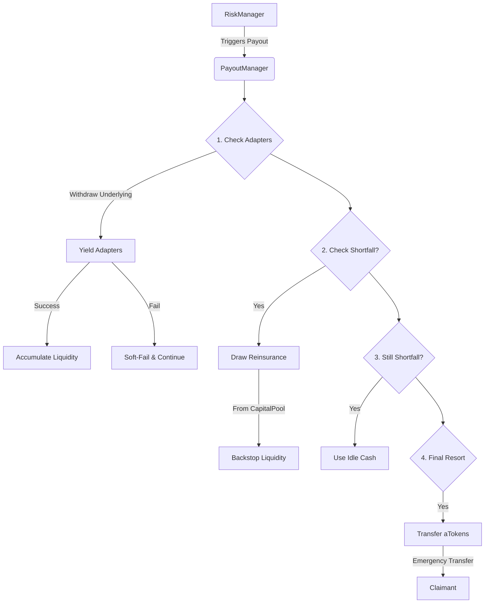

The **Payout System** is responsible for executing claim payouts when a valid claim is approved by the **RiskManager**. It ensures that claimants are paid promptly while managing the complex liquidity requirements of the protocol.

## Overview

The core of this system is the **PayoutManager** contract. It acts as a coordinator that gathers liquidity from various sources to fulfill a claim.

### Key Responsibilities
1.  **Liquidity Aggregation:** Pulls funds from idle capital, external yield strategies, and reinsurance pools.
2.  **Payout Execution:** Transfers funds to the claimant and fee recipients.
3.  **Loss Realization:** Distributes the realized loss across the underwriting pool (Syndicate) via the **LossDistributor**.

---

## Architecture

### **PayoutManager.sol**

This contract is the entry point for executing payouts. It is triggered solely by the **RiskManager** after a claim has been validated.

### The Liquidity Waterfall

To fulfill a claim, the **PayoutManager** follows a strict "waterfall" to gather the necessary liquidity with minimal impact on the system's yield generation.



1.  **Adapters (Yield Strategies):** First, it attempts to withdraw the required underlying assets (e.g., USDC) from the yield adapters where the syndicate's capital is deployed.
2.  **Reinsurance (Backstop):** If the syndicate's capital is insufficient (or if the claim exceeds the syndicate's liability), it draws from the shared Reinsurance/Backstop pool via **CapitalPool.drawReinsuranceLiquidity()**.
3.  **Idle Cash:** It uses any loose cash sitting idle in the **CapitalPool**.
4.  **aTokens (Last Resort):** If liquidity is frozen or unavailable in the underlying form, it can transfer the raw strategy tokens (e.g., aUSDC) directly to the claimant. This applies to both the **Syndicate's** adapters and the **Reinsurance** pool.


### Reinsurance Tranches

When the **PayoutManager** draws from the Reinsurance pool (Step 2 above), the **SharedAssetController** manages the capital using a **Tranche System**. This allows for different risk profiles within the reinsurance pool.

*   **Priority Levels:** Each tranche has a priority level (0 = highest, 255 = lowest).
*   **Drawdown Order:** Tranches are consumed in **reverse priority order**.
    *   **Junior Tranches (Lower Priority):** These are drawn *first* to cover claims. They act as the "first loss" capital, protecting the senior tranches.
    *   **Senior Tranches (Higher Priority):** These are drawn *last*, only after all junior tranches have been exhausted. Priority 0 is the most senior.
*   **Salvage:** If funds are recovered later (salvage), they are distributed back to the tranches that covered the loss, in proportion to their contribution.

### Resilience & Safety

The system is designed to be robust against external failures:

*   **Soft-Fail Adapters:** If a specific yield adapter reverts (e.g., due to a paused protocol), the **PayoutManager** catches the error and continues to the next source of liquidity. It does **not** revert the entire payout transaction.
*   **Fee Forgiveness:** If there is enough liquidity to pay the claimant but not the protocol fee, the fee is forgiven (`ClaimFeeForgiven` event) to ensure the user always gets paid.
*   **Reentrancy Protection:** All payout functions are guarded against reentrancy attacks.

### Rate Engine Integration

When a claim is paid, the **PayoutManager** notifies the **RateEngine**.
```solidity
rateEngine.recordClaim(poolId, amount);
```
This feedback loop allows the pricing model to adapt to realized losses, potentially increasing premiums for future policies in that pool.

### **LossDistributor**

When a payout occurs, the capital backing that policy is "burned" to pay the claim. This loss must be reflected in the share price of the Syndicate.

The **LossDistributor** calculates the pro-rata loss for the specific pool and updates the Syndicate's state. This ensures that:
- The share price drops appropriately.
- The loss is socialized among all LPs in that specific pool/syndicate.

---

## Integration Details

### Executing a Payout

This function is restricted to the **RiskManager**.

```solidity
function executePayout(Types.PayoutData calldata p) external onlyRiskManager;
```

**PayoutData Struct:**

```solidity
struct PayoutData {
    address claimant;          // Address of the policyholder
    uint256 claimantAmount;    // Amount to be paid to the claimant
    uint256 feeAmount;         // Fee to be paid to the protocol/partners
    uint256 underwriterAmount; // The portion of the claim covered by the syndicate
    uint256 catastropheAmount; // The portion covered by the reinsurance pool
    address[] adapters;        // List of yield adapters to withdraw from
}
```

### Events

```solidity
event Initialized(address capitalPool, address riskManager, address lossDistributor);
event ClaimFeeForgiven(uint256 indexed poolId, address indexed feeRecipient, uint256 amountForgiven);
event ATokensTransferredForShortfall(address indexed claimant, uint256 valueCovered);
```
