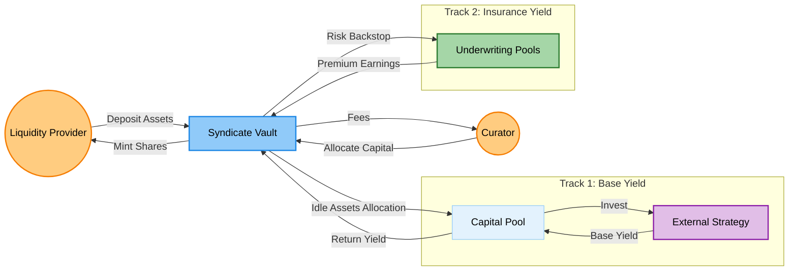

The **Syndicate System** is the core underwriting engine of LayerCover. It allows liquidity providers (LPs) to deposit capital into managed vaults ("Syndicates") which then allocate that capital to various underwriting pools to earn yield.

## Overview



A **Syndicate** is a specialized [ERC4626](https://eips.ethereum.org/EIPS/eip-4626) vault that:
1.  **Aggregates Capital:** Collects assets (e.g., USDC) from multiple LPs.
2.  **Delegates Risk:** Allows a "Curator" (manager) to allocate capital to specific risk pools.
3.  **Optimizes Yield:** Earns premiums from underwriting + base yield from underlying asset strategies (e.g., Aave).
4.  **Manages Lifecycle:** Handles deposit locks, withdrawal queues, and performance fees.

### Key Features

*   **Managed Allocation:** Curators can dynamically rebalance capital across different pools without LPs needing to withdraw.
*   **High-Water Mark Fees:** Performance fees are only charged on new profits, ensuring fair compensation for managers.
*   **Deposit Locks:** LPs can lock their capital for a fixed duration to earn "Yield Boosts" (multipliers on their share of the premium).
*   **Intents:** Supports off-chain intent matching for instant liquidity or specific coverage reservations.

---

## Architecture

The Syndicate system is composed of several interacting contracts:

| Contract | Description |
| :--- | :--- |
| **Syndicate.sol** | The main vault contract. It holds the assets, issues shares (ERC20), and manages the high-level entry/exit flows. |
| **SyndicateStrategy** | A logic delegate that handles complex calculations for yield, fees, and locks. This keeps the main vault contract size manageable. |
| **SyndicateFactory** | Deploys new Syndicates as minimal proxies (clones) to save gas. |
| **UnderwriterManager** | The central registry that tracks capital allocations across the protocol. |
| **CapitalPool** | The underlying pool where assets are actually held when not deployed to other strategies. |

---

## Core Concepts

### 1. Capital Allocation & Dual Yield

Capital in a Syndicate exists in two dimensions: **Custody** (where the assets are held) and **Allocation** (what risk the assets are backing).

**Custody States:**
*   **Idle:** Assets are held directly in the **CapitalPool** vault.
*   **External Strategy:** Assets are deposited into a yield source (e.g., Aave, Compound) to earn base yield.

**Allocation States:**
*   **Unallocated:** Capital is not backing any insurance policies.
*   **Allocated:** Capital is pledged to specific underwriting pools to earn premiums.

**Dual Yield:**
Crucially, capital can be **simultaneously Allocated and in an External Strategy**. This allows LPs to earn "Dual Yield":
1.  **Base Yield** from the external strategy (e.g., Aave supply APY).
2.  **Premium Yield** from underwriting insurance policies.

**Auto-Allocation:**
When an LP deposits, the Syndicate can automatically allocate that fresh capital to a set of default pools defined by the Curator. This ensures capital is immediately put to work.

### 2. Yield & Fees

Syndicates generate yield from two sources:
1.  **Policy Premiums:** When the allocated capital is used to underwrite a policy, the premium paid by the buyer flows into the Syndicate.
2.  **Base Yield:** Idle capital can be deposited into third-party protocols (like Aave or Compound) via the **CapitalPool**.

**Fee Models:**
Syndicates support two mutually exclusive fee models, configured at deployment:

1. **High-Water Mark (Performance Fee):**
   * Fees are charged only on *new* profits that exceed the highest previous share price (High-Water Mark).
   * Standard model for aligning incentives (e.g., 10% of profits).

2. **Yield Fee:**
   * Fees are charged on *all* yield generated by the Syndicate, regardless of previous losses.
   * Useful for simpler "revenue share" arrangements.

### 3. Duration Management (Locks)

To align LP incentives with the long-term nature of insurance, Syndicates support **Deposit Locks**.

*   **Deposit Lock:** LPs can choose to lock their deposit for a specific duration (e.g., 90 days).
    ```solidity
    depositWithLock(assets, receiver, duration);
    ```
*   **Yield Boost:** Locked deposits earn a higher share of the yield compared to unlocked deposits. The longer the lock, the higher the multiplier.
*   **Withdrawals:** Locked assets cannot be withdrawn until the lock expires.

### 4. Withdrawal Queue

Because capital may be tied up in active policies, withdrawals are not always instant.

1.  **Request:** An LP initiates the withdrawal process.
    ```solidity
    requestWithdrawal();
    // OR
    depositWithWithdrawalIntent();
    ```
2.  **Queue:** The request enters a queue. The Syndicate has a "withdrawal delay" (e.g., 7 days) to allow time for capital to be deallocated or for policies to expire.
3.  **Finalize:** Once the delay passes and sufficient liquid capital is available, the LP claims their assets.
    ```solidity
    executeWithdrawal();
    ```

---

## Integration Guide

### For Liquidity Providers (LPs)

#### Depositing

**Standard Deposit:**
```solidity
// Approve tokens first
IERC20(usdc).approve(syndicateAddress, amount);

// Deposit 1000 USDC
syndicate.deposit(1000e6, receiverAddress);
```

**Deposit with Lock (for Boosted Yield):**
```solidity
// Deposit 1000 USDC locked for 90 days (approx 7.77 million seconds)
uint32 duration = 90 days;
syndicate.depositWithLock(1000e6, receiverAddress, duration);
```

#### Withdrawing

**Requesting Withdrawal:**
```solidity
// Request to withdraw 500 shares
// This starts the countdown timer
(uint256 requestId, uint256 assetsPreview) = syndicate.depositWithWithdrawalIntent(
    0,              // 0 assets to deposit (just requesting withdraw)
    receiverAddress,
    7 days          // Requested max delay (must be >= minWithdrawalDelay)
);
```

**Executing Withdrawal:**
After the delay period has passed:
```solidity
// Finalize the withdrawal
syndicate.executeWithdrawal(500 shares, receiverAddress);
```

### For Curators (Managers)

#### Allocating Capital

Curators manage the risk profile of the Syndicate by choosing which pools to back.

```solidity
// Allocate to Pool ID 1 and Pool ID 5
uint256[] memory poolIds = new uint256[](2);
poolIds[0] = 1;
poolIds[1] = 5;

uint256[] memory amounts = new uint256[](2);
amounts[0] = 50000e6; // 50k USDC
amounts[1] = 25000e6; // 25k USDC

syndicate.allocateToPools(poolIds, amounts);
```

#### Harvesting Yield

Curators can trigger a harvest to collect premiums and compound yield.

```solidity
// Harvest yield from underlying strategies
syndicate.harvestYield(minAmountOut);
```

---

## Smart Contract Reference

### Syndicate Contract

#### Initialize
Initializes a new Syndicate clone.
```solidity
function initialize(
    address asset_,
    address capitalPool_,
    address underwriterManager_,
    address riskManager_,
    address syndicateManager_,
    address feeRecipient_,
    uint16 performanceFeeBps_,
    uint16 yieldFeeBps_,
    uint8 feeModel_,
    string calldata name_,
    string calldata symbol_,
    address initialOwner_,
    address strategy_,
    address salvage_
) external;
```

#### Deposit with Lock
Deposits assets and locks them for a specified duration to earn boosted yield.
```solidity
function depositWithLock(
    uint256 assets, 
    address receiver, 
    uint32 duration
) external returns (uint256 shares);
```

#### Allocate to Pools
Allocates capital to specific underwriting pools. Only callable by the Manager/Curator.
```solidity
function allocateToPools(
    uint256[] calldata poolIds, 
    uint256[] calldata amounts
) external;
```

#### Request Deallocation
Signals that capital should be removed from a pool. This may not happen instantly if the capital is locked in active policies.
```solidity
function requestDeallocateFromPool(
    uint256 poolId, 
    uint256 amount
) external;
```

### Syndicate Strategy Interface

The strategy contract handles the heavy lifting for calculations.

#### Pending Yield
View function to see how much yield an account has earned.
```solidity
function pendingYield(address account) external view returns (uint256);
```

#### Get Reservation
Gets details about a specific intent reservation.
```solidity
function getReservation(bytes32 key) external view returns (ReservationView memory);
```

---

## Events

```solidity
event Deposit(address indexed sender, address indexed owner, uint256 assets, uint256 shares);
event Withdrawn(address indexed sender, address indexed receiver, address indexed owner, uint256 assets, uint256 shares);
event Allocated(uint256 indexed poolId, uint256 amount);
event Deallocated(uint256 indexed poolId, uint256 amount);
event YieldHarvested(uint256 amount);
event PerformanceFeeCollected(uint256 amount);
```

## Common Errors

```solidity
error DepositCapExceeded(uint256 cap, uint256 amount);
error MinWithdrawalDelayNotMet(uint256 unlockTime, uint256 currentTime);
error NotAuthorized(address caller);
```
