import { Callout } from '@/components/Callout'
import { ThemedImage } from '@/components/ThemedImage'
import { RiskPointsCalculator } from '@/components/RiskPointsCalculator'

<Callout type="info">
  **TL;DR:** Deposit single-sided liquidity, allocate across uncorrelated pools for leverage, and manage exposure with a risk points budget.
</Callout>

## Single-Sided Liquidity

Underwriters participate by depositing a single asset (e.g., USDC) into the **CapitalPool**. There's no LP pairing, no governance token requirement, and no impermanent loss.

- **Asset choice** - Deposit USDC (or wstETH on the LST instance)
- **External yield** - Idle capital (not backing active claims) earns DeFi yield via whitelisted adapters (Aave, Compound)
- **Full withdrawal** - Get back your principal + earned premiums + yield, minus any claim losses

<div className="my-8">
  <ThemedImage
    lightSrc="/doc-assets/illustrations/yield-light.png"
    darkSrc="/doc-assets/illustrations/yield-dark.png"
    alt="External Yield Generation"
    className="w-full rounded-lg border border-border"
  />
</div>

---

## Capital Pledges

When you allocate capital to a pool, you create a **pledge** - a commitment to back policies sold from that pool.


- Total pledges ($120K) can **exceed your deposit** — this is leverage
- Each pledge is capped at **35% of your principal** (see [Per-Pool Concentration Limit](#per-pool-concentration-limit))
- Your capital can be pledged across **multiple pools simultaneously**
- Pledges can be adjusted as pools change or as you rebalance

---

## Risk Points & Leverage

The protocol uses **risk points** to control leverage - the ability to back more total coverage than your deposit.

### How Risk Points Work

Each pool is assigned a **risk cost** (0–100) based on its risk rating. When you allocate to a pool, it consumes risk points from your total budget.

| Risk Rating | Risk Cost | Max Leverage (single pool) |
| :--- | :--- | :--- |
| ✅ AAA | 10 | 10× |
| ✅ AA  | 20 | 5× |
| ⚠️ A   | 30 | 3.3× |
| ⚠️ BBB | 50 | 2× |
| 🚨 BB  | 70 | 1.4× |
| 🚨 B/C | 100 | 1× (no leverage) |

**Default risk points budget: 100**

### Worked Example

You deposit **100,000 USDC** and have 100 risk points to spend. Each pool pledge is capped at **35%** of principal (35K on 100K):

| Allocation | Pool Rating | Risk Cost | Points Used |
| :--- | :--- | :--- | :--- |
| $35K → Aave USDC | AAA (10) | 10 × (35/100) = 3.5 | 3.5 |
| $35K → Compound cDAI | AA (20) | 20 × (35/100) = 7 | 7 |
| $30K → DeFi Vault X | A (30) | 30 × (30/100) = 9 | 9 |
| $20K → Yield Farm Y | BBB (50) | 50 × (20/100) = 10 | 10 |
| **$120K total coverage** | | | **29.5 / 100 used** |

You're backing **120K** in coverage with only **100K** in capital — that's **1.2× leverage**, spread across four pools with no single pool exceeding the 35% concentration limit. You still have 70.5 risk points remaining for more allocations.

### Try It Yourself

<RiskPointsCalculator defaultDeposit={100000} maxBudget={100} />

<Callout type="warning">
  **Leverage means correlated risk matters.** If two pools cover the same protocol and both pay claims simultaneously, your capital could be insufficient. That's why the protocol limits leverage via risk points and uses **mutex groups** to flag correlated pools.
</Callout>

---

## Mutex Groups

Pools that cover correlated risks are grouped into **mutex (mutual exclusion) groups**. When multiple pools in the same mutex group are allocated together, their risk costs compound.


If an Aave exploit occurs, all three pools could pay claims simultaneously. The protocol accounts for this by requiring higher effective risk budgets for correlated allocations.

---

## Per-Pool Concentration Limit

To prevent over-concentration of risk, the protocol enforces a **35% per-pool exposure cap**. No single pool can receive more than 35% of a syndicate's deposited principal, regardless of available risk points.

### How It Works

When allocating capital, the protocol calculates the maximum pledge per pool:

```
maxPledgePerPool = principal × 35%
```

Any allocation that would push a pool's pledge above this threshold is rejected.

### Worked Example

You deposit **$100,000**. The per-pool cap is 35%:

| Pool | Pledge | Cap ($35K) | Status |
| :--- | :--- | :--- | :--- |
| Aave USDC | $35,000 | $35,000 | ✅ At limit |
| Compound cDAI | $30,000 | $35,000 | ✅ Under limit |
| DeFi Vault X | $25,000 | $35,000 | ✅ Under limit |
| **Aave USDC +$5K** | **$40,000** | **$35,000** | **❌ Rejected** |

Even though you have unused risk points, the fourth allocation is rejected because it would push Pool A above 35% of your $100K principal.

```mermaid
flowchart LR
    P["$100K Principal"] --> C["35% Cap = $35K per pool"]
    C --> PA["Pool A: $35K ✅"]
    C --> PB["Pool B: $30K ✅"]
    C --> PC["Pool C: $25K ✅"]
    C -.-> PD["Pool A +$5K ❌"]
    style PD fill:#ef444420,stroke:#ef4444
```



<Callout type="info">
  **Lloyd's alignment.** This 35% cap mirrors traditional insurance concentration limits. Lloyd's of London restricts syndicates from allocating more than a set percentage of capacity to any single risk class, preventing catastrophic losses from a single correlated event.
</Callout>

### Captive Syndicate Overrides

Governance can grant specific syndicates a **per-syndicate exposure override** for higher concentration. This is designed for **captive syndicates** — dedicated vaults that back a single protocol.

- A **100% override** allows the syndicate to pledge its entire principal to one pool
- A **50% override** allows up to half of principal per pool
- Setting the override to **0** reverts to the global 35% default

When an override is active, the maximum number of pool allocations is also dynamically capped to prevent leverage amplification (e.g., 100% override → max 1 pool).

---

## Capital Adequacy Ratio

Syndicates must maintain a minimum **50% capital adequacy ratio** to write new business. This means the syndicate's principal must be at least 50% of its total pledged exposure.

If losses erode a syndicate's principal below this threshold, the protocol blocks new intent reservations (quoting) until the ratio recovers — either through new deposits or pledge reductions.

<Callout type="warning">
  **Solvency gating.** This mirrors Lloyd's Solvency Capital Requirement (SCR). Syndicates below the threshold can still manage existing policies and process claims, but cannot take on new risk until recapitalized.
</Callout>

---

## Premium Distribution

When policyholders pay premiums, the premium is split:


- **85%** goes to underwriters (proportional to capital pledged to the pool)
- **10%** goes to the Backstop Pool (protocol-wide reinsurance)
- **5%** goes to the protocol treasury

---

## Next Steps

<div className="grid gap-4 sm:grid-cols-2 my-8">
  <a href="/underwriters/syndicates" className="block p-4 rounded-lg border border-border hover:border-brand-500 hover:shadow-lg hover:shadow-brand-500/10 hover:-translate-y-1 transition-all duration-300 no-underline">
    <h4 className="text-base font-semibold text-foreground m-0">🏛️ Syndicates →</h4>
    <p className="text-sm text-muted-foreground m-0 mt-1">Passive capital deployment via managed vaults</p>
  </a>
  <a href="/underwriters/risk-assessment" className="block p-4 rounded-lg border border-border hover:border-brand-500 hover:shadow-lg hover:shadow-brand-500/10 hover:-translate-y-1 transition-all duration-300 no-underline">
    <h4 className="text-base font-semibold text-foreground m-0">🔍 Risk Assessment →</h4>
    <p className="text-sm text-muted-foreground m-0 mt-1">How to evaluate pools before allocating</p>
  </a>
</div>
