import { Callout } from '@/components/Callout'

<Callout type="info">
  **TL;DR:** Losses are shared pro-rata at the claim block. You receive tokenized salvage rights for distressed assets - hold for recovery or sell immediately.
</Callout>

## How Losses Are Distributed

When a claim is paid from a pool you're backing, your capital is reduced proportionally:

$$\text{Your Loss} = \text{Claim Amount} \times \frac{\text{Your Pledge}}{\text{Total Pool Capital}}$$

```mermaid
flowchart LR
    C["🚨 Claim: $100K"] --> P["Pool Capital: $1M"]
    P --> U1["You: $200K pledge → $20K loss"]
    P --> U2["LP 2: $300K pledge → $30K loss"]
    P --> U3["LP 3: $500K pledge → $50K loss"]
```

**Key rules:**
- Loss is calculated at the **exact block** of the claim event
- You **cannot avoid losses by withdrawing** after an exploit - liability is snapshotted
- Multiple claims against the same pool compound losses

---

## Salvage Rights

When a claim is paid, the protocol receives **distressed assets** from the policyholder (e.g., depegged USDC, exploited vault shares). These are tokenized as **salvage rights** and distributed to underwriters.

### What Are Salvage Rights?

- **Tokenized claims** on the distressed assets held by the protocol
- **Tradeable** on secondary markets - sell to distressed debt funds or speculators
- **Recoverable** - if the underlying asset recovers value, you benefit

### Recovery Scenario

| Outcome | You Receive |
| :--- | :--- |
| Asset never recovers (\$0) | Salvage rights are worthless - your loss is final |
| Partial recovery (e.g. \$0.60/\$1) | You can redeem salvage for recovered value |
| Full recovery (\$1/\$1) | You recoup most or all of your loss |

<Callout type="info">
  **Example:** You suffered a \$20K loss backing a depegged stablecoin. The stablecoin later re-pegs. Your salvage rights are now worth ~\$20K - effectively making you whole (minus opportunity cost).
</Callout>

### Trading Salvage

Can't wait for recovery? Salvage rights are transferable, so you can:

1. **Sell on secondary markets** - Distressed debt funds buy salvage at a discount (e.g., \$0.20–\$0.50 on the dollar)
2. **Hold for upside** - Wait for potential recovery
3. **Transfer** - Move to another wallet or entity

---

## Multi-Layer Payout Waterfall

When a claim exceeds the primary pool's capital, LayerCover has fallback layers:

- **Layer 1:** Capital pledged to the specific pool (your capital)
- **Layer 2:** 3rd Party Reinsurance - external reinsurers providing quota-share capacity (if available for the pool)
- **Layer 3:** Backstop Pool - protocol-wide reinsurance funded by a percentage of all premiums
- **Layer 4:** Protocol treasury - last resort

<Callout type="warning">
  As an underwriter, your loss is capped at your pledge amount. 3rd party reinsurance, the Backstop Pool, and protocol treasury absorb any excess.
</Callout>

---

## Next Steps

  <a href="/protocol" className="block p-4 rounded-lg border border-border hover:border-brand-500 hover:shadow-lg hover:shadow-brand-500/10 hover:-translate-y-1 transition-all duration-300 no-underline">
    <h4 className="text-base font-semibold text-foreground m-0">🏗️ Protocol Architecture →</h4>
    
Dive into the core protocol design and components

  </a>
  <a href="/protocol/backstop-pool" className="block p-4 rounded-lg border border-border hover:border-brand-500 hover:shadow-lg hover:shadow-brand-500/10 hover:-translate-y-1 transition-all duration-300 no-underline">
    <h4 className="text-base font-semibold text-foreground m-0">🏦 Backstop Pool →</h4>
    
How the Backstop Pool provides protocol-wide safety

  </a>

