import { Callout } from '@/components/Callout'

<Callout type="info">
  **TL;DR:** Deposit capital → Earn premiums from policies sold + DeFi yield on idle funds. Two paths: direct pool allocation or passive Syndicate participation.
</Callout>

LayerCover enables capital providers to earn returns by backing insurance policies. Your capital is deployed single-sided (USDC or wstETH) and earns from two sources simultaneously.

---

## Dual Yield Sources

```mermaid
flowchart LR
    D["💰 Your Deposit"] --> CP["CapitalPool"]
    CP --> P["📋 Premium Income"]
    CP --> Y["📈 DeFi Yield"]
    P --> R["🎯 Your Returns"]
    Y --> R
    
    style P fill:#22c55e20,stroke:#22c55e
    style Y fill:#3b82f620,stroke:#3b82f6
```

| Source | How | Typical Range |
| :--- | :--- | :--- |
| **Premium Income** | Your share of policy premiums from pools you back | Variable per pool |
| **DeFi Yield** | Idle capital deployed to Aave, Compound via whitelisted adapters | Market rate |

---

## Two Participation Modes

  

    🏛️
    <h3 className="text-lg font-semibold text-foreground mb-2">Syndicates (Passive)</h3>
    
Deposit into a managed vault. A professional Syndicate Manager handles pool selection, risk allocation, and fixed-rate market making on your behalf.

    <a href="/underwriters/syndicates" className="text-sm font-medium text-brand-600 dark:text-brand-400 no-underline mt-2 inline-block">Learn about Syndicates →</a>
  

  

    🎯
    <h3 className="text-lg font-semibold text-foreground mb-2">Direct Allocation (Advanced)</h3>
    
Manage your own capital allocation across specific pools. Full control over risk exposure, leverage, and pool selection.

    <a href="/underwriters/capital-and-leverage" className="text-sm font-medium text-brand-600 dark:text-brand-400 no-underline mt-2 inline-block">Learn about Allocation →</a>
  

---

## Key Concepts at a Glance

| Concept | What It Means |
| :--- | :--- |
| **Single-Sided Liquidity** | Deposit one asset (USDC). No LP pairs, no impermanent loss. |
| **Risk Points Budget** | Each pool consumes risk points. Your total budget limits exposure. |
| **Leverage** | Back more coverage than your deposit via uncorrelated pool diversification. |
| **Capital Locking** | Capital backing active policies is locked until those policies expire or settle. Unlocked capital can be withdrawn instantly. |
| **Salvage Rights** | If a claim is paid, you receive tokenized rights to the distressed assets. |

---

## How Claims Affect You

When a policy pays out a claim:

1. Your capital is reduced **pro-rata** based on your share of the pool at the claim block
2. You receive **salvage rights** - tokenized claims on the distressed assets
3. Salvage rights are **tradeable** - sell to distressed debt investors or hold for potential recovery
4. You **cannot front-run claims** - the protocol snapshots liability at the moment of the incident

---

## Next Steps

  <a href="/underwriters/syndicates" className="block p-4 rounded-lg border border-border hover:border-brand-500 hover:shadow-lg hover:shadow-brand-500/10 hover:-translate-y-1 transition-all duration-300 no-underline">
    <h4 className="text-base font-semibold text-foreground m-0">🏛️ Syndicates →</h4>
    
Passive LP via managed vaults

  </a>
  <a href="/underwriters/capital-and-leverage" className="block p-4 rounded-lg border border-border hover:border-brand-500 hover:shadow-lg hover:shadow-brand-500/10 hover:-translate-y-1 transition-all duration-300 no-underline">
    <h4 className="text-base font-semibold text-foreground m-0">📊 Capital & Leverage →</h4>
    
Risk points, leverage controls

  </a>
  <a href="/underwriters/risk-assessment" className="block p-4 rounded-lg border border-border hover:border-brand-500 hover:shadow-lg hover:shadow-brand-500/10 hover:-translate-y-1 transition-all duration-300 no-underline">
    <h4 className="text-base font-semibold text-foreground m-0">🔍 Risk Assessment →</h4>
    
Evaluating and rating pools

  </a>

