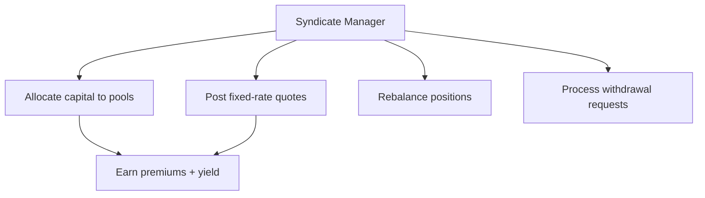

import { Callout } from '@/components/Callout'

<Callout type="info">
  **TL;DR:** Syndicate Managers allocate LP capital across risk pools, post fixed-rate quotes on the orderbook, and earn performance fees on net profits.
</Callout>

This page is for **Syndicate Managers** - the operators who manage capital allocation on behalf of depositors. If you're an LP looking to deposit passively, see [Syndicates](/underwriters/syndicates).

---

## Manager Responsibilities

| Responsibility | Description |
| :--- | :--- |
| **Pool Selection** | Choose which risk pools to back based on risk/reward |
| **Capital Allocation** | Distribute LP capital across selected pools |
| **Quote Management** | Post sell-side intents on the RFQ OrderBook at competitive rates |
| **Rebalancing** | Adjust allocations as pools change, rates shift, or capacity fills |
| **Withdrawal Processing** | Deallocate capital and process LP redemptions |

---

## Allocation Strategy

### Pool Selection Criteria

When choosing pools for your syndicate:

1. **Risk rating** - Higher-rated pools (AAA/AA) offer less premium but lower claim risk
2. **Premium rates** - Compare the rate policyholders are paying vs your required return
3. **Utilisation** - Pools with high demand but low capacity offer pricing power
4. **Correlation** - Avoid concentrating on pools that share mutex groups
5. **Term profile** - Shorter terms (30d) give faster capital recycling

### Leverage Management

As the manager, you control the syndicate's leverage profile by choosing your allocation mix:

<Callout type="warning">
  **Capital efficiency vs safety.** Higher leverage means more premium income per dollar but increased exposure. Conservative syndicates typically run 2–3× leverage; aggressive ones push toward 5–8×.
</Callout>

---

## Fixed-Rate Market Making

Managers can post **sell-side intents** on the RFQ OrderBook - essentially committed quotes at specific rates.

**How it works:**

1. **Post intent** - Commit a specific amount at a specific rate (e.g., "$50K at 600bps for 90 days")
2. **Buyer matches** - A policyholder accepts your quote
3. **Policy minted** - Capital is locked immediately, premium is collected
4. **Capital returned** - At policy expiry (or claim), capital is released

**Why?** Market making lets managers set their own prices and guarantee execution. Instead of waiting for policies to be sold via the pool's AMM rate, you directly offer competitive quotes.

---

## Performance Fees

Managers earn a **performance fee** on net profits generated by the syndicate:

$$\text{Fee} = \text{Performance Fee \%} \times (\text{Premiums} + \text{Yield} - \text{Losses})$$

- Typical performance fees range from **10–20%**
- Fees are deducted at the vault level, so LP share prices already reflect fees
- No fee is charged on principal - only on profits

---

## Capacity Management

| Control | Description |
| :--- | :--- |
| **Deposit caps** | Set maximum TVL for the syndicate |
| **Per-LP limits** | Optionally cap individual deposit sizes |
| **Whitelist mode** | Restrict deposits to approved addresses |
| **Allocation limits** | Maximum percentage of syndicate capital per pool |

---

## Next Steps

  <a href="/underwriters/claims-and-salvage" className="block p-4 rounded-lg border border-border hover:border-brand-500 hover:shadow-lg hover:shadow-brand-500/10 hover:-translate-y-1 transition-all duration-300 no-underline">
    <h4 className="text-base font-semibold text-foreground m-0">🔄 Claims & Salvage →</h4>
    
How losses are distributed and salvage recovery works

  </a>
  <a href="/protocol/pricing" className="block p-4 rounded-lg border border-border hover:border-brand-500 hover:shadow-lg hover:shadow-brand-500/10 hover:-translate-y-1 transition-all duration-300 no-underline">
    <h4 className="text-base font-semibold text-foreground m-0">💲 Pricing Model →</h4>
    
How fixed-rate intents and the OrderBook work

  </a>

