import { Callout } from '@/components/Callout'
import { FAQAccordion } from '@/components/FAQAccordion'

<Callout type="info">
  **TL;DR:** Deposit into a managed vault and earn premiums + yield. A Syndicate Manager handles pool selection, risk allocation, and fixed-rate quoting on your behalf.
</Callout>

Syndicates are the **passive** path into underwriting on LayerCover. Think of them as yield vaults with a professional risk manager - you deposit capital and a Syndicate Manager optimises the yield.

---

## How Syndicates Work

1. **You deposit** USDC into a Syndicate vault and receive proportional shares
2. **The Manager allocates** your capital across risk pools based on their strategy
3. **Premiums flow in** as policies are sold from the backed pools
4. **Capital earns** additional yield from whitelisted DeFi protocols via the CapitalPool
5. **You withdraw** by redeeming your shares for the underlying USDC

---

## How Syndicate Managers Underwrite

Syndicate Managers earn premiums by posting **sell-side intents** — signed, off-chain quotes offering coverage at specific rates. LayerCover uses a **JIT (Just-In-Time) liquidity model**: capital is not pre-allocated to pools. Instead, reservation and allocation happen atomically when a buyer accepts a quote.

### The Flow

1. **Manager signs an intent** — specifying pool, coverage amount, premium rate, and duration constraints. This is off-chain and costs no gas.
2. **Buyer submits a matching order** — the off-chain matcher pairs compatible intents with orders.
3. **Atomic on-chain execution** — the `IntentMatcher` contract handles everything in one transaction:
   - Reserves capacity on the syndicate vault
   - Allocates capital to the pool just-in-time
   - Collects premium from the buyer
   - Mints the policy NFT
4. **Capital is locked** for the policy's duration, and the syndicate earns premium income.

<Callout type="info">
  **JIT liquidity.** Capital stays liquid in the syndicate vault until a buyer matches an intent. This maximises capital efficiency — idle capital continues earning DeFi yield via the CapitalPool until the moment it's needed to back a policy. Allocations are subject to the [35% per-pool concentration limit](/underwriters/capital-and-leverage#per-pool-concentration-limit) and the syndicate's [risk points budget](/underwriters/capital-and-leverage#risk-points--leverage).
</Callout>

---

## Depositing & Withdrawing

### Deposits
- Deposit USDC to receive Syndicate shares (ERC-4626)
- Shares represent your proportional claim on the vault's total assets
- No minimum deposit - enter at any time

### Withdrawals

Withdrawals from syndicates are **instant** - redeem your shares for the underlying USDC at any time, subject to available liquidity.

```mermaid
sequenceDiagram
    participant You
    participant Syndicate
    participant CapitalPool

    You->>Syndicate: Redeem shares
    Syndicate->>CapitalPool: Release unlocked capital
    CapitalPool-->>Syndicate: Capital returned
    Syndicate-->>You: 💰 USDC withdrawn
```

<Callout type="info">
  **Solvency protection:** Capital that is actively backing policies is locked and cannot be withdrawn until those policies expire or are settled. This prevents front-running claims without requiring a notice period.
</Callout>

---

## Choosing a Syndicate

When evaluating syndicates, consider:

| Factor | What to Look For |
| :--- | :--- |
| **Historical APY** | Past performance of the vault |
| **Pool Allocation** | Which risk pools the manager is backing |
| **Risk Rating Mix** | Percentage in AAA vs lower-rated pools |
| **Manager Track Record** | History of allocation decisions and losses |
| **TVL** | Total capital in the syndicate |
| **Performance Fee** | Manager's cut of profits (typically 10-20%) |

---

## FAQ

<FAQAccordion faqs={[
  {
    question: "What if the Syndicate Manager makes bad allocation decisions?",
    answer: "Managers cannot steal your capital - they can only allocate it across whitelisted pools. If they allocate poorly and claims hit, your capital is reduced pro-rata. Choose managers with strong track records and diversified allocation strategies."
  },
  {
    question: "Can I withdraw during a claim event?",
    answer: "You can withdraw unlocked capital at any time. However, capital backing active policies is locked until those policies expire. Your loss share is determined by your capital snapshot at the claim block - withdrawing afterward doesn't avoid losses."
  },
  {
    question: "Are Syndicate shares transferable?",
    answer: "Yes. Syndicate shares are standard ERC-4626 tokens and are fully transferable. The new holder inherits both the yield and the risk exposure."
  },
  {
    question: "How are performance fees calculated?",
    answer: "Performance fees are taken from net profits (premiums + yield - losses). They are deducted at the vault level, so the share price already reflects fees paid."
  }
]} />

---

## Next Steps

  <a href="/underwriters/managing-a-syndicate" className="block p-4 rounded-lg border border-border hover:border-brand-500 hover:shadow-lg hover:shadow-brand-500/10 hover:-translate-y-1 transition-all duration-300 no-underline">
    <h4 className="text-base font-semibold text-foreground m-0">⚙️ Managing a Syndicate →</h4>
    
For managers: allocation, intents, and fees

  </a>
  <a href="/underwriters/claims-and-salvage" className="block p-4 rounded-lg border border-border hover:border-brand-500 hover:shadow-lg hover:shadow-brand-500/10 hover:-translate-y-1 transition-all duration-300 no-underline">
    <h4 className="text-base font-semibold text-foreground m-0">🔄 Claims & Salvage →</h4>
    
How losses are distributed and salvage works

  </a>

